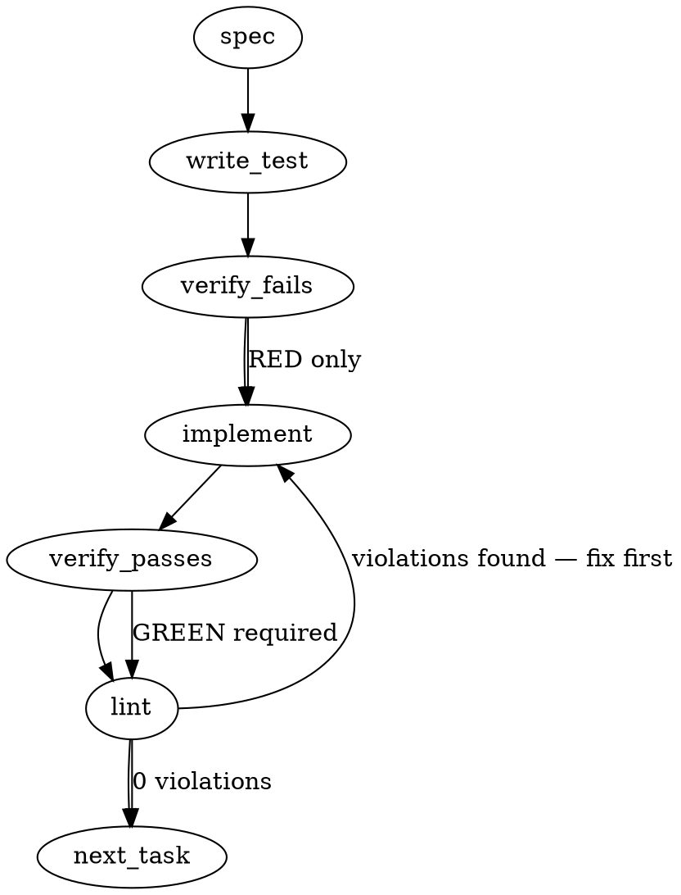

### Problem Statement

The merge-ready PreToolUse gate wrapper (`CLAUDE_GATE_WRAPPER` in `packages/cli/src/commands/init-templates.ts`, scaffolded to `.claude/hooks/gate-wrapper.cjs`) projects a `gh pr merge` from the Bash/PowerShell envelope and evaluates it through `totem gate check --event merge-ready`. Two disclosed limits of that projection, both named on the pilot install (mmnto-ai/totem#2855) and both a bypass under the STRICT tier: (1) the projection recognizes only a bare `gh` at command position, so a wrapper program's operand (`sudo gh pr merge 5`, `timeout 30 gh pr merge 5`, `env GH_TOKEN=x gh pr merge 5`), a builtin carrying a flag (`command -p`, `exec -a NAME`, `time -p`), a merge handed over as one quoted word (`eval "gh pr merge 5"`), a backtick substitution, a leading redirection, and the executable spelled `gh.exe` or with a path all run unjudged; (2) the projection's git reads (up to three per merge, 10 s each) run BEFORE the wrapper's 30 s aggregate deadline exists, so a hung git on a multi-merge envelope can reach the host's hook timeout, where the wrapper's own fail-closed exit never applies.

This spec is the ruled design for ONE pull request that cures mmnto-ai/totem#2856 (both items above) and mmnto-ai/totem#2857 (the wrapper's heredoc scanner, a hand copy of core's that diverged in the fail-open direction — its own spec at `.totem/specs/2857.md` carries the scanner contract and points here for the shared design). One PR because the two issues edit the same template and the same test file, and the strict-tier flip on every consumer waits on both.

### Architectural Context

- Under PILOT every miss is the safe direction (one lost advisory read); under STRICT the same miss is a bypass. Both issues are the strict install's precondition (the status seat named them as such on mmnto-ai/totem-status#260, 2026-09-19).
- ADR-082 Amendment 1 (product×harness quadrant): the wrapper is a stateless deterministic actuator interlock at the harness boundary with ONE host-agnostic evaluator and thin adapters; its matcher surface is bounded and fails loud or denies on undecidable forms rather than silently passing them — a coverage claim larger than the mechanism is a Tenet 19 violation. Every widening below is a form the tokenizer can decide; every form it cannot stays a disclosed miss in the template's comment and a locked row in the suite.
- ADR-109: the wrapper's exit contract — 0 for allow / warn / pilot-softened deny, 2 for a strict deny and for every fail-closed arm — is unchanged.
- Lesson (`.totem/lessons`, "Avoid fail-closed hooks during bootstrap"): the PATH fallback for the CLI stays; an applicable gate that cannot be evaluated still fails closed with exits named in the message.
- Lesson (cohort, "Use sync anchors for inlined standalone code"): the hook is a dependency-free CommonJS script that cannot import local packages; inlined utilities are ported verbatim, labelled with sync anchors at both sites, and backed by an executable parity test. This is the ground for the scanner decision in `2857.md`.
- Measured on this machine by the census leg (2026-09-19, Node v24.16.0): `@mmnto/totem`'s exports map carries `import` conditions only and no scanner subpath (mmnto-ai/totem#2851), so `require('@mmnto/totem/...')` fails with ERR_PACKAGE_PATH_NOT_EXPORTED from anywhere; the package is not linked at this monorepo's root `node_modules/@mmnto/` (only under `packages/cli/node_modules/`); Node 24 can `require()` core's ESM dist by absolute file path. A run-time require of core's scanner from the hook would therefore need install-layout probing plus a new fail-closed class on every layout it does not know — rejected for this PR, recorded as the alternative in `2857.md`.

### Files to Examine

- `packages/cli/src/commands/init-templates.ts` — `CLAUDE_GATE_WRAPPER` (an untagged template literal, lines ~1390–2383 at `b16d5179`): `COMMAND_POSITION_WORDS` and `isAssignmentPrefix` (~1808–1828), `ghPrMergeArgvs` (~1836–1947), `gitRead` (~1949–1954), `projectMergeReady` (~1983–2044), the CLI resolution (~2190–2227), the evaluation loop with `const deadline = Date.now() + 30000` (~2296–2302), the disclosed-miss comment (~1534–1575), the deadline disclosure (~2283–2295).
- `.claude/hooks/gate-wrapper.cjs` — the committed scaffold, byte-identical to the rendered template at `b16d5179`; re-scaffolded by `totem gate install merge-ready --pilot` after the template changes. NO TEST asserts that equality (corrected by the fold, F8): the suite renders the template into a temp file and never reads this path, so the equality is verified by SCRIPT at the head of the branch and the missing lock is mmnto-ai/totem#2833.
- `packages/cli/src/commands/gate-install.test.ts` — `runWrapper`, `writeStubCli`, `stubArgv`, `spawnedPayload`, `initGitRepo`, `bash`; the disclosed-miss loop (~1048–1104); the command-position rows (~1017–1046); the false-deny rows (quoted strings, heredoc bodies, other verbs).
- `packages/core/src/transport-shield.ts` — `findHeredocs`, `HEREDOC_AT`, `DQ_ESCAPABLE`, `WORD_BOUNDARY`, `skipArithmetic`, `HeredocSpan` (the scanner of record for `2857.md`).

### Technical Approach & Contracts

**A. The executable token (2856 item 1a).** A helper `isGhExecutable(token)` in the template: true for `gh`, `gh.exe`, and any token whose basename after the last `/` or `\` is `gh` or `gh.exe` (case-insensitive on the `.exe` suffix). `ghPrMergeArgvs` tests `isGhExecutable(tokens[0])` where it tested `tokens[0] === 'gh'`. A variable executable (`$GH pr merge 5`, `${GH} pr merge 5`) stays a disclosed miss: the wrapper cannot expand it, and the existing `unresolvedTarget` arm covers only the PR argument.

**B. Transparent wrapper programs and flag-carrying builtins (2856 item 1b).** After the existing strip of command-position words and assignment prefixes, the strip loop also consumes a CLOSED list of transparent programs with their options, then re-runs the assignment strip (for `env NAME=v gh …`), and only then tests the executable. The list and its option grammar, exact:

| word      | options that take a separate operand (skip the option and the next token) | other `-` tokens                                                                              | positional consumed before the command | notes                                                                                                                                                       |
| --------- | ------------------------------------------------------------------------- | --------------------------------------------------------------------------------------------- | -------------------------------------- | ----------------------------------------------------------------------------------------------------------------------------------------------------------- |
| `sudo`    | `-u -g -p -C -D -h -r -t -T -U`                                           | skipped                                                                                       | none                                   | `--` ends options                                                                                                                                           |
| `env`     | `-u -C`                                                                   | skipped                                                                                       | none                                   | assignment strip re-runs after it; `-S` / `--split-string`: re-entered, Fold 3 (the operand is split into words that take the option's place, not consumed) |
| `timeout` | `-k -s`                                                                   | skipped                                                                                       | ONE (the duration)                     | `--` ends options                                                                                                                                           |
| `nice`    | `-n`                                                                      | skipped (a bare `-10` is an adjustment)                                                       | none                                   |                                                                                                                                                             |
| `nohup`   | none                                                                      | skipped                                                                                       | none                                   |                                                                                                                                                             |
| `command` | none                                                                      | `-p` skipped; `-v` or `-V` ends the segment with NO projection (they describe, never execute) | none                                   | already in `COMMAND_POSITION_WORDS`; the flag handling is new                                                                                               |
| `exec`    | `-a`                                                                      | `-c -l` skipped                                                                               | none                                   | already in `COMMAND_POSITION_WORDS`                                                                                                                         |
| `time`    | `-o -f`                                                                   | `-p` and other `-` tokens skipped                                                             | none                                   | `--` ends options; already in `COMMAND_POSITION_WORDS`                                                                                                      |
| `eval`    | —                                                                         | —                                                                                             | —                                      | the remaining tokens are joined with one space and re-tokenized ONCE (depth 1); the projection of that inner string is the segment's projection             |

A `--` token after any wrapper ends its options. A long option with an attached value (`--user=x`, `--kill-after=5`, `--adjustment=10`) is one `-` token and is skipped as such. `npx` is NOT on the list (it runs a package, never the GitHub CLI). Any word not on the list at command position is the command itself.

**C. Leading redirections and backtick substitution (2856 item 1c, the two remaining locked misses the tokenizer can decide).** At the segment's front, a redirection operator token (`>`, `>>`, `<`, `2>`, `&>`, `>|`, or any `[0-9]*[<>]{1,2}` alone) is skipped together with its next token (the file); a fused form (`>out.txt`, `2>/dev/null`) is skipped alone. A backtick becomes a segment separator in the tokenizer, exactly as `(` and `)` are, so the operand of a backtick substitution is a segment of its own (a backtick inside quotes is already text; inside a heredoc body it is already blanked).

**D. The budget (2856 item 2).** The deadline moves to the FIRST statement of the wrapper's entry, before stdin is read and before any projection. Its length is 30 000 ms by default and is lowered — never raised — by a new hook argument `--budget-ms <n>` (an integer; a value below 1000 reads as 1000, above 30000 or unparseable as 30000; the settings.json line the install writes does not pass it; the suite does). `gitRead(args)` spawns with `timeout: Math.max(250, Math.min(10000, deadline - Date.now()))` and returns `''` without spawning when the budget is already spent. Before EACH `gate check` spawn the loop checks the budget: spent ⇒ stderr `[totem gate-wrapper] the <n> ms budget was spent before gate "<event>" could be evaluated (the projection's git reads did not answer in time) — blocking (fail-closed).` and `process.exit(2)`, at every tier. The per-spawn timeout `Math.max(1000, deadline - Date.now())` is unchanged. Net effect: the wrapper always terminates within the budget plus one floor (1 000 ms) with its OWN exit code.

**E. The export seam (shared with `2857.md`).** The rendered wrapper runs its entry only when it is the main module (`require.main === module`); otherwise it assigns `module.exports = { blankHeredocBodies, findHeredocSpans, ghPrMergeArgvs, isGhExecutable, projectMergeReady }` so the suite can drive the projection and the scanner in-process (the parity test in `2857.md`, and unit rows for the strip table above). No behaviour changes when run as a hook.

**F. The disclosed-miss comment and the suite.** Every form B and C flips from the "never spawns" loop to a positive `spawnedPayload()` row (one row per form, `pr: 5`, with the strip's variations: `sudo -u root gh pr merge 5`, `timeout -k 5 30 gh pr merge 5`, `env -u X A=1 gh pr merge 5`, `nice -n 10 gh pr merge 5`, `command -p gh pr merge 5`, `exec -a x gh pr merge 5`, `time -p gh pr merge 5`, `time -- gh pr merge 5`, `eval "gh pr merge 5"`, `` echo `gh pr merge 5` ``, `> out.txt gh pr merge 5`, `2>/dev/null gh pr merge 5`, `gh.exe pr merge 5`, `./gh pr merge 5`, `/usr/local/bin/gh pr merge 5`, `C:\tools\gh.exe pr merge 5`). Each form gets one MUTANT row that must NOT project: `sudo -u gh pr merge 5` (the operand of `-u` is `gh`), `timeout gh pr merge 5` (no duration: `gh` is consumed as the duration — a disclosed false-negative of the grammar, locked), `command -v gh pr merge 5`, `npx gh pr merge 5`, `$GH pr merge 5`, `ghx pr merge 5`, `gh.cmd pr merge 5`. The false-deny rows (quoted strings, heredoc bodies, `A=(gh pr merge 8)`, a `case` pattern, a function body, `echo "gh pr merge 5"`) stay and must still never spawn. The template's disclosed-miss comment is rewritten to the residue: a variable executable; `timeout` with no duration; a wrapper program not on the list; a builtin flag not in the table; PowerShell call operators (`& gh pr merge 5` — `&` is a segment separator today, so this one projects; state it either way from a row, never from memory).

**G. The slow-git row (2856 item 2's verification).** A test-only shim: a copy (hard link where the volume allows) of `process.execPath` named `git.exe` (win32) or `git` (POSIX, mode 0755) in a temp bin dir prepended to PATH through `runWrapper`'s `env` parameter, plus `NODE_OPTIONS=--require=<abs path to slow.cjs>` where `slow.cjs` sleeps 8 s (`Atomics.wait`) and exits 0 ONLY when `path.basename(process.argv0)` or `path.basename(process.execPath)` is `git` / `git.exe`, and is a no-op in every other node process (the wrapper and the stub CLI also run under that `NODE_OPTIONS`). The row runs `bash('gh pr merge 5')` with `['--budget-ms', '1500']` and asserts: exit 2, stderr carries the budget line, `stubArgv()` is null (the CLI was never spawned), elapsed under 6 000 ms. A control row with the same shim and no `--budget-ms` is NOT written (it would take 30 s); the clamp is unit-tested through the export seam instead (`1`, `'abc'`, `99999` → 1000, 30000, 30000).

### Edge Cases & Traps

- **False-deny direction stays closed.** No widening may project from a quoted string, a heredoc body, an array assignment, a `case` pattern, a function definition body, or a comment. The suite's existing rows lock this; every new form adds a mutant row.
- **Template-literal escaping.** Inside `CLAUDE_GATE_WRAPPER` a backslash is authored doubled (`'\\t'` renders `'\t'`; a literal backslash character is `'\\\\'`), a backtick is `` \` ``, and a `${` in emitted code is `\${`. Edit with the Edit tool only; never transport this text through a shell.
- **`eval` depth.** One level only: `eval "eval \"gh pr merge 5\""` stays a disclosed miss (the row is locked).
- **`timeout`'s duration.** The grammar consumes exactly one positional before the command; `timeout 30s gh pr merge 5` and `timeout --foreground 30 gh pr merge 5` project; `timeout gh pr merge 5` (no duration, invalid to timeout itself) does not, and is locked as such.
- **Windows shim.** `spawnSync('git', …)` without `shell` resolves `git.exe` through PATH (measured cohort-wide); a `.cmd` shim is not resolvable that way, hence the copied node binary. `NODE_OPTIONS` reaches every node process the wrapper spawns, hence the argv0 guard.
- **`runWrapper`'s own 30 s timeout** equals the wrapper's default budget; the slow-git row lowers the budget so the wrapper's arm fires first.
- **The committed scaffold.** `.claude/hooks/gate-wrapper.cjs` must be re-scaffolded from the new template (`totem gate install merge-ready --pilot` from the worktree's built CLI, or a byte copy of the rendered constant) or this repository's own hook stays on the old projection — SILENTLY, because no test reads that file (corrected by the fold, F8). The equality is verified by script at the head of the branch (`require('./packages/cli/dist/commands/init-templates.js').CLAUDE_GATE_WRAPPER === fs.readFileSync('.claude/hooks/gate-wrapper.cjs','utf8')`); mmnto-ai/totem#2833 is the missing lock.

### Implementation Tasks

- [ ] **Task 1: export seam + `isGhExecutable`** — the seam (E), the helper (A), the `tokens[0]` test; rows for `gh.exe`, `./gh`, `/usr/local/bin/gh`, `C:\tools\gh.exe`; mutants `ghx`, `gh.cmd`, `$GH`. write test → verify fails → implement → verify passes → lint
- [ ] **Task 2: the transparent-wrapper strip** — the table (B) as data in the template (a closed object literal), the strip loop, the `eval` depth-1 re-tokenize; one positive row and one mutant per form. write test → verify fails → implement → verify passes → lint
- [ ] **Task 3: leading redirections + backtick separator (C)** — rows `> out.txt gh pr merge 5`, `2>/dev/null gh pr merge 5`, `` echo `gh pr merge 5` ``; the false-deny rows re-run. write test → verify fails → implement → verify passes → lint
- [ ] **Task 4: the budget (D)** — deadline first, `--budget-ms` clamp, `gitRead` bounded by the remaining budget, the spent-budget fail-closed arm before each spawn; the clamp unit-tested through the seam. write test → verify fails → implement → verify passes → lint
- [ ] **Task 5: the slow-git row (G)**. write test → verify fails (on the pre-fix template the wrapper runs past the budget and `runWrapper` kills it at 30 s, or the CLI is spawned) → implement → verify passes → lint
- [ ] **Task 6: the scanner (see `2857.md`)** — the verbatim port, the span blanker, the parity test, the two flipped rows.
- [ ] **Task 7: comments, scaffold, changeset** — rewrite the disclosed-miss comment (F) and the deadline disclosure to the new residue; re-scaffold `.claude/hooks/gate-wrapper.cjs`; a `minor` changeset for `@mmnto/cli` (a new hook argument) — the fixed changeset group takes every `@mmnto/*` package with it; README/docs: `docs/wiki/cli-reference.md` gains one sentence on `--budget-ms` under `gate install` if that section documents the wrapper's arguments at all (it documents matchers only today — then no docs change, say so in the PR body).

### Execution Flow (structural constraint)

### Verification (MANDATORY — do not skip)

1. `totem lint` — deterministic rule check. Zero violations.
2. `pnpm --filter @mmnto/cli exec vitest run src/commands/gate-install.test.ts` green; `pnpm --filter @mmnto/totem exec vitest run src/transport-shield.test.ts src/transport-shield.fold.test.ts` green (core unchanged in behaviour); then the FULL workspace `pnpm build && pnpm test`, exit 0, read from the summary lines, never a grep-filtered pipe.
3. `pnpm run format:check` and ESLint over `packages/cli` clean; a changeset present.
4. `totem review` advisory; the review of record is the falsification leg dispatched before the PR is presented.

### Test Plan

- Executable spellings project; near-misses do not (Task 1).
- Every wrapper form in table B projects `{repo, pr: 5, headSha}`; every mutant does not (Task 2).
- Leading redirections and backtick substitution project; quoted and heredoc forms never spawn (Task 3).
- The clamp; the spent-budget arm fires with exit 2 and the named line, inside the budget, without spawning the CLI (Tasks 4–5).
- Scanner parity over the corpus and the seeded fuzz (Task 6, `2857.md`).

## Implementation Design

### Scope

This PR widens the wrapper's projection to the forms in tables B and C and the executable spellings in A, bounds the wrapper's whole run by one budget with a named fail-closed arm, ports core's heredoc scanner into the template verbatim with a parity lock, and re-scaffolds this repository's committed hook. It does NOT change the gate's evaluator (`packages/core/src/merge-ready.ts`), the settings.json line the install writes, the exit-code contract, the tokenizer's grammar beyond the backtick separator, core's public exports, or the transport-shield gate; it does not make the tokenizer a shared module (core's `tokenizeShell` stays a second copy of that grammar — named as residue, not cured here).

### Data model deltas

- `TRANSPARENT_WRAPPERS` (template, module-level `const` object literal): word → `{ operand: string[], positional: number, terminator: boolean }`. Written once at load; read by the strip loop; closed (no runtime additions).
- `isGhExecutable(token): boolean` (template): pure.
- `--budget-ms <n>` (hook argv): parsed once at entry into `budgetMs` (number, clamped to [1000, 30000]); `deadline = Date.now() + budgetMs` (number, module-level `let` set once at entry, read by `gitRead` and the loop). Invariant: `deadline` is set before any spawn.
- `findHeredocSpans(command, powershell): Span[]` (template) — see `2857.md`; `blankHeredocBodies` becomes a span blanker with the same signature as today.
- `module.exports` when not main — the five functions in E. No reserved keys, no sentinels.

### State lifecycle

All state is per-process (one hook invocation): created at entry, never mutated after the projection begins except `pending`/`parens` inside the scanner walk (per call), destroyed at exit. Nothing persists; nothing is shared across invocations.

### Failure modes

| Failure                                                                                                                  | Category              | Agent-facing surface                                                                                                                                                                                                                                                                                                                                                   | Recovery                                                                                                                                                                                                        |
| ------------------------------------------------------------------------------------------------------------------------ | --------------------- | ---------------------------------------------------------------------------------------------------------------------------------------------------------------------------------------------------------------------------------------------------------------------------------------------------------------------------------------------------------------------- | --------------------------------------------------------------------------------------------------------------------------------------------------------------------------------------------------------------- |
| Budget spent before a `gate check` spawn (hung git)                                                                      | transient             | hard error: stderr budget line, exit 2 at every tier                                                                                                                                                                                                                                                                                                                   | git answers on the next attempt; the operator reads the line                                                                                                                                                    |
| `--budget-ms` unparseable or out of range                                                                                | init                  | silent clamp to the default / floor — justified: a malformed test-only argument must never widen the budget (Tenet 4 keeps the safe direction; the value is echoed in the budget line when the arm fires)                                                                                                                                                              | fix the argument                                                                                                                                                                                                |
| A wrapper form outside table B                                                                                           | permanent (disclosed) | silent miss under PILOT and STRICT — the residue named in the template comment and locked as rows                                                                                                                                                                                                                                                                      | widen the table in a later PR                                                                                                                                                                                   |
| An INVALID option to a table word (`command -x`, `exec -x`, `timeout -Z 30`, `nice -Z`, `env -Z`, `nohup -x`, `sudo -Z`) | permanent (disclosed) | silent FALSE FIRE: the program answers "invalid option" and runs nothing, the strip reads the unknown `-` token as one of that word's options and the merge behind it is judged (fold 2, G4)                                                                                                                                                                           | `TOTEM_MERGE_GATE_OVERRIDE=1`; a closed `flags` list per program is the rejected cure — measured on a mutant it turns every real flag the list omits (`sudo -n`, `sudo -E`, `timeout --foreground`) into a MISS |
| `timeout` with no duration                                                                                               | permanent (disclosed) | no projection (locked mutant row)                                                                                                                                                                                                                                                                                                                                      | as above                                                                                                                                                                                                        |
| `eval` nested deeper than one level                                                                                      | permanent (disclosed) | no projection (locked row)                                                                                                                                                                                                                                                                                                                                             | as above                                                                                                                                                                                                        |
| A variable executable (`$GH`)                                                                                            | permanent (disclosed) | no projection (locked row)                                                                                                                                                                                                                                                                                                                                             | as above                                                                                                                                                                                                        |
| Budget spent before the envelope arrives on stdin                                                                        | transient             | hard error: stderr `… budget was spent before the envelope arrived on stdin — blocking (fail-closed).`, exit 2 at every tier (fold F6)                                                                                                                                                                                                                                 | the host writes and closes the envelope; the operator reads the line                                                                                                                                            |
| A trailing backtick at the END of the input, ps mode (`gh pr merge 5` + backtick)                                        | permanent (disclosed) | silent FALSE FIRE: it is a continuation with nothing to continue, so pwsh answers a parse error and runs NOTHING, while the backtick — not followed by a newline — falls through to the segment-separator arm and the merge in front of it is judged (fold 4, H4)                                                                                                      | `TOTEM_MERGE_GATE_OVERRIDE=1`                                                                                                                                                                                   |
| A `$VAR` inside an `env -S` operand (`env -S 'gh pr merge $PR'`)                                                         | permanent (disclosed) | silent FALSE FIRE: env supports only `${VARNAME}` and REFUSES the whole command, running nothing, while the split reaches the anchor and `$PR` rides as an `unresolvedTarget` the strict tier denies (fold 4, H5)                                                                                                                                                      | as above                                                                                                                                                                                                        |
| A backtick, then WHITESPACE, then a newline, ps mode (`gh pr merge ` + backtick + space + LF + `5`)                      | permanent (disclosed) | silent FALSE FIRE: the backtick escapes the SPACE, so pwsh runs `gh pr merge` with NO target (the current branch's PR merges) and reads the next line as its own statement, while the continuation arm wants the newline IMMEDIATELY and the separator arm hands the backtick on as the target — an `unresolvedTarget` the strict tier denies (fold 5, J3)             | as above                                                                                                                                                                                                        |
| CLUSTERED short options on a table word (`env -vu X gh pr merge 5`, `env -iS '<cmd>'`)                                   | permanent (disclosed) | silent MISS under PILOT and STRICT: the option test reads the WHOLE `-` token, so a cluster is dropped as one flag and the operand belonging to its last letter then blocks the anchor, while coreutils RUNS the merge. Attachment is not the gap (`env -uX`, `nice -n10`, `timeout -k5 30`, `timeout -sTERM 30` all project and all run) — clustering is (fold 5, J4) | read a cluster letter by letter in a later PR                                                                                                                                                                   |
| Scanner parity fuzz finds a divergence                                                                                   | build-time            | test failure naming the input                                                                                                                                                                                                                                                                                                                                          | port the arm                                                                                                                                                                                                    |
| The committed scaffold drifts from the template                                                                          | silent (no sensor)    | NONE — no test reads the committed hook (fold F8); verified by script at the head of the branch, and mmnto-ai/totem#2833 is the missing lock                                                                                                                                                                                                                           | re-scaffold; land mmnto-ai/totem#2833 for the lock                                                                                                                                                              |

### Invariants to lock in via tests

- Every form in tables B and C projects exactly `{ repo, pr: 5, headSha }` and nothing else from the envelope.
- Every mutant row projects nothing and the wrapper exits 0 without spawning the CLI.
- No widening projects from inside a quoted string, a heredoc body, an array assignment, a `case` pattern, a function body or a comment.
- The wrapper's total run is bounded by the budget plus one 1 000 ms floor, and a spent budget exits 2 with the named line at every tier, without spawning the CLI.
- `--budget-ms` can only lower the budget.
- The template's scanner and core's `findHeredocs` return identical spans over the shared corpus and a seeded fuzz corpus (`2857.md`).
- The committed `.claude/hooks/gate-wrapper.cjs` equals the rendered template.

### Open questions (ruled under the operator's standing greenlight of 2026-09-19; each is revisable at the PR)

- **`--budget-ms` as a hook argument rather than an env var.** Options: an argument (no ambient influence; the install line never passes it) vs `TOTEM_TEST_DEADLINE_MS` (the generated draft's proposal; an env var any process could set). Ruled: the argument, lower-only.
- **`eval`, backtick and leading redirections in scope.** Options: the issue's named list only (wrappers, `gh.exe`, path) vs the three extra locked misses the tokenizer can decide. Ruled: in scope — each is a bypass shape under STRICT and each is a few lines with a row and a mutant; `eval` bounded to depth 1.
- **The scanner cure.** Options (a) run-time require of core's scanner, (b) build-time generation, (c) verbatim port with a parity lock. Ruled (c), on the census measurements recorded under Architectural Context; (a) is re-openable once mmnto-ai/totem#2851 gives `@mmnto/totem` a `require` condition and a scanner subpath.

## Fold 1 — the falsification leg's thirteen findings, ruled (2026-09-19)

The leg over `e152e37b` (0 BLOCKING, 5 MATERIAL, 8 MINOR; every finding executed against bash, coreutils 8.32, the engine or a mutant of the rendered hook) is folded as follows. Each item names its rule and its row; the RED discipline applies to every new row (it fails on the pre-fold hook, by mutant or by the pre-fold copy). The unquoted-path and `>|` / `2>&1` misses stay locked as before.

1. **`sudo`'s describe-only flags end the segment with no projection** (F1, a new false deny): `-l`, `--list`, `-v`, `--validate`, `-V`, `--version`, `-K`, `--remove-timestamp` — the `describe` field the `command` row already has. Rows: `sudo -l gh pr merge 5`, `sudo --list gh pr merge 5`, `sudo -v gh pr merge 5` never spawn; `sudo -E gh pr merge 5` and `sudo -b gh pr merge 5` still project.
2. **Long options that take a SEPARATE operand join each operand list** (F2, an undisclosed miss family inside the closed table): `sudo` adds `--user --group --prompt --chdir --chroot --host --role --type --other-user --command-timeout`; `env` adds `--unset --chdir`; `timeout` adds `--kill-after --signal`; `nice` adds `--adjustment`. Rows: `sudo --user root gh pr merge 5`, `timeout --signal KILL 30 gh pr merge 5`, `timeout --kill-after 5 30 gh pr merge 5`, `env --unset X gh pr merge 5`, `nice --adjustment 10 gh pr merge 5` project. `env -S '<cmd>'` / `--split-string` is a locked miss (its operand IS the command under env's own splitting rules) — a row and a residue line — **superseded by Fold 3**: the operand is split and re-entered, and neither spelling is a miss.
3. **The `time` row is bash's reserved word, not `/usr/bin/time`** (F3, a new false deny pinned by a row): grammar `time [-p] [--] pipeline` — no operand-taking options, `-p` skipped, `--` ends options, and ANY other `-` token ends the segment with no projection (bash answers `-f: command not found` and runs nothing). The row `time -o out.txt gh pr merge 5` moves to the mutants beside `time -f x gh pr merge 5`; `/usr/bin/time -f x gh pr merge 5` is a locked miss (a wrapper program spelled by path is not on the table) with a residue line.
4. **Substitutions inside double quotes are a disclosed MISS, never a "data" control** (F4): bash executes a backtick pair and `$( … )` inside double quotes. The row ``echo "`gh pr merge 5`"`` moves from the false-deny controls to the disclosed-miss loop with `echo "$(gh pr merge 5)"` beside it, both commented as a fail-open filed as mmnto-ai/totem#2893; the single-quoted row stays a control; the hook comment "a backtick inside quotes never reaches here" is rewritten to say the quoted substitution is not parsed and runs unjudged (2893); the residue comment and the changeset name 2893.
5. **One redirection strip over the WHOLE segment, before the wrapper strip** (F5 + F12): a redirection operator token standing alone (`[0-9]*[<>]{1,2}`, `<<<`, `<>`-forms) is dropped together with the token after it; a fused form (`>out.txt`, `2>/dev/null`, `<<<bar`, `2<>file`, `<<EOF`) is dropped alone — anywhere in the segment, so a trailing redirection never rides into argv (the engine denied `branch: ">"` with a false reason) and a mid-command one never blocks the anchor. Rows: `gh pr merge 5 > out.txt` projects `pr: 5` with argv `['5']`; `gh pr merge --squash > merge.log` in a repo on a branch projects that branch, never `>`; `gh pr merge --squash 2> err.log` likewise; `gh > out.txt pr merge 5`, `<<<bar gh pr merge 5`, `2<> file gh pr merge 5` project. Residue, disclosed and locked: `>|`, `2>&1`, `>& file`, `<& 3`, `exec 3>&1 …` — the `|` or `&` is a tokenizer separator and ends the token first.
6. **The stdin read is inside the budget** (F6): at the entry, a timer set for the remaining budget writes `[totem gate-wrapper] the <n> ms budget was spent before the envelope arrived on stdin — blocking (fail-closed).` and exits 2; the `end` handler clears it before evaluating. Row: an envelope written to the wrapper's stdin WITHOUT closing it (async `spawn`, write, no `end`), `--budget-ms 1000` → exit 2 in about 1 s with that line and no CLI spawn; the existing hung-git row unchanged.
7. **`--budget-ms=<n>` is accepted** (F7): the `=` spelling parses like the separate-token form; a repeated flag is last-wins and can never exceed the 30 000 default (stated in the comment). Row, end-to-end with the shim: `--budget-ms=1500` → exit 2 at about 1.5 s with the budget line.
8. **The spec's three citations of `gate-install.test.ts:187` are false** (F8): no test reads the committed hook; the equality is verified by script at the head, and the missing lock is mmnto-ai/totem#2833. The three sentences (Files to Examine, Task 7, the failure-mode table) are corrected to say so.
9. **Comment-region blanking gets its discriminating rows** (F9): `echo hi # ; gh pr merge 9` and ``echo hi # use `gh pr merge 5` to merge`` never spawn (each fires on the mutant with the comment regions left in place).
10. **The PowerShell block-comment row's comment is corrected** (F10): with the `<#` arm removed the inline row fires (the `<#` token now matches the fused-redirection strip), so it IS a control.
11. **The § A/B/C positive loops assert the clause** (F11): `toEqual({ repo, pr: 5, headSha })`, not `toMatchObject({ pr: 5 })`.
12. **The PowerShell double-quote backtick escape is a disclosed FALSE FIRE** (F13): in ps mode `Write-Output "a `"; gh pr merge 5`"b"` is one string to PowerShell and projects `pr: 5` here (it projected `unresolvedTarget` before, a deny either way under strict); the disclosed-false-fires paragraph names it and a row asserts the current behaviour as disclosed.
13. **After the fold:** every new row RED-verified by mutant or pre-fold copy and named in the report; the real gate re-run (build, test, format, ESLint, `totem lint --branch`); the committed hook re-scaffolded and equal to the rendered constant; the changeset's disclosed list updated (2893, `env -S`, a path-spelled wrapper program, the redirection residue); the spec's failure-mode table gains the stdin-timer row.

## Fold 2 — the re-armed leg's seven findings on fold 1, ruled (2026-09-19)

The leg over `c52ae094` (0 BLOCKING, 3 MATERIAL, 4 MINOR; every claim executed against bash 5.3, coreutils 8.32, pwsh 7 or a mutant of the rendered hook) is folded as follows. Items 2, 5 and 6 of fold 1 (the stdin timer, the spec corrections, the RED discipline) were verified and stand.

1. **The redirection strip drops only UNQUOTED operator tokens** (G1, a regression fold 1 introduced against main) — **superseded by Fold 4: operator quoting** (the "any part of the token came from quotes or an escape" rule below is not the shell's; the strip now compares the matched operator prefix against the index of the token's first literal character): the tokenizer records, per token, whether any part of it came from inside quotes or from a backslash escape (`literal: true`); the whole-segment strip skips a literal token, so `-b " "`, `-t ">>"`, `-b \<br\>` survive and the value-flag pairing keeps its operand. This annotates the tokenizer's output; it changes no grammar. Rows (each RED on the fold-1 hook by the leg's own measurement): `gh pr merge -b " " 5` → `{ repo, pr: 5, headSha }`; `gh pr merge -b " " --repo owner/name 5` → `{ repo: 'owner/name', pr: 5, headSha }`; `gh pr merge -t ">>" --repo owner/name 5` likewise; `gh pr merge -b \<br\> 5` → `pr: 5`; the existing row "a value-taking flag does not swallow the PR target" widened to a body without spaces (`-b " " 5`). The unquoted forms keep stripping (`gh pr merge 5 > out.txt` → argv `['5']`).
2. **All five `&`/`|`-carrying operators run the merge** (G2): the residue sentence in the hook comment and the test corpus comment say so for every one of `>|`, `2>&1`, `>& file`, `<& 3`, `exec 3>&1 …` (bash runs `gh pr merge 5` after each; measured with a stub); `>| out.txt gh pr merge 5` and `2>&1 gh pr merge 5` are relabelled in `MUTANT_ROWS` as locked disclosed misses, not mutants. The changeset already says it right.
3. **PowerShell's line continuation is joined in ps mode** (G3): a backtick immediately followed by a newline (or CRLF) is a line continuation in PowerShell, the exact twin of the tokenizer's backslash-newline arm for bash; in ps mode the two characters are consumed and the word continues. Rows: ps ``gh pr merge `\n5`` → `{ repo, pr: 5, headSha }` (on the fold-1 hook and on main it projected `unresolvedTarget: '`'`— strict denied a bogus target, pilot warned and let PR 5 merge unjudged); ps ``gh pr merge 5`\n--admin``→`pr: 5`; bash mode unchanged (a backtick-newline in bash is a substitution opener, and the row for it stays). The "PowerShell line continuation" residue bullet is removed; the changeset names the arm.
4. **An invalid option to a table word is a disclosed FALSE FIRE, not a closed flag list** (G4): `command -x`, `exec -x`, `timeout -Z 30`, `nice -Z`, `env -Z`, `nohup -x`, `sudo -Z` each make the program run NOTHING (`invalid option`), while the wrapper projects `pr: 5`. Ruled: disclose, in the disclosed-false-fires paragraph, with rows asserting the current behaviour — a closed `flags` list per program (the fold-1 cure for `time`, whose reserved-word grammar is two flags) would turn every real flag it omitted (`sudo -n`, `timeout --foreground`, …) into a MISS, the wrong direction; a false fire on a command that runs nothing costs one bogus deny. `time` keeps its `flags` list.
5. **The hook's exit-code contract header names the two new exit-2 arms** (G5): the spent budget before evaluation, and the stdin timer.
6. **The `env -S` bullet states the real mechanism** (G6): for both spellings the miss is the anchor failing on a single quoted word — the operand survives the strip (only `-S` is in the operand list, and the anchor is never re-entered); `--split-string` (separate form) joins the operand list for consistency, with no change in outcome. **Superseded by Fold 3 below**: consistency in the miss direction was the wrong cure — the operand is split and read, not consumed, and neither spelling is a miss any more.
7. **`ROW_TRAILING_REDIRECT_PR` discriminates** (G7): it asserts argv `['5']` through the export seam (the fold-1 hook without the strip gave `['5', '>', 'out.txt']`), beside the two branch-payload rows that already bite.
8. **After the fold:** every new row RED-verified (by the leg's fold-1 measurement or a scratch mutant) and named in the report; the real gate re-run; the committed hook re-scaffolded and equal to the rendered constant; the changeset carries the literal-token rule, the PowerShell continuation arm and the invalid-option false fire; the spec's failure-mode table gains the invalid-option row (silent false fire, disclosed).

## Fold 3 — `env -S` is re-entered like `eval`, ruled on the fold-2 build's own measurement (2026-09-19)

The fold-2 build reported (its choice 8) that adding `--split-string` to env's operand list made `env --split-string gh pr merge 5` — a merge GNU env really runs (its `-S` operand is split into words and PREPENDED to the remaining arguments) — a new miss, consistent with `env -S gh pr merge 5`, which fold 1 had already left a miss. Consistency in the miss direction is the wrong cure. Ruled:

1. **`env -S <operand>` and `env --split-string <operand>` (and the attached `--split-string=<operand>`) are re-entered, not consumed:** the operand's text is tokenized once (depth 1, exactly the mechanism `eval` has under `evaluates`), those tokens REPLACE the option and its operand at their position, the remaining tokens follow them, and the strip continues from there (assignment strip, then the anchor). So `env -S 'gh pr merge 5'` → `pr: 5`; `env -S "gh pr merge" 5` → `pr: 5`; `env -S gh pr merge 5` → `pr: 5`; `env --split-string gh pr merge 5` → `pr: 5`; `env --split-string='gh pr merge 5'` → `pr: 5`; `env -u X -S 'gh pr merge 5'` → `pr: 5`; `env -S 'A=1 gh pr merge 5'` → `pr: 5` (the assignment strip re-runs). Each row RED on the fold-2 hook (every one projects nothing there except none — measure and name them).
2. **Residue:** env's own splitting rules for its `-S` string (its `\` escapes, `$VAR` expansion inside the string, `#` comments) are not modelled beyond the wrapper's ordinary tokenization; a disclosed line replaces the `env -S` miss bullet, and one locked row shows the boundary (`env -S 'gh pr merge \$X' ` or the like — pick a spelling env splits differently from this tokenizer, state what env does, assert the wrapper's current projection).
3. **`--split-string` leaves the operand list**; the `evaluates` mechanism carries an operand-taking form (the option's operand is what is re-tokenized, where `eval`'s is the rest of the segment) — the smaller of a new field or a widened `evaluates` value is the choice, recorded in the report.
4. **After the fold:** the real gate; the hook re-scaffolded and equal to the rendered constant; the changeset's env sentences rewritten (the entry leaves the disclosed list; the strip-table paragraph gains the re-entry); the spec's fold-2 item 6 wording superseded by this section.

## Fold 4 — the third leg's seven findings on folds 2 and 3, ruled (2026-09-19)

The leg over `47fab6ce` (1 BLOCKING, 1 MATERIAL, 5 MINOR; bash 5.3, coreutils 8.32, pwsh 7, end-to-end through the committed hook) found fold 3 sound on every probe (eight spellings project, each RED on the fold-2 build; nested, attached, redirection-in-operand, sudo-in-operand, eval-wrapped and a 20 000-input fuzz matched coreutils or were disclosed) and one regression in fold 2 that this seat's own ruling caused: fold-2 item 1 said a token is literal when ANY part of it came from quotes or an escape; bash's rule is OPERATOR quoting — a redirection is real whenever the operator characters are unquoted, however the filename is quoted. Folded as follows.

1. **The literal rule is the shell's: strip when the operator prefix lies entirely before the token's first literal character** (H1 BLOCKING, H2 MATERIAL — one root). The tokenizer records, per token, the index of its first character that came from inside quotes or from an escape (`-1` when none); the whole-segment strip drops a token whose matched operator prefix (`>`, `>>`, `2>`, `<`, `<<<`, `2<>`, …) ends at or before that index, and its file token likewise for the ALONE form. Rows (each RED on the fold-3 hook by the leg's measurement): `>"out.txt" gh pr merge 5`, `2>"err.log" gh pr merge 5`, `2>"/dev/null" gh pr merge 5`, `<"in.txt" gh pr merge 5`, `<<<'bar' gh pr merge 5` → `{ repo, pr: 5, headSha }` (bash runs each merge); `gh pr merge --squash >"merge.log"`, `gh pr merge --squash 2>"err.log"`, `gh pr merge --squash >>"out.txt"` → the current branch, never a fabricated one; `gh pr merge 5 >"out.txt"` → argv `['5']`; `gh pr merge --squash >"$FILE"` → the current branch. The fold-2 rows stay green: `-b " " 5` (first literal 0: nothing stripped), `-b \<br\> 5` (0), and `gh pr merge --squash ">"out.txt` (the operator itself quoted → an ARGUMENT, bash passes `>out.txt` to gh — a locked row asserting argv `['--squash', '>out.txt']`).
2. **The residue sentences say the shell's rule** (H3): the hook's "A LITERAL token is never a redirection, whatever its text" paragraph and the changeset's "any part of which came from inside quotes" sentence are rewritten to operator quoting, with `>"out.txt"` (real) and `">"out.txt` (data) as the two exemplars.
3. **PowerShell's backtick-newline continues the LINE, not the word** (H4): in ps mode the join applies only at a word boundary (no token open, or after whitespace) — the shipped rows; inside a word the backtick-newline is an ESCAPED NEWLINE embedded in the token (`merg` + backtick + LF + `e` is the argument `merg\ne`, which is not `merge`, so nothing projects — bash's backslash-newline really joins, PowerShell's does not). Rows: ps `gh pr merg`+BT+LF+`e 5` and `g`+BT+LF+`h pr merge 5` project nothing (each projected `pr: 5` on the fold-3 hook); the three shipped ps rows unchanged. A trailing backtick at end of input is a pwsh parse error (nothing runs) while the wrapper projects — a disclosed FALSE FIRE with a row, added to the false-fires paragraph. The "exact twin of bash's trailing backslash" sentences (hook, changeset) are corrected to "the twin at a word boundary".
4. **The env residue is backed by rows, and the short attached operand is read** (H5): (a) `env -S 'env -S "gh pr merge 5"'` (quotes inside the string are not stripped; coreutils runs the merge; the wrapper misses) — a locked row; (b) `env -S 'gh pr merge $PR'` — env refuses (`only ${VARNAME} expansion is supported`, nothing runs) while the wrapper projects `unresolvedTarget: '$PR'`, a strict deny: a disclosed FALSE FIRE with a row in the false-fires paragraph, not the miss list; (c) the `=` split for options applies to LONG options only (`--x=…`), never to a short one, so `env -S='gh pr merge 5'` is one `-` token dropped as a flag and projects nothing (env runs no merge there: a locked row); and a short `evaluatesOperand` option with ATTACHED text carries its operand — `env -Sgh pr merge 5` and `env -S'gh pr merge 5'` (the token `-Sgh pr merge 5`) splice the rest of the token as the operand and project `pr: 5` (coreutils runs both) — rows; the "attached SHORT `-S` operand" residue bullet is removed.
5. **The changeset's five-operator clause says all five run the merge** (H6): the sentence under "Disclosed and locked as rows" is rewritten to name them as fail-open misses the shell runs (the hook comment's sentence, in the changeset's words), and the changeset gains the PowerShell-quoting-not-modelled bullet the hook carries.
6. **The spec's superseded passages are marked** (H7): § B's strip-table row for `env` drops `-S` from the operand column and gains "`-S` / `--split-string`: re-entered, Fold 3"; Fold 1 item 2's `env -S` sentence gains "— superseded by Fold 3"; fold-2 item 1's "any part" rule gains "— superseded by Fold 4: operator quoting".
7. **After the fold:** every new row RED-verified (by the leg's fold-3 measurement or a scratch mutant) and named in the report; the real gate; the committed hook re-scaffolded and equal to the rendered constant; the changeset's literal-rule, continuation and env sentences carry the corrections above; the spec's failure-mode table gains the two new false-fire rows (a trailing backtick at end of input; `$VAR` inside an env -S string).

## Fold 5 — the fourth leg's five findings on fold 4, ruled; convergence named (2026-09-19)

The leg over `9b42de08` (0 BLOCKING, 1 MATERIAL, 4 MINOR) found every fold-4 arm true by execution and RED-derivable by mutant, a 10 000-input fuzz with no throw (worst 0.301 ms), an 8 000-input scanner parity with no divergence, and — from a 3 768-case quoting sweep against real bash — exactly ONE fail-open family left on the branch's own redirection strip, plus four residues. Folded as follows; the leg's corpus scripts (scratchpad `r8/`: `runcases.sh`, `cases.txt`, `compare.cjs`, `classify.cjs`, `falsefire.cjs`, `e2e.cjs`) are the verification of this fold — re-run after the change, the MISS count for the whitespace-filename family must read 0 and the OVERSTRIP count must stay 0.

**Corrected by Fold 6 (2026-09-19):** "exactly ONE fail-open family" was false when it was written. The leg's classifier labelled all 160 of its misses the whitespace family by construction; partitioned by provenance, 54 of them were, and the other 106 are a SECOND fail-open family — a quote or an escape inside the OPERATOR prefix — which fold 5 left untouched and fold 6 cures. Read this preamble's claim as scoped to the family fold 5 measured.

1. **A fused redirection with a quoted filename containing whitespace strips** (J1 MATERIAL): `REDIRECTION_FUSED`'s filename class `[^\s]+` becomes `[\s\S]+` (the operator prefix is what decides; the first-literal-index rule already guards a quoted operator), so `>"out file.txt" gh pr merge 5` (a real redirection, a real merge — the hook never spawned) projects `pr: 5`, `<<<"bar baz" gh pr merge 5` likewise, and the trailing twins `gh pr merge --squash >"merge log.txt"` / `<<<"bar baz"` project the current branch, never `>merge log.txt`. Rows for all four, each RED on the fold-4 hook. The fold-2 keep-rows (`-b " " 5`, `">"out.txt`, `-b "a > b" 5`) stay green: their first literal index is 0.
2. **`-S=<x>` is dropped as a flag, the ruled route** (J2): the attached-short-operand arm does not apply when the character after the option letter is `=` — coreutils reads `env -S=X gh pr merge 5` as an empty-named assignment `=X` and RUNS the merge, and `env -S='gh pr merge 5'` runs `pr` and no merge; with the token dropped as a flag both read right (`pr: 5`; nothing). Rows for both (the first RED on the fold-4 hook).
3. **Backtick, whitespace, newline in PowerShell is a disclosed FALSE FIRE** (J3): pwsh runs `gh pr merge` with NO target there (the current branch's PR merges) and evaluates the next line as its own statement, while the wrapper projects `unresolvedTarget: '`'` (strict denies a target nobody wrote). One sentence in the false-fires paragraph, one row asserting the current projection; the EOF-backtick sentence narrowed to "a backtick that is the LAST character of the input".
4. **Clustered short options are a disclosed MISS** (J4): `env -vu X gh pr merge 5` and `env -iS '…'` run the merge (coreutils) and project nothing, because the option test reads the whole token and a cluster is dropped as one flag while its separate operand then blocks the anchor; the attached spellings of the ordinary operand options (`env -uX`, `nice -n10`, `timeout -k5 30`, `timeout -sTERM 30`) all project and all run. One residue bullet naming clustering (not attachment) as the gap, two locked rows.
5. **The contrived quoting shapes are one residue sentence** (J5): an empty quote pair or a quoted operator abutting a real one (`"">out.txt`, `">">out.txt`, `"2">file`, `>"">out.txt`) diverge in argv TEXT only — deny direction, no bypass — named beside the whitespace rule with two rows asserting the current projection.
6. **After the fold:** the leg's corpus re-run and its counts pasted into the report; the real gate; the hook re-scaffolded and equal to the rendered constant; the changeset's redirection paragraph carries the whitespace rule and the `-S=` sentence; the spec's failure-mode table gains the J3 false-fire row and the J4 miss row.

**Convergence, named by the seat on this fold.** Four legs, thirty-nine findings, every one folded; the fifth fold is one regex character, one `=` guard, rows and sentences, verified by re-executing the fourth leg's own corpus. No fifth leg: the fold adds no claim the corpus does not measure.

## Fold 6 — the operator prefix is bounded by the first literal index; the second fail-open family, ruled (2026-09-19)

The fold-5 build partitioned the fourth leg's 160 misses by provenance (regenerating the corpus from its generator and proving the regeneration byte-identical) and found the leg's classifier had labelled every miss as the whitespace family by construction: 54 were; the other 106 are a SECOND fail-open family, unchanged by fold 5 and identical on the fold-4 hook — a quote or escape INSIDE the operator prefix. `>">"out.txt gh pr merge 5`: bash reads the bare first `>` as the operator and `">"out.txt` as the filename (a real redirection, a real merge); the wrapper's token is `>>out.txt` with its first literal index at 1, `[<>]{1,2}` greedily matches `>>`, that prefix ends past the index, the guard keeps the word, it stands in front of `gh` and nothing projects — a bypass under STRICT. The Fold 5 preamble's "exactly ONE fail-open family" was therefore false, and this section corrects it. Ruled:

1. **The operator prefix is the LONGEST operator prefix that ends at or before the token's first literal index** (when that index is `-1`, the longest match, as today). The strip's two patterns keep their shape; the match is re-tried with the shorter prefix when the greedy one reaches past the index (`>>` → `>`; `<<<` → never shorter, since `<<` and `<` are different operators — treat `<<<` as all-or-nothing; `2<>` likewise). Rows, each RED on the fold-5 hook: `>">"out.txt gh pr merge 5`, `>'>'out.txt gh pr merge 5`, `>\>out.txt gh pr merge 5`, `>">a "b gh pr merge 5` → `{ repo, pr: 5, headSha }`; trailing twins `gh pr merge --squash >">"merge.log` → the current branch. Keep-rows green: `">"out.txt` (first literal 0 — no operator prefix lies before it — stays data, argv `['--squash', '>out.txt']`), `-b " " 5`, `-b "a > b" 5`, `>"out file.txt"` (fold 5).
2. **The corpus is the verification**: the fold-5 scripts (`f5/`: `runcases.sh`, `cases.txt`, `family.cjs`, `compare.cjs`, `classify.cjs`, `falsefire.cjs`, `e2e.cjs`) re-run against the re-scaffolded hook; both MISS families must read 0 and OVERSTRIP 0; the FABRICATE and false-fire remainders decomposed by `family.cjs` and pasted, each remaining bucket named as a disclosed residue in the hook's J5 sentence (the empty quote pair at index 0; `$FILE` unexpanded; the trailing quoted-operator-abutting text divergences) — any bucket that is a fail-open is a finding, not a residue, and stops this fold.
3. **The prose**: the J5 residue sentence loses its leading-position hedge (the leading shapes are cured) and keeps the trailing text divergences; the Fold 5 preamble in this spec gains a correcting sentence; the changeset's redirection paragraph carries the bounded-prefix rule in one sentence.
4. **After the fold:** the real gate; the hook re-scaffolded and equal to the rendered constant; the corpus counts before and after pasted into the report.

**Convergence, named by the seat on this fold, finally.** Fold 6 is one rule the corpus measures end to end; the corpus's remaining buckets are text divergences in the deny direction, disclosed and locked. No further leg: after five folds every fail-open the round could construct has a cure or a locked disclosure, and the two mechanical verifiers (the 3 768-case shell corpus and the scanner parity fuzz) run green.
