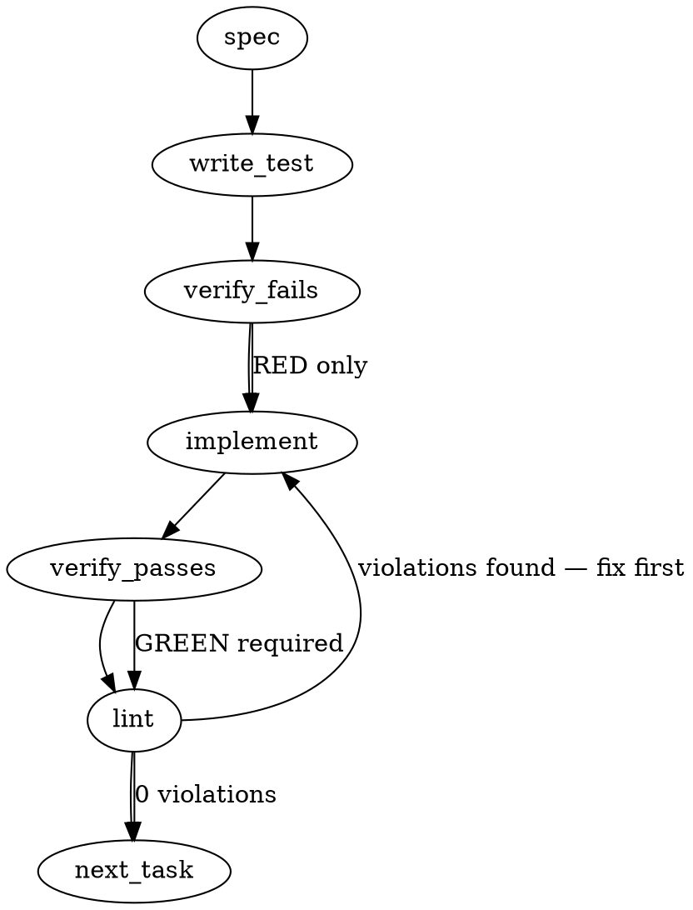

### Problem Statement

Predicate 4 of `totem gate check --event merge-ready` blocks pull requests when a HIGH bot inline comment targets the head commit, ignoring whether the finding was already formally dispositioned (e.g., resolved or declined-and-filed). Under the `strict` tier, this causes false-positive blocks on resolved/dispositioned findings that must be unlocked via a disposition-aware evaluation or an audited manual override.

### Architectural Context

- **Lesson — A declined bot finding must be excluded from lesson/rule**: Declined findings must retain their explicit disposition and surface an auditable breadcrumb instead of being silently bypassed or treated as resolved.
- **Lesson — Lock head SHA during pagination**: When fetching PR timeline items or threads to verify dispositions, we must assert that the head SHA remains unchanged to avoid race conditions against concurrent pushes.
- **Related Implementations**: The evidence verification pattern in `packages/cli/src/commands/resolve-threads.ts` provides the structural rules for thread resolution. Predicate 4 evaluation resides within `packages/core/src/merge-ready.ts`.

### Files to Examine

- `packages/core/src/merge-ready.ts` — Location of the `evaluateMergeReady` function and Predicate 4 evaluation logic.
- `packages/cli/src/commands/resolve-threads.ts` — Source of truth for bot thread detection, resolution states, and disposition patterns to reuse.
- `packages/core/test/merge-ready.test.ts` — Existing test suite for merge-ready predicate assertions.

### Technical Approach & Contracts

To address the strict gate blockage, we will implement both a **disposition-aware evaluation** (automated) and an **audited manual override** (env-controlled).

#### 1. Schema & Options Contract Updates

We must extend the `MergeReadyOptions` and the underlying payloads in `packages/core/src/merge-ready.ts` to support resolution metadata:

```typescript
export interface MergeReadyOptions {
  tier?: 'pilot' | 'strict';
  env?: NodeJS.ProcessEnv;
  now?: () => Date;
  runner?: GhRunner; // Reused for GraphQL queries if pagination/timeline fetch is needed
}

// Ensure the parsed payload schema (Zod/interfaces) extracts:
// - Thread resolution status: thread.isResolved (or thread.state === 'RESOLVED')
// - Thread resolution timestamp and actor
// - Timeline of PR comments to match disposition comments (body, author, createdAt)
```

#### 2. Sequence Logic

##### A. Disposition-Aware Check (Automated Rule)

For each HIGH inline comment targeting the head commit:

1. Identify if the comment is part of a bot-rooted thread using `isBotRootedThread` or equivalent logic.
2. If the thread is marked as `RESOLVED` (or `isResolved` is true):
   - Locate the PR-level comments or thread comments.
   - Match a comment that serves as a valid "disposition comment" (using the same pattern as `resolve-threads` evidence verification: post-dates the thread's initial comment, contains explicit disposition keywords like `DECLINED`, `FIXED`, `FOLDED`).
   - If a valid disposition comment post-dates the finding, treat this HIGH inline as **dispositioned** and do not trigger a Predicate 4 block.
   - If resolved but no matching disposition comment is found, it remains a **deny** (to prevent silent bypasses).

##### B. Audited Override Check (Manual Rule)

If the env variable `TOTEM_MERGE_READY_OVERRIDE` is set:

1. Parse the value as a GitHub Comment ID.
2. Query the PR timeline/comments for this specific Comment ID.
3. Assert that:
   - The comment exists on the evaluated PR.
   - The comment post-dates the latest target HIGH inline comment.
   - The author is a human/non-bot user.
4. If valid, log an auditable entry to `stderr` specifying the comment ID, author, and date, then bypass the Predicate 4 check.

---

### Edge Cases & Traps

- **Race Condition (Head OID drift)**: A developer might push a new commit while `totem gate check` is paginating comments.
  - _Mitigation_: Ensure the head SHA is locked and verified across all paginated Graphql requests during evaluation.
- **Silent Declines / Shadow Bypasses**: Bypassing a finding without a public trail violates strict tracking.
  - _Mitigation_: Output a structured, auditable log to stderr containing the exact comment ID and disposition payload when excluding a declined finding.
- **Spoofed Override**: A bot account setting a comment to trigger its own bypass.
  - _Mitigation_: Enforce a strict non-bot validation on the override comment's author metadata.

---

### Implementation Tasks

- [ ] **Task 1: Extend Merge-Ready Payload Schemas**
      Update the parsing structures in `packages/core/src/merge-ready.ts` to process thread resolution states (`isResolved`, `resolvedAt`) and PR timeline comments (id, body, author, createdAt).

  > TEST DIRECTIVE: Before implementing, write a failing test named `rejects_payloads_missing_thread_resolution_states` to ensure strict parsing of the new schema.
  > _Write test -> Verify fails -> Implement schema -> Verify passes -> Lint_

- [ ] **Task 2: Implement Disposition-Aware Thread Resolution Matching**
      Integrate a helper in `packages/core/src/merge-ready.ts` that matches resolved threads against a timeline of PR-level disposition comments, mirroring the rules used by `resolve-threads`.

  > TOTEM INVARIANT (Declined bot finding): A declined bot finding must be excluded from lesson/rule extraction, retain its explicit disposition, and surface an auditable breadcrumb instead of being silently treated as resolved.
  > TEST DIRECTIVE: Before implementing, write a failing test named `denies_resolved_high_bot_inline_without_subsequent_disposition_comment` proving that simply marking a thread resolved without a post-dated disposition comment still results in a deny.
  > _Write test -> Verify fails -> Implement matching -> Verify passes -> Lint_

- [ ] **Task 3: Implement Audited Override Resolution**
      Implement the environment-variable bypass check using `TOTEM_MERGE_READY_OVERRIDE`.

  > TOTEM INVARIANT (Lock head SHA during pagination): When paginating through API responses for a PR, verify the head SHA on every page against the initial read to prevent evaluating a moving target if a new commit is pushed mid-read.
  > TEST DIRECTIVE: Before implementing, write a failing test named `rejects_override_comment_authored_by_bot` to verify that bot comments cannot trigger overrides.
  > _Write test -> Verify fails -> Implement override validation -> Verify passes -> Lint_

- [ ] **Task 4: Integrate into Predicate 4 Evaluation**
      Modify Predicate 4 evaluation within `evaluateMergeReady` to skip blocking if the finding is either dispositioned-resolved or successfully overridden. Output a clear, structured JSON/text audit trail to stderr indicating why the exception was made.
      _Write integration tests (matching the three calibration scenarios from the issue) -> Verify fails -> Apply integrations -> Verify passes -> Lint_

---

### Execution Flow (structural constraint)



---

### Verification (MANDATORY — do not skip)

1. Run `totem lint` locally to assert deterministic style conformance.
2. Execute `totem review` over the diff to analyze secondary lanes.

---

### Test Plan

#### Automated Calibration Tests

Configure mocks in `packages/core/test/merge-ready.test.ts` to match the three real-world calibration PR scenarios:

1. **Scenario 1 (Declined-and-Filed)**:
   - High inline: GCA high (invalid JSON escapes)
   - State: Thread resolved, matching post-dated PR comment containing `DECLINED` / issue link.
   - Assertion: `evaluateMergeReady` returns `allow` under strict tier.
2. **Scenario 2 (Declined High with Override)**:
   - High inline: greptile P1 (exact token leak)
   - State: Thread unresolved, but `TOTEM_MERGE_READY_OVERRIDE` environment variable is present and matches a valid human PR comment.
   - Assertion: `evaluateMergeReady` returns `allow` under strict tier, with audit warning emitted to stderr.
3. **Scenario 3 (Fixed High)**:
   - High inline: gemini high (`res.faults` unguarded)
   - State: Thread resolved by a later commit's diff mapped onto the head.
   - Assertion: `evaluateMergeReady` returns `allow` under strict tier.

## Implementation Design

<!-- totem-context: appended by totem-claude on 2026-09-16 after the generated draft above; the draft proposes two arms, but the ruling of 2026-09-13 on mmnto-ai/totem#2861 chartered ONE — the disposition-aware read — so this section governs where the two disagree. The mechanism was delegated to the seat by that ruling ("the mechanism is the seat's to derive from the gate's code"), and the operator's standing greenlight of 2026-09-16 covers the build; the open questions below record the choices made on that delegation rather than block on them. -->

### Scope (2 sentences)

Predicate 4 (`high-severity-inline`) gains a DISCHARGE: a bot HIGH/Major inline whose `comment.commit.oid` is the head no longer counts as "still applying" when its thread is RESOLVED and the resolve-threads evidence rule holds on the same read — a non-bot reply after the root inside the thread, or a non-bot PR-level comment created strictly after the root. It will NOT add a comment-id override (`TOTEM_MERGE_GATE_OVERRIDE=1` stands; the draft's "option 2" is not chartered), will NOT read disposition keywords (the resolve-threads rule is deliberately keyword-free), will NOT change predicate 2 (an unresolved HIGH still denies there, so the resolve stays required), will NOT touch the severity read, and will NOT issue REST.

### Data model deltas

- **The query** (`MERGE_READY_FRAGMENT`): thread `comments(first: 10)` selects `pageInfo { hasNextPage }` and, per comment, `author { __typename login }` and `createdAt`; the PullRequest selects a fourth paginated connection `comments(first: 100, after: $commentsAfter)` with `pageInfo { hasNextPage endCursor }` and `nodes { author { __typename login } createdAt }`; `SHARED_VARS` gains `$commentsAfter: String`. The exported query's sha changes, so the three PR captures are re-captured with it (the README rule); the benign corpus is not a page capture and is untouched.
- **`ThreadEntry`** gains `rootCreatedAt: string` (read strictly — a root without a string `createdAt` is an unreadable thread), `humanReplies: number` (non-bot comments after the root within the read window) and `commentsComplete: boolean` (`!pageInfo.hasNextPage`; a comments connection with no `pageInfo` is unreadable).
- **`PrCommentEntry { isBot: boolean; createdAt: string }`** (new), read by `readPrComments` with the same strictness as `readReviews`: a missing connection, a missing `nodes` array or `pageInfo`, a node that is not an object, a non-null author without a string `__typename` and `login`, or a comment without a string `createdAt` is an unreadable page. `ReadState.prComments`, `PrPage.comments / commentsHasNext / commentsCursor` carry it across pages.
- **Bot test for an evidence comment** (`isBotAuthor`): a null author (deleted account) is NOT a bot (the reply was human when written — the resolve-threads rule, item 6 of `.totem/specs/2841.md`); otherwise `__typename === 'Bot'`, or `hasBotAppLoginSuffix(login)`, or `isBotReviewerLoginExact(login)`. `__typename` is REQUIRED for the same reason resolve-threads requires it: a document that quietly stopped selecting it would fail OPEN (every App reply reading as the human answer).
- **`Discharge`** (internal): `'in-thread-reply' | 'pr-level-disposition' | 'none' | 'unread'`. `unread` = the thread is a candidate (bot-rooted, HIGH, on head, resolved), no evidence was found, and either the comments window is incomplete or the root instant does not parse.
- **`MergeReadyProvenanceDetail.dischargedHigh: number`** (new, additive). `highInline` keeps its name and now counts the HIGHs still applying AFTER discharge — the number the calibration rows already cite.
- No new state containers, no reserved keys, no sentinel values.

### State lifecycle

Everything is per-evaluation: built inside `readPullRequest`, consumed by `evaluateMergeReady`, dropped at return. No module-level state (the override stays read per evaluation, as before).

### Failure modes

| Failure                                                                           | Category       | Agent-facing surface                                           | Recovery                                                                                                                          |
| --------------------------------------------------------------------------------- | -------------- | -------------------------------------------------------------- | --------------------------------------------------------------------------------------------------------------------------------- |
| the PR `comments` connection is missing, has no `nodes` or no `pageInfo`          | runtime (read) | UNEVALUABLE, named (strict deny / pilot warn)                  | re-run; a query drift is caught by the README query-sha test                                                                      |
| a thread comment without `createdAt`, or an author without `__typename` / `login` | runtime (read) | UNEVALUABLE, named                                             | same                                                                                                                              |
| a candidate thread's comments window is incomplete AND no evidence was found      | runtime (read) | UNEVALUABLE, named ("more replies than the read fetched")      | post the PR-level disposition (read in full, every page) or reply in-thread within the first ten comments                         |
| a candidate's root instant does not parse                                         | runtime (read) | UNEVALUABLE (folded into the same arm, named)                  | —                                                                                                                                 |
| a resolved HIGH on head with no evidence (a bare UI resolve)                      | fact           | DENY at predicate 4; the reason names the bare resolve         | post the disposition; the thread is already resolved, so the next read discharges it                                              |
| an unresolved HIGH with evidence                                                  | fact           | DENY at predicate 2 (unchanged)                                | `totem resolve-threads <pr> --apply`                                                                                              |
| the PR-level comments need more than `MAX_PAGES` pages                            | runtime (read) | UNEVALUABLE (the existing cap, shared by all four connections) | —                                                                                                                                 |
| the head moves between pages                                                      | runtime (read) | UNEVALUABLE (existing)                                         | retry                                                                                                                             |
| a non-bot trigger comment (an operator re-invoking a bot) post-dates the root     | design limit   | silent — it IS evidence, exactly as it is for resolve-threads  | disclosed in the docstring; the discharge still requires the RESOLVE, which stays the seat's deliberate act after the disposition |
| a deleted-account reply is the only evidence                                      | design         | silent — counts as human (mirrors resolve-threads)             | disclosed                                                                                                                         |

No row degrades silently into a pass: every unreadable input is the UNEVALUABLE class, and the two design limits move only the discharge of a thread a human ALSO resolved.

### Invariants to lock in via tests

- A resolved bot HIGH on head with a non-bot PR-level comment strictly after its root is discharged: predicate 4 passes, `highInline` 0, `dischargedHigh` 1, and one stderr notice names the discharge.
- The same shape with a non-bot IN-THREAD reply and no PR-level comment is discharged.
- A resolved bot HIGH on head with NO evidence still denies at predicate 4, and the reason names the bare resolve (the negative control).
- A BOT comment post-dating the root is not evidence, and a human comment PRE-dating the root is not evidence (both live in the negative control).
- An UNRESOLVED HIGH with evidence denies at predicate 2, and `highInline` still counts it: the resolve is required.
- A candidate whose comments window is incomplete and carries no evidence is unevaluable, named, at both tiers; a candidate whose evidence is found inside the window is discharged even when the window is incomplete.
- A missing PR `comments` connection is unevaluable, never "no evidence".
- PR-level evidence on the SECOND comments page is found, and the read sent `commentsAfter` with the first page's cursor.
- A deleted-account (null author) reply counts as evidence.
- Existing invariants hold unchanged: an older-commit HIGH does not deny; a null-commit HIGH is unevaluable; `commit` is read, never `originalCommit`; predicate order.
- The README's query sha equals the exported query; every fixture's sha256 matches its file; the capture / synthetic split counts are exact.
- The evidence read sends the exported query as argv and never a REST path.
- The real discharge specimen (a capture of mmnto-ai/totem#2871, calibration row) reads `highInline` 0, `dischargedHigh` 1, and lands on the UNKNOWN-mergeability arm that every merged PR reaches — the only path to that arm runs through predicates 1–4 passing.

### Open questions (answered on the delegated mechanism; recorded, not blocking)

- **Question:** what happens when a candidate thread has more than ten comments and none of the first ten is the human reply?
  **Options:** page the nested connection per thread (a second document, as resolve-threads does); name it unevaluable; raise the window to 100.
  **Recommendation (taken):** unevaluable, named. The PR-level disposition is read in full and is the charter's own path; nested paging is a fold for the day the field shows a candidate with its human reply beyond the tenth comment.
- **Question:** how is "replays as ALLOW" read on a merged PR, where GitHub answers `mergeStateStatus: UNKNOWN`?
  **Options:** a replay-only flag that skips predicate 5; read the UNKNOWN arm as the witness.
  **Recommendation (taken):** no flag. The UNKNOWN arm is reachable only when predicates 1–4 pass, so a row that moves from `deny · high-severity-inline` to `unevaluable · UNKNOWN` with `highInline` 0 and `dischargedHigh` N has replayed through predicate 4; the record says exactly that.
- **Question:** the ruling says "a posted disposition NAMING it"; the resolve-threads rule is post-dating, keyword-free.
  **Options:** a keyword or thread-id match; the resolve-threads rule.
  **Recommendation (taken):** the resolve-threads rule — the issue's option 1 names it verbatim, no deterministic reading distinguishes a disposition from other human prose, and the trigger-comment consequence is disclosed rather than hidden behind a keyword that a trigger could also carry.

### Fold 1 — after the first falsification leg (2026-09-16, deposit against `9380a041`)

The leg returned one BLOCKING, two MATERIAL and ten MINOR findings; every one is folded below or answered, and where a fold supersedes a line of the design above, this section governs.

- **f1 (BLOCKING, folded) — post-dating alone was one comment from vacuous.** With the resolve-threads rule copied verbatim, a bare UI resolve discharged whenever ANY non-bot PR-level comment followed the root, and in the field every round has several (the leg counted six human comments after the roots on mmnto-ai/liquid-city#1278). The PR-level arm now requires the disposition's own signature: a non-bot comment created strictly after the root whose body, with fenced / `<pre>` / indented code stripped, carries a line beginning `local-lane:` — the machine-rendered line every disposition posted through `/review-reply` ends with (its step 2, verbatim) and no trigger, gate-read note, merge note or bot summary does. Measured on the fourteen calibration rows before choosing it: twelve of the thirteen DENY rows' disposition comments carry the line at line start; the one that does not (mmnto-ai/totem-strategy#1331) carries it inside an inline code span mid-sentence, and the second-round disposition on mmnto-ai/liquid-city#1278 carries none. The query now selects `body` on the PR-level connection (strict: a comment without a string body is an unreadable page). Supersedes the Scope sentence's "the resolve-threads evidence rule holds" for the PR-level arm and the failure-mode row "a non-bot trigger comment … IS evidence": a trigger is no longer evidence here. The asymmetry with the verb is deliberate and disclosed in `dischargeOf`'s docstring: the verb decides whether a thread MAY be resolved; the predicate decides whether a resolved HIGH is DISPOSITIONED.
- **f2 (MATERIAL, folded) — the unread arm was a pilot-tier downgrade.** A bare-resolved HIGH whose thread had more than ten comments went to the UNEVALUABLE class, which pilot maps to `warn`, where pre-cure the same input denied at every tier. The arm is gone: a candidate with an incomplete window and no evidence in what was read is a fact-side DENY at both tiers whose reason names the window; evidence found inside the window or at PR level still discharges (f7's missing witness is now the fixture `synthetic-high-inline-discharged-window-incomplete.json`). `Discharge` loses `'unread'`; an unparseable root instant is `'none'`, as it is for the verb (f8's unreachable branch is gone). Supersedes the Data-model line for `Discharge`, the two "unevaluable" window rows in the Failure-modes table, the window invariant, and Open question 1's recommendation.
- **f3 / f4 (MATERIAL / MINOR, folded) — GitHub does not answer `UNKNOWN` for every merged PR.** mmnto-ai/liquid-city#1279 answers `DIRTY` while merged, and lands on predicate 5, not the UNKNOWN arm. The witness that predicate 4 passed is `firstFailure` reaching predicate 5 (or the UNKNOWN arm) at all — both are reachable only after predicates 1–4 return nothing — so the replay record reads each row by which of the two it reached, with `highInline` 0 and `dischargedHigh` N. Supersedes Open question 2's second sentence and the README's generalisation.
- **f5 (MINOR, folded)** — the README's 2871 bullet said "every bot thread resolved"; six of the seven are outdated and unresolved, one resolved. Corrected.
- **f6 (MINOR, folded)** — the bare-resolve clause sat after the quoted body and never survived the 160-character bound on `provenance.matched`; it now precedes the body, and the tests assert it on `matched`.
- **f9 (MINOR, folded)** — `gate-types.ts`'s detail docstring names `dischargedHigh` and `dischargedBy`.
- **f10 (MINOR, closed by f2)** — the unsettled set is no longer a third bucket; it is counted in `highInline`.
- **f11 (MINOR, folded)** — provenance carries `dischargedBy: { inThreadReply, prLevelDisposition }` and the stderr notice names both counts.
- **f12 (MINOR, question, answered in the docstring)** — the root-at-index-0 reading is a positional assumption shared with the verb and borne out by every capture, not a transcribed schema guarantee; the in-thread reply test is now temporal as well as positional (a reply counts only when its `createdAt` follows the root's).
- **f13 (MINOR, question, closed by f1)** — a removed App's `author: null` PR-level summary cannot discharge anything: it carries no disposition line. In-thread, a null author still counts as the human it was (the verb's item 6).

**Replay after the fold** (the same fourteen rows, this branch's build): the nine ruled rows and mmnto-ai/totem#2871 discharge fully; mmnto-ai/liquid-city#1279 reaches predicate 5 with `highInline` 0 / `dischargedHigh` 2; mmnto-ai/totem-strategy#1330 stays 0 / 0. Two rows now read DENY at predicate 4 on the marker: mmnto-ai/totem-strategy#1331 (both HIGHs; the disposition line rides inside prose) and mmnto-ai/liquid-city#1278 (two of five; the second-round disposition carries no line) — dispositions posted outside the template's shape, which is what the marker exists to tell apart from a click, and the record says so.

### Fold 2 — after the re-armed leg (2026-09-16, deposit against `57548351`), and the fork it names

The re-armed leg returned one BLOCKING, two MATERIAL and eight MINOR findings, and named convergence: the marker rule NARROWS the fail-open class but cannot close it, and no further marker refinement will.

- **r2-f1 (BLOCKING, NOT folded — a fork for the operator).** The PR-level arm is keyed to the ROUND, not the thread: it reads "a disposition was posted after this finding", never "this finding was dispositioned". A HIGH rooted before a round's disposition that the disposition did not address is discharged if someone then resolves it by hand — the leg constructed it: two bare resolves discharged by a comment that says in words it did not address them. The ruling's letter ("a posted disposition NAMING it") needs a thread-level linkage the read can see, and none exists in today's disposition comments (the tables name findings in prose; no thread or root-comment id; no in-thread reply on any GCA thread, by the bot-protocols rule). The two closures the leg names — a machine-rendered per-thread line in the disposition (a template change to review-reply step 2, e.g. one `disposition: <rootCommentId> <verb>` line per bot thread, which the gate then requires to name THIS thread's root), or requiring the in-thread reply arm alone with `totem resolve-threads` taught to post it — both fail the ruled acceptance on the historic calibration rows, which carry neither. So the ruling's letter and the ruling's acceptance cannot both hold under today's disposition shape; which to amend is the operator's ruling. The code and the changeset now disclose the round-level linkage as an open limit rather than a closed one (the fold-1 wording "reads the disposition's own signature" had over-claimed).
- **r2-f2 (MATERIAL, folded)** — the stripper rejected a well-formed disposition: the skills render the line inside a text fence, and mmnto-ai/totem-strategy#1330's disposition carries it that way. `carriesDispositionLine` now reads the raw body with HTML comments removed, at line start, fenced included; a blockquoted, listed, tabled or inline-span line does not count. The predicate is exported and the tests assert through it (r2-f8) with a shape matrix.
- **r2-f3 (MATERIAL, folded)** — the deny reason asserted "no disposition on record" where a disposition existed without the line (a shape review-reply step 1 sanctions: "there is none to carry"). The reason now names the line it looked for: "no non-bot reply in its thread and no PR-level comment after its root carrying the review-reply local-lane line (a bare resolve, or a disposition without the line, does not discharge a HIGH)". The changeset and docstrings say the line is the disposition's usual shape, not a guarantee.
- **r2-f4 / r2-f5 (MINOR, folded)** — the "sole path" and "never carries" claims are restated as the cohort measurement they were; tabs and deeper indents count now that no code stripper runs first.
- **r2-f6 (MINOR, answered)** — a null-author PR-level comment carrying the line does discharge; the fold-1 f13 answer was about content, not a guard. Recorded as not guarded, judged unreachable (an App's summary carries no line).
- **r2-f7 (MINOR, answered)** — the discharged-window fixture pins an invariant both revisions hold and kills the completeness-before-evidence mutant; its role says so.
- **r2-f9 / r2-f10 / r2-f11 (MINOR, folded)** — the root-first claim rests on one capture, said so; the negative control's role lists its five PR-level nodes and marks the `[bot]`-suffixed User node as a counterfactual shape; the README's instants sentence counts seven at the first stamp, three at the second, one created.

**Replay after fold 2:** unchanged from fold 1 (the accepted fenced line touches no calibration row's HIGH-on-head set): the nine ruled rows, mmnto-ai/totem#2871 and mmnto-ai/liquid-city#1279 through predicate 4 at `highInline` 0; mmnto-ai/totem-strategy#1331 and the second round of mmnto-ai/liquid-city#1278 at DENY with the reason now naming the line.

**The fork, stated for the ruling.** Option A — ship the round-level read as it stands (marker plus post-dating), with the residual disclosed: a bare resolve of a HIGH the round's disposition did not address is discharged; the acceptance holds as recorded. Option B — thread-level linkage: review-reply step 2 emits one machine line per dispositioned bot thread naming its root comment id, and the PR-level arm requires the line that names THIS thread; the acceptance is then re-run by posting such lines on the merged calibration PRs (three seats, twelve PRs, on the operator's word) or amended to the rows dispositioned under the new shape. The seat's recommendation is B: it is what "naming it" means, both legs converged on "no marker refinement closes the class", and the template change is one paragraph beside the line the template already renders.

### Fold 3 — the ruling (2026-09-16, the operator: "go with your recommendation"): thread-level linkage

The fork of Fold 2 is ruled for Option B. The PR-level arm now reads a line that NAMES the thread, and the round-level `local-lane:` read is gone.

- **The line.** `disposition: <root comment id> <verb>` — one per bot-rooted thread the round answered, on its own line (fenced or not; leading blanks allowed; an HTML comment does not count; a blockquoted, listed, tabled or inline-span line is not at line start). The id is the thread root's REST comment id (`databaseId` in GraphQL; the `id=` on a `totem resolve-threads` dry-run row; the `rootCommentId` `totem triage-pr` prints). The verb is the round's word for it (fixed / declined / deferred / nit / extracted / held); the gate reads the id and does not validate the verb. `dispositionedRootIds(body)` is exported and the tests assert through it.
- **The gate.** The query selects `databaseId` on every thread comment (strict: a root without a safe-integer id is an unreadable thread); `ThreadEntry.rootId`; `PrCommentEntry.dispositions` (the ids the body names); `dischargeOf`'s PR-level arm requires a non-bot comment created strictly after the root whose `dispositions` include this thread's `rootId`. The in-thread arm is unchanged. The deny reason quotes the exact line the read looked for, with the thread's own id, ahead of the finding. The r2-f1 counterexample (a later round's disposition naming another thread, then a bare resolve) is now the negative control's fifth PR-level node, and it denies.
- **The template.** `review-reply` step 2 ends the round disposition with the lines (one per bot-rooted thread the round answered), after the per-item prose and before the `local-lane:` line. The paragraph lands on this branch after mmnto-ai/totem#2876 merges, because both edit the same template line; until then the contract lives in the gate's docstring and this record.
- **The acceptance, re-run under B.** Every calibration row reads DENY at predicate 4 until a per-thread line naming its resolved HIGHs is posted on the merged PR; the seat posted its two (mmnto-ai/totem#2871 comment 5691027142, mmnto-ai/totem#2855 comment 5691027296) and dispatched the ids for the other eleven rows to strategy-claude (three rows) and lc-claude (eight rows) at 02:19Z. Replay on this build: mmnto-ai/totem#2855 and mmnto-ai/totem#2871 discharge (`highInline` 0, `dischargedHigh` 1 by the PR-level arm each); mmnto-ai/totem-strategy#1330 stays 0 / 0; the other eleven read DENY with the reason naming the id each is waiting on. The replay on the issue is re-read and re-recorded as the seats' lines land. mmnto-ai/totem#2871's capture was re-taken after the line was posted and is the real discharge specimen under B.
- **What this closes.** Both legs' blocking findings (post-dating alone; the round marker): a disposition can no longer discharge a thread it did not name. The trigger-comment, gate-read-note and merge-note classes stay non-evidence by construction. The fenced-quotation residue of Fold 2 shrinks to "a quotation re-names the ids the original named" — it can add no thread the original disposition did not address.
- **Not in this fold.** `totem resolve-threads` is unchanged (it decides whether a thread MAY be resolved; the per-thread line is the seat's assertion of what it dispositioned). A `resolve-threads` dry run that prints a ready-made block of `disposition: <id> <verb>` lines for the seat to fill is a follow-on the template's step 4 could grow; not built here.
