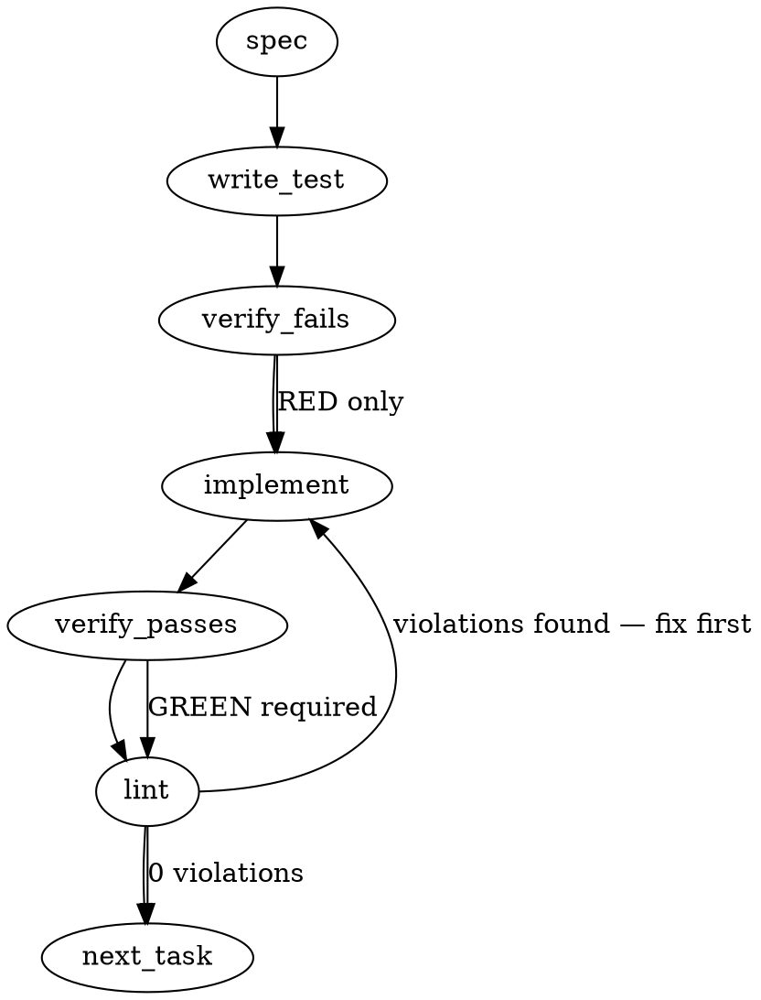

### Problem Statement

The `sync-labels-forms.test.ts` dry-run suite times out at the package-level 15 s limit on loaded macOS CI runners. This failure is caused by the overhead of 9 sequential `pwsh` cold-starts spawning against a `gh` stub under high runner load.

### Architectural Context

- `packages/cli/vitest.config.ts` configures a package-wide test timeout of 15 seconds for non-Windows platforms: `const TEST_TIMEOUT_MS = process.platform === 'win32' ? 30_000 : 15_000;`.
- Integration and contract test suites in the CLI package that spawn heavy subprocesses (e.g., `gemini-sessionstart-contract.test.ts`, `sessionstart-manifest-contract.test.ts`) override the Vitest default timeout to `30_000` or `90_000` on specific tests or suites.
- The `scripts/sync-labels.ps1 dry run` suite executes real PowerShell (`pwsh`) command invocations via `spawnSync` against a mock `gh` stub on the test's virtual PATH. Each invocation takes up to a few seconds to boot PowerShell and process the script, meaning 9 sequential tests can easily exceed 15 seconds on a loaded CI runner.

### Files to Examine

- `packages/cli/src/commands/sync-labels-forms.test.ts` — The test suite containing the `scripts/sync-labels.ps1 dry run` tests that time out under macOS CI.
- `packages/cli/vitest.config.ts` — The CLI package-level Vitest configuration where the default `testTimeout` of 15,000ms is defined.

### Technical Approach & Contracts

- **Recommended Approach:**
  Define a suite-specific timeout constant and pass it as the third parameter to the suite-level `describe.skipIf(!PWSH_PRESENT)` block in `sync-labels-forms.test.ts`. This applies the increased timeout limit specifically to the PowerShell dry-run tests without modifying the global package-level vitest timeout of 15s.

  ```typescript
  const DRY_RUN_TIMEOUT_MS = 60_000;

  describe.skipIf(!PWSH_PRESENT)(
    'scripts/sync-labels.ps1 dry run',
    () => {
      // ...
    },
    DRY_RUN_TIMEOUT_MS,
  );
  ```

- **Trade-offs of Alternative Approaches:**
  - _Option 2 (Serializing / Pool Overrides):_ Since Vitest already runs test cases within a single file sequentially by default, explicit serialization within the file (`describe.sequential`) doesn't reduce execution time. Overriding the pool globally or for the file is overly complex and might disable parallel worker threads for unrelated suites.
  - _Option 3 (Starting one persistent `pwsh` process):_ Highly complex, brittle, and introduces severe test-isolation risks. Each test case sets custom environment variables (e.g., `TOTEM_GH_STUB_FAIL`, `TOTEM_GH_STUB_ISSUES`) to configure the stub's mock behavior. Modifying the environment and resetting state within a single active process requires extensive shell plumbing and makes the test harness hard to maintain.

### Edge Cases & Traps

- **Vitest configuration overrides:** Do not raise the package-level `testTimeout` in `packages/cli/vitest.config.ts`. Keep a tight 15s feedback loop for standard unit/integration tests that do not spawn external processes. The override must remain scoped strictly to the `scripts/sync-labels.ps1 dry run` suite.
- **PowerShell Availability Check:** The suite-level `describe.skipIf(!PWSH_PRESENT)` gate must remain intact. If `pwsh` is not present, the suite is skipped cleanly.
- **Platform Invariance:** Ensure the timeout override works identically on Windows, Linux, and macOS platforms. Since Windows already had a 30s budget, a 60s suite-specific timeout will apply universally to this suite across all platforms, which is safe and desirable.

### Implementation Tasks

- [ ] **Task 1: Define Timeout Constant and Apply to Suite**
      Define `DRY_RUN_TIMEOUT_MS = 60_000` in `packages/cli/src/commands/sync-labels-forms.test.ts` and pass it to the suite `describe` block.
  - Files to modify: `packages/cli/src/commands/sync-labels-forms.test.ts`
  - Invariant constraint:
    > TOTEM INVARIANT (dry-run-timeout): Do not alter the global package testTimeout in vitest.config.ts. The timeout override must be scoped to the dry-run suite.
  - Steps:
    1. Open `packages/cli/src/commands/sync-labels-forms.test.ts`.
    2. Define `const DRY_RUN_TIMEOUT_MS = 60_000;` before the dry-run `describe` block.
    3. Update the `describe.skipIf(!PWSH_PRESENT)('scripts/sync-labels.ps1 dry run', ...)` call to pass `DRY_RUN_TIMEOUT_MS` as the third parameter.
    4. Run `pnpm test` on the file to verify syntax and compilation are clean.

### Execution Flow (structural constraint)



### Verification (MANDATORY — do not skip)

Every implementation MUST end with these steps:

1. `totem lint` — deterministic rule check (zero LLM, ~2s). Fixes any violations.
2. `totem review` — supplementary AI lanes over the diff (~18s, advisory). Address critical findings; your team's review discipline decides the review of record.
3. If using MCP, call `verify_execution` to confirm compliance before declaring the task done.

### Test Plan

1. **Local Suite Execution:** Run `pnpm vitest run packages/cli/src/commands/sync-labels-forms.test.ts` to ensure that all tests within the file (both the forms-to-canon assertions and the dry-run spawns) compile, execute, and pass successfully.
2. **Timing & Budget Audit:** Verify that each individual test case under the `scripts/sync-labels.ps1 dry run` suite executes under the custom 60-second limit and prints the timing output successfully.

### Amendment (falsification review, 2026-09-21)

This spec was generated from the issue body before its fourth exhibit landed (issue comment of 2026-09-20T22:12Z): PR mmnto-ai/totem#2902 at `3c6cdad1`, run 35485250867, `Build & Lint (windows-latest)`, one row of `packages/cli/src/commands/review-fan.test.ts` failing with `Hook timed out in 10000ms` at the block's `beforeEach` (line 2275: one `mkdtempSync` and eight `git` spawns). That exhibit is the same class at a different limit — vitest's `hookTimeout` is a separate 10 s default that no config in the workspace set — so the build carries a second task the original spec did not name:

- [x] **Task 2: `hookTimeout` rides the same platform floor as `testTimeout`.** All six workspace `vitest.config.ts` files (cli, core, mcp, pack-agent-security, pack-agent-workflow, pack-rust-architecture) set `hookTimeout: TEST_TIMEOUT_MS` (30 s on win32, 15 s elsewhere). `testTimeout` is unchanged in every one of them, so the invariant above holds as written; restated: do not raise `testTimeout`, and `hookTimeout` rides the same platform floor. Precedent: mmnto-ai/totem#2608 raised one mcp hook to 30 s by hand for the same class.

Two corrections to the record the build carries: the three macOS exhibits hit two distinct rows (A, B, A per the issue's table), not three; and Task 1 shipped as the equivalent `describe(name, options, fn)` form — `const DRY_RUN_ROW_BUDGET = { timeout: 60_000 }` passed as the suite's options — rather than a third positional number, because prettier's rendering of the positional form re-indented the whole suite body.
