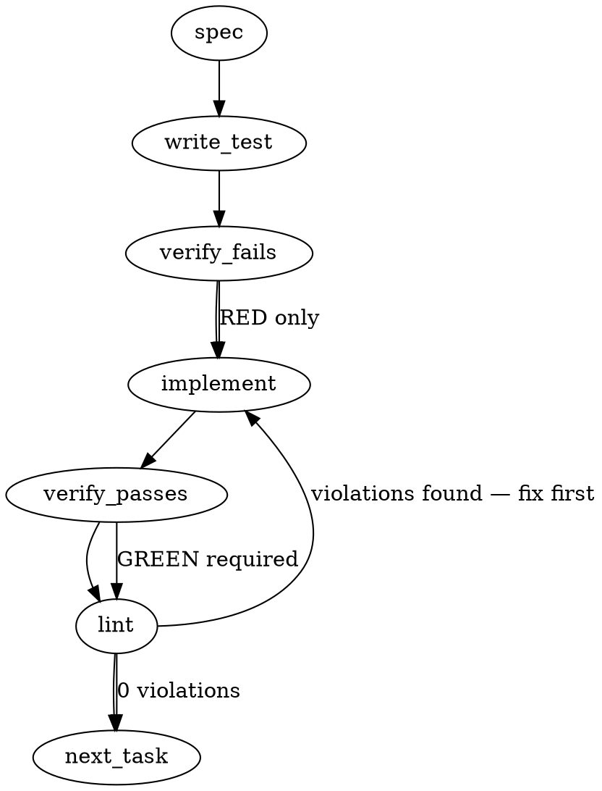

### Problem Statement

The distributed `review-reply` skill template contains a bare command `pnpm totem triage-pr $ARGUMENTS` that depends on `pnpm`'s ambient bin-fallback resolution. On Windows systems, this falls back to a `.cmd` shim which triggers an empty terminal command banner instead of running the CLI binary, requiring a transition to robust, non-fallback commands like `pnpm exec totem` or a direct Node entry path.

### Architectural Context

- **ADR-072 / Tenet 14:** Never tie governance or runtime behaviors to volatile ambient system state.
- **Skill Distribution System:** Managed by `totem init`, which writes canonical templates to `.claude/skills/<name>/SKILL.md` and `.agents/skills/<name>/SKILL.md` and asserts exact parity inside `packages/cli/src/commands/init.test.ts` to prevent template drift.
- **Relevant Lesson — Use pnpm exec for workspace binaries in monorepos:** Use `pnpm exec` instead of `pnpm bin` (or bare bin fallbacks) when executing binaries within monorepos or Turborepo environments to ensure proper package and path resolution across all host platforms (especially Windows).

### Files to Examine

- `packages/cli/src/commands/init-templates.ts` — Contains the `REVIEW_REPLY_SKILL_CONTENT` constant, which serves as the canonical source template.
- `.claude/skills/review-reply/SKILL.md` — The rendered Claude-agent skill file checked into source control.
- `.agents/skills/review-reply/SKILL.md` — The rendered vendor-neutral twin skill file checked into source control.
- `packages/cli/src/commands/init.test.ts` — The unit tests containing strict byte-copy identity locks verifying that the embedded template strings match the checked-in files exactly.

### Technical Approach & Contracts

1. **Command Replacement:** In the `REVIEW_REPLY_SKILL_CONTENT` template string and both `.md` files, replace:
   ```bash
   pnpm totem triage-pr $ARGUMENTS
   ```
   with:
   ```bash
   pnpm exec totem triage-pr $ARGUMENTS
   # or, if in a workspace checkout: node packages/cli/dist/index.js triage-pr $ARGUMENTS
   ```
2. **Byte-for-Byte Synchronization:** Ensure that all three locations (the template constant in TypeScript and the two Markdown files) are modified with exact byte-parity.
3. **Validation of Synchronization:** The unit tests in `init.test.ts` enforce that any change to the template string matches the checked-in Markdown files verbatim. Running Vitest over `packages/cli/src/commands/init.test.ts` will verify that the locks are preserved or updated correctly.

### Edge Cases & Traps

- **Whitespace / Line Ending Discrepancies:** Windows vs Unix line endings (`\r\n` vs `\n`) can easily break the template lock tests in CI. Ensure Unix line endings (`\n`) are preserved inside both Markdown files and template string constants.
- **Dormant Lint Violations (totem lint):** When modifying the constant in `init-templates.ts`, ensure no dormant rules are violated. Any changed lines will be evaluated against active linter checks.
- **Missing or Incomplete Test Updates:** Changes to `init-templates.ts` might break other tests that assert the substring structure or length of `REVIEW_REPLY_SKILL_CONTENT`. All assertions in `init.test.ts` must be verified.

### Implementation Tasks

- [ ] **Task 1: Update the Skill Template Constant**
      Modify `packages/cli/src/commands/init-templates.ts` to replace the fallback invocation with the robust `pnpm exec` and direct Node forms.

  > TOTEM INVARIANT (Use pnpm exec for workspace binaries in monorepos): Use `pnpm exec` instead of `pnpm bin` when checking for or executing binaries that might be internal workspace packages.
  - Locate `REVIEW_REPLY_SKILL_CONTENT` in `packages/cli/src/commands/init-templates.ts` near line 3604.
  - Update `pnpm totem triage-pr $ARGUMENTS` to `pnpm exec totem triage-pr $ARGUMENTS` with the Node path variant on the subsequent line.
  - write test (or update existing) → verify fails → implement → verify passes → lint

- [ ] **Task 2: Sync Rendered Markdown Skill Files**
      Update the checked-in copy of the skill files to match the updated constant.
  - Locate `.claude/skills/review-reply/SKILL.md` and `.agents/skills/review-reply/SKILL.md`.
  - Apply the exact same command replacement inside the Phase 1 bash code block in both Markdown files.
  - write test (or update existing) → verify fails → implement → verify passes → lint

- [ ] **Task 3: Run Parity and Regressions Verification**
      Run all template and skill verification tests to confirm complete parity across targets.
  > TOTEM INVARIANT (Maintain reporting symmetry across targets): When a command accounts for the same item on several roots (a distributed skill on `.claude/skills/` and `.agents/skills/`), verify its integrity across both roots uniformly.
  - Run the `init.test.ts` suite via Vitest to confirm `REVIEW_REPLY_SKILL_CONTENT matches .claude/skills/review-reply/SKILL.md` and `every DISTRIBUTED_CLAUDE_SKILLS constant matches its .agents/skills byte-copy`.
  - write test (or update existing) → verify fails → implement → verify passes → lint

### Execution Flow (structural constraint)



### Verification (MANDATORY — do not skip)

Every implementation MUST end with these steps:

1. `totem lint` — deterministic rule check (zero LLM, ~2s). Fixes any violations.
2. `totem review` — supplementary AI lanes over the diff (~18s, advisory). Address critical findings; your team's review discipline decides the review of record.
3. If using MCP, call `verify_execution` to confirm compliance before declaring the task done.

### Test Plan

- **Template Identity Lock (Vitest):** Run `packages/cli/src/commands/init.test.ts` to assert that the changed `REVIEW_REPLY_SKILL_CONTENT` matches `.claude/skills/review-reply/SKILL.md` exactly.
- **Agent Twin Sync Lock (Vitest):** Assert that the `review-reply` entry under `.agents/skills/review-reply/SKILL.md` matches the template constant byte-for-byte.
- **Cross-Platform Verification (Manual/CI):** Confirm that the template string resolves safely across shell environments without triggering command shell banners.
