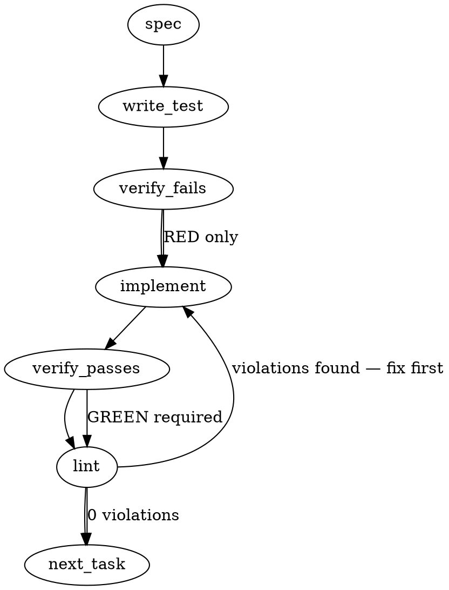

### Problem Statement

The `@mmnto/cli`, `@mmnto/totem` (`packages/core`), and `@mmnto/mcp` packages do not expose their `package.json` file in their `exports` maps. This causes Node.js module resolution to throw `ERR_PACKAGE_PATH_NOT_EXPORTED` on calls like `require('@mmnto/cli/package.json')`. We must add `"./package.json": "./package.json"` to their exports maps, establish an automated lock test, and add a patch changeset.

### Architectural Context

- **In-repo Precedent:** `packages/pack-rust-architecture/package.json` already defines `"./package.json": "./package.json"` within its exports map.
- **Related Issue:** This is a sibling to `mmnto-ai/totem#2851` which addresses exports maps with import/require conditions. The changes here are strictly additive subpaths and must not alter existing conditions.
- **Relevant Lessons:** None found in provided context.

### Files to Examine

1. `packages/pack-rust-architecture/package.json` — Reference package showing correct `./package.json` export.
2. `packages/cli/package.json` — Target to update (`@mmnto/cli`). Currently exports `.` only.
3. `packages/core/package.json` — Target to update (`@mmnto/totem`). Currently exports several subpaths but lacks `./package.json`.
4. `packages/mcp/package.json` — Target to update (`@mmnto/mcp`). Currently exports `.` only.

### Technical Approach & Contracts

We will modify the three target package manifests to map `./package.json` to `./package.json`.

#### Target Contracts (`package.json` structures)

##### 1. `@mmnto/cli` (`packages/cli/package.json`)

Convert the current string-based export to an object format:

```json
"exports": {
  ".": "./lib/index.js",
  "./package.json": "./package.json"
}
```

##### 2. `@mmnto/mcp` (`packages/mcp/package.json`)

Convert the current string-based export to an object format:

```json
"exports": {
  ".": "./dist/index.js",
  "./package.json": "./package.json"
}
```

##### 3. `@mmnto/totem` (`packages/core/package.json`)

Append the key to the existing object exports mapping:

```json
"exports": {
  ".": {
    "import": "./lib/index.js"
  },
  "./package.json": "./package.json",
  "./package.json-and-other-subpaths": "..."
}
```

#### Lock Test Verification

We will implement an automated lock test using the shared helper `readJsonSafe`. The test will look up the workspace packages dynamically or statically, asserting that all three target packages explicitly export `./package.json` mapping to `./package.json`.

_Trade-offs:_

- _Option A:_ Hardcode the list of package files inside the test.
- _Option B:_ Automatically scan the workspace for public packages and assert they all have it.
- _Recommendation:_ Option B is strongly recommended to prevent future workspace packages from regressing on this standard.

### Edge Cases & Traps

1. **Destructive String-to-Object Conversion:** When converting standard exports from a string (e.g. `"exports": "./lib/index.js"`) to an object configuration (e.g. `"exports": { ".": "./lib/index.js", ... }`), ensure that the original main entrypoint path `.` is precisely retained without regression.
2. **Key Ordering & Formatting:** Node.js resolves exports sequentially. Ensure that `"./package.json"` is placed cleanly alongside other subpaths. Also, avoid formatting or indentation differences that trigger linting errors on package manifest edits.
3. **Private Package Scope:** Private workspace packages (`pack-agent-*`) are explicitly out of scope and should be bypassed by the lock test.

### Implementation Tasks

- [ ] **Task 1: Implement the Lock Test**
  - Create the lock test file `packages/core/src/exports-lock.test.ts`.
  - Use the `readJsonSafe` shared helper to resolve and read the manifest files for `packages/cli/package.json`, `packages/core/package.json`, and `packages/mcp/package.json`.
    > TEST DIRECTIVE: Before implementing, write a failing test named `asserts package exports contain self-referential package json path` that proves the regression is caught.
  - Run the test suite to verify it fails on all three packages with missing exports.

- [ ] **Task 2: Add exports mapping to @mmnto/cli**
  - Modify `packages/cli/package.json` to change `"exports": "./lib/index.js"` (or current entry point) to an exports map object containing `.` and `./package.json`.
  - Run the lock test from Task 1 to verify that `@mmnto/cli` now passes, while the other two still fail.
  - Verify formatting and run lint.

- [ ] **Task 3: Add exports mapping to @mmnto/totem**
  - Modify `packages/core/package.json` to include `"./package.json": "./package.json"` in its `exports` map object.
  - Run the lock test from Task 1 to verify that `@mmnto/totem` now passes.
  - Verify formatting and run lint.

- [ ] **Task 4: Add exports mapping to @mmnto/mcp**
  - Modify `packages/mcp/package.json` to change `"exports": "./dist/index.js"` (or current entry point) to an exports map object containing `.` and `./package.json`.
  - Run the lock test from Task 1 to verify that all target packages now pass the exports assertion.
  - Verify formatting and run lint.

- [ ] **Task 5: Create Changeset File**
  - Create a changeset markdown file at `.changeset/add-package-json-exports.md` with the following content:

    ```markdown
    ---
    '@mmnto/cli': patch
    '@mmnto/totem': patch
    '@mmnto/mcp': patch
    ---

    Expose `./package.json` subpath in exports map to allow direct package manifest resolution via Node.js require/import.
    ```

  - Run verification and lint commands.

### Execution Flow (structural constraint)



### Verification (MANDATORY — do not skip)

Every implementation MUST end with these steps:

1. `totem lint` — deterministic rule check (zero LLM, ~2s). Fixes any violations.
2. `totem review` — supplementary AI lanes over the diff (~18s, advisory). Address critical findings; your team's review discipline decides the review of record.
3. If using MCP, call `verify_execution` to confirm compliance before declaring the task done.

### Test Plan

1. **Unit Verification (Lock Test):** `packages/core/src/exports-lock.test.ts` will explicitly load the package files and assert:
   ```typescript
   expect(manifest.exports).toBeDefined();
   expect(manifest.exports['./package.json']).toBe('./package.json');
   ```
2. **Integration Verification:** Execute target resolutions using Node.js to guarantee the exact error reported in the issue is resolved:
   - `node -e "require('./packages/cli/package.json').version"`
   - `node -e "require('./packages/core/package.json').version"`
   - `node -e "require('./packages/mcp/package.json').version"`
     All three commands must execute cleanly and return the version without throwing `ERR_PACKAGE_PATH_NOT_EXPORTED`.
