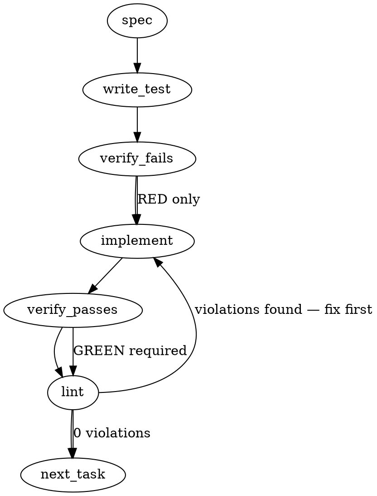

### Problem Statement

The human-readable output of `totem mail` lists unread dispatches by their basename, sender, and subject, but fails to show their resolved file paths. This forces users to manually search outboxes (potentially exposing other seats' private/blind round dispatches). The command needs to print the resolved path for each unread dispatch inline, and/or clarify how to obtain the `filePath` via `totem mail --json` in the listing footer.

### Architectural Context

- **Lesson — totem mail mark does not resolve the bare filename**: Points out that `totem mail mark` fails with `ENOENT` when given bare basenames, requiring the full `filePath` from `totem mail --json`. Showing the resolved `filePath` directly in the human list prevents this friction entirely.
- **Goal**: Address the blind round disclosure hazard (liquid-city lesson `3e412e8d`) where operators browsing outboxes manually bypass the "blindness" rule constraint.

### Files to Examine

- `packages/cli/src/commands/mail.ts` — Contains the implementation of the `totem mail` CLI command, listing format logic, and option parsers.
- `packages/cli/src/commands/mail.test.ts` (or sibling test file) — Test suite for verifying the mail listing format and command flags.

### Technical Approach & Contracts

We will implement **Option B** (printing the resolved path under or alongside each item) and include a concise reference in the footer. This solves both discoverability and the specific "bare filename" resolution trap.

#### Contract Changes

The data interfaces inside `packages/cli/src/commands/mail.ts` (or imported core mail types) already carry `filePath`. We must modify the human listing block to format this property.

Example output structure update:

```typescript
// Existing output structure:
// <subject> (from <sender>)
//
// Proposed output structure:
// - [<sender>] <subject>
//   Read: <filePath>
```

#### Steps

1. Locate the formatting block for the default/human output inside `packages/cli/src/commands/mail.ts`.
2. For each unread dispatch, output its `filePath` (or a repo-relative path if absolute paths risk leaking local directory structures).
3. Append a footer line to the listing if unread dispatches exist: `(read with: totem mail --json to access the raw "filePath" field)`.
4. Ensure the `--json` serialization pathway is left entirely untouched.

---

### Edge Cases & Traps

1. **Absolute vs. Workspace-Relative Paths**: Exposing absolute paths (e.g., `/Users/username/work/...`) in CLI output is a minor security/privacy leak and reduces copy-paste friendliness across different environments. The path should be printed relative to the repository root (using `resolveGitRoot` or relative to the current working directory).
2. **Terminal Colorization**: Ensure that when printing the path, it is formatted consistently with the CLI color scheme (e.g., dim or cyan sub-headers) and doesn't break color-blind accessibility or piped non-TTY stdout.
3. **Empty Mailboxes**: The footer or individual paths must not render if there are zero unread dispatches.

---

### Implementation Tasks

- [ ] **Task 1: Inspect and Prepare CLI Environment**
  - Read `packages/cli/src/commands/mail.ts` and its test suite.
  - Locate the exact string-builder or print statement rendering human-readable mail listings.

- [ ] **Task 2: Add Failing Tests for Human Listing Paths**

  > TEST DIRECTIVE: Before implementing, write a failing test named `should_include_resolved_filepath_in_human_listing` that proves the terminal output contains the exact relative or absolute path of each unread mail item.
  > TEST DIRECTIVE: Before implementing, write a failing test named `should_include_json_instruction_in_footer` that proves the human-readable footer contains reference to `totem mail --json`.

- [ ] **Task 3: Implement Path Rendering and Footer**
  - Modify `packages/cli/src/commands/mail.ts` to output the `filePath` indented under each item.
    > TOTEM INVARIANT (totem mail mark does not resolve the bare filename): The path displayed must be the exact path usable by the file reader or `totem mail mark` (or easily copy-pastable relative to repository root), resolving any bare-name ambiguity.
  - Add the footer clarification text to the bottom of the human listing output.
  - Run tests and verify they now pass.

- [ ] **Task 4: Guarantee JSON Output Integrity**
  > TEST DIRECTIVE: Before implementing, write a failing test named `should_leave_json_output_entirely_unmodified` that asserts the schema and key/value output structure of `totem mail --json` remains absolutely identical to its previous version.
  - Verify that the `--json` option handler is completely bypassed by the human-formatting changes.
  - Run lint and all CLI unit tests.

### Execution Flow (structural constraint)



### Verification (MANDATORY — do not skip)

Every implementation MUST end with these steps:

1. `totem lint` — deterministic rule check (zero LLM, ~2s). Fixes any violations.
2. `totem review` — supplementary AI lanes over the diff (~18s, advisory). Address critical findings; your team's review discipline decides the review of record.
3. If using MCP, call `verify_execution` to confirm compliance before declaring the task done.

### Test Plan

- **Integration Test**: Run `totem mail` with a mock outbox containing at least one unread message. Verify stdout contains the item's `filePath` and the `--json` instruction footer.
- **Regression Test**: Run `totem mail --json` on the same mock outbox and assert the output matches the exact JSON schema without any extra footer string injection or schema changes.

---

## Correction (totem-claude, 2026-09-21, before implementation)

<!-- totem-context: the generated spec above is the committed preflight artifact; this block names where it is wrong against source and what was not followed, the device the mmnto-ai/totem#2896 and mmnto-ai/totem#2917 specs used -->

- **False premise, the existing shape.** The listing does not render `<subject> (from <sender>)`. At b3373d9a `formatTextResult` (`packages/cli/src/commands/mail.ts`) renders two lines per item, `  - <file> (from <from> @ <repo>, to: <to>)` and `      subject: <subject>`, in two arms (the directed listing and the identity-gated broadcast listing).
- **Not followed, the footer.** The issue offers either arm; with the path under every item a footer naming `--json` is redundant. No footer is added.
- **Not followed, a repo-relative path.** A dispatch lives in the SENDER's outbox in a sibling repository of the workspace, so a path relative to the reader's repo root is meaningless and one relative to cwd is not copy-pastable across shells. The line renders the absolute `filePath` verbatim, the string `--json` has always emitted, so it discloses nothing the `--json` arm did not already, and it is exactly what `totem mail mark` takes (lesson-296c72de).
- **Not followed, colorization.** `formatTextResult` is a plain-text renderer; every existing line is uncolored. The new line matches.
- **Not applicable, the `should_leave_json_output_entirely_unmodified` directive.** The `--json` item shape is already locked by a `toEqual` over the full item list (`mail.test.ts`, the sort + metadata suite); the change touches only the text renderer, so the existing lock is the regression test.
- **Followed.** A test written first and RED on the previous renderer, the path under every item in both arms, the empty-inbox arms untouched, lint and the review lanes before the push.
