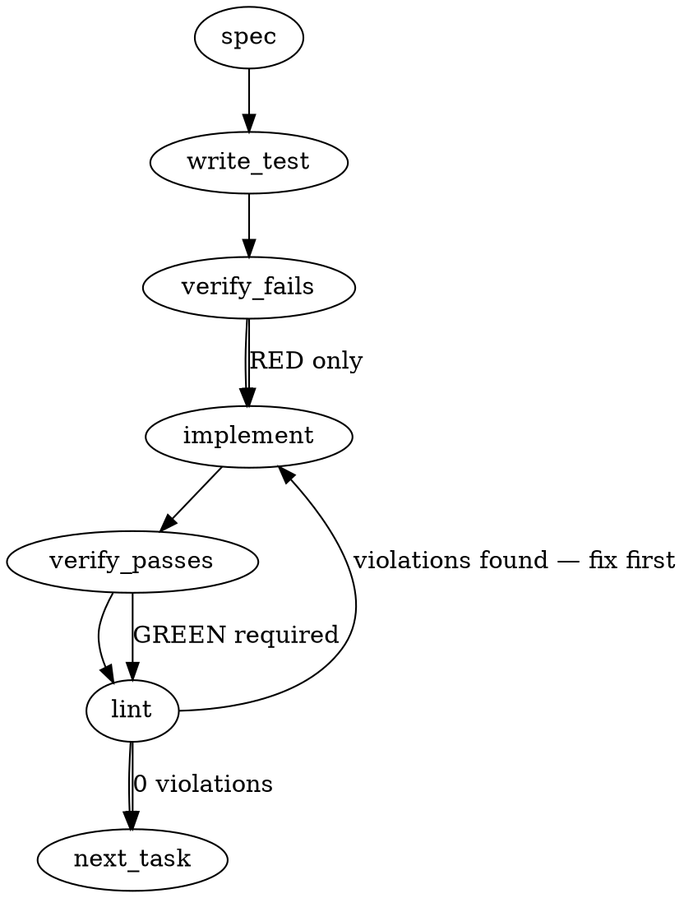

### Problem Statement

We need to implement a derived-parity sensor (`totem doctor --skills`) to detect cohort-wide drift in agent skills/hooks, alongside defining the underlying canonical data contracts that will power the future `totem <noun> install` distribution mechanism. The implementation must distinguish between intentional divergence ("feature-lead") and accidental staleness, and handle multiple vendor substrates (e.g., Claude, Gemini) without forcing a strict failure on mismatch.

### Architectural Context

- **ADR-038 & Tenet 16 (Generalize AGENTS.md model):** Skills are cross-vendor concepts, but their instantiated files are vendor-shaped. Code must check `.claude/skills/*` and `.gemini/skills/*`, never assuming Claude Code is the sole target.
- **Sensor, not gate (Issue #448 / Enforcement Model):** `totem doctor --skills` is a sensor. Skill drift must warn/report rather than exit with code `1`, as blocking maintenance for skill staleness violates the core enforcement doctrine.
- **Packs cannot carry hooks (Inventory Finding):** Totem rules map to packs, but skills and hooks are thin parameterized shims placed in consumer repo roots. We must not attempt to distribute skills via the pack loader.
- **Bimodal Drift Resolution:** The cohort has a mix of intentional feature-leads and accidental staleness. We must introduce frontmatter or HTML comment pragmas (`<!-- totem-skill-fork -->`) to distinguish these states.

### Files to Examine

1. `packages/cli/src/commands/doctor.ts` (Assumed) — The target location for injecting the `--skills` flag and parity check.
2. `packages/cli/src/commands/init.ts` — Review `installClaudeHooks` for prior art on interacting with `.claude` directories.
3. `packages/cli/src/commands/install-hooks.ts` — Review `buildPrePushHook` to understand how thin shims are currently parameterized and written.

### Technical Approach & Contracts

**1. Bimodal Drift Pragma Strategy**
Since strict content hashing creates false positives (e.g., a user adding a newline), and we need to differentiate staleness from intentional forks, we will rely on HTML comment pragmas embedded within the markdown skill files:

- `<!-- totem-skill-version: 1.x.x -->`: Tracks the core-sync version.
- `<!-- totem-skill-fork: true -->`: Explicitly opts out of parity warnings.

**2. Data Contracts (Zod Schemas)**
We need a canonical structure representing Totem core's knowledge of a skill:

```typescript
import { z } from 'zod';

export const VendorTargetSchema = z.enum(['claude', 'gemini']);

export const SkillManifestSchema = z.object({
  id: z.string(), // e.g., 'signoff'
  canonicalVersion: z.string(), // e.g., '1.0.0'
  supportedVendors: z.array(VendorTargetSchema),
  // Future-proofing for `totem <noun> install`:
  coreVerb: z.string().optional(), // e.g., 'totem signoff'
});
export type SkillManifest = z.infer<typeof SkillManifestSchema>;

export const ParityStateSchema = z.enum([
  'SYNCED',
  'STALE_DRIFT',
  'INTENTIONAL_FORK',
  'MISSING',
  'UNSUPPORTED_VENDOR',
]);
export type ParityState = z.infer<typeof ParityStateSchema>;

export const ParityResultSchema = z.object({
  skillId: z.string(),
  vendor: VendorTargetSchema,
  state: ParityStateSchema,
  localVersion: z.string().optional(),
});
```

**3. Sensor Logic Execution Sequence**

1. Resolve repository root via `resolveGitRoot` (from `@mmnto/totem` shared helpers).
2. For a given list of `SkillManifest` objects (e.g., core `signoff`), iterate through its `supportedVendors`.
3. Check if the vendor substrate directory exists (e.g., `.claude`). If not, skip (it's valid for a repo to not use a specific vendor).
4. Look for `.vendor/skills/<skillId>.md`. If missing -> `MISSING`.
5. Read file contents. Extract pragmas via regex.
6. If `fork: true` -> `INTENTIONAL_FORK`.
7. If local version matches `canonicalVersion` -> `SYNCED`.
8. Else -> `STALE_DRIFT`.

### Edge Cases & Traps

- **Trap: Gating on drift.** The CLI process must exit `0` even if drift is detected. A non-zero exit code will break CI/CD checks unnecessarily.
- **Edge Case: Missing Vendor Substrates.** If a repository solely uses Claude Code, the `.gemini` folder will not exist. The sensor must not report Gemini skills as `MISSING` if the `.gemini` substrate itself is entirely absent.
- **Edge Case: Regex limitations.** Users may format pragmas differently: `<!--totem-skill-version:1.0.0-->` or `<!-- totem-skill-version: 1.0.0 -->`. The regex must be whitespace-tolerant.
- **Trap: Reimplementing Git root finding.** Use the provided `resolveGitRoot` shared helper; do not write custom git directory traversal.

### Implementation Tasks

- [ ] **Task 1: Define Parity Data Contracts**
  - Create `packages/cli/src/core/skills/contracts.ts` containing the Zod schemas (`SkillManifestSchema`, `ParityStateSchema`, `ParityResultSchema`).
  - Create `packages/cli/src/core/skills/contracts.test.ts`.
    > TEST DIRECTIVE: Before implementing, write a failing test named `rejects invalid parity state transitions` that proves the Zod schema fails on unregistered states.
  - write test → verify fails → implement → verify passes → lint

- [ ] **Task 2: Implement Parity Sensor Logic**
  - Create `packages/cli/src/core/skills/sensor.ts` and `packages/cli/src/core/skills/sensor.test.ts`.
  - Implement `checkSkillParity(root: string, manifest: SkillManifest): ParityResult[]`.
  - Use `resolveGitRoot` to confirm the context. Ignore missing vendor substrates (if `.gemini` doesn't exist, don't return results for it).
  - Implement whitespace-tolerant regex for parsing `totem-skill-version:` and `totem-skill-fork:`.
    > TOTEM INVARIANT (Never assume Claude Code): Parity logic must iterate over multiple vendor substrates rather than hardcoding a single path.
    > TEST DIRECTIVE: Before implementing, write a failing test named `ignores missing skills if the vendor substrate folder does not exist` that ensures we don't spam errors for unused AI agents.
  - write test → verify fails → implement → verify passes → lint

- [ ] **Task 3: Wire `--skills` flag to `totem doctor`**
  - Modify `packages/cli/src/commands/doctor.ts` to accept a `--skills` flag.
  - Wire it to `checkSkillParity` using a hardcoded canonical registry of current skills (e.g., `signoff` at `1.0.0`).
  - Output results to the console using warning-level standard out.
    > TOTEM INVARIANT (Sensor, not gate): Parity drift must report state but not block maintenance or exit with an error code by default.
    > TEST DIRECTIVE: Before implementing, write a failing test named `returns exit code 0 even when STALE_DRIFT is detected` to enforce the sensor-not-gate rule.
  - write test → verify fails → implement → verify passes → lint

### Execution Flow (structural constraint)



### Verification (MANDATORY — do not skip)

Every implementation MUST end with these steps:

1. `totem lint` — deterministic rule check (zero LLM, ~2s). Fixes any violations.
2. `totem review` — AI-powered architectural review (~18s). Addresses any critical findings.
3. If using MCP, call `verify_execution` to confirm compliance before declaring the task done.

### Test Plan

- **Pragma Parsing Flexibility:** Ensure `<!--totem-skill-version:1.2.3-->` and `<!--   totem-skill-fork: true -->` are both correctly parsed.
- **Vendor Context Awareness:** Create a mock repo with only `.claude/`. Run the sensor. Verify Gemini skills are skipped and do not return `MISSING`.
- **Exit Code Integrity:** Run `totem doctor --skills` in a mock environment containing known STALE_DRIFT files. Verify standard output prints the warning, but the process exits with `0`.
- **Intentional Fork Bypass:** Ensure a file marked with `totem-skill-fork: true` returns `INTENTIONAL_FORK` regardless of the version string present or missing.

---

> **⚠️ The auto-generated spec above is OFF-TARGET — superseded by the Implementation Design below.**
> `totem spec` resolved strategy#448's _older_ charter (skill-parity `--skills` with bespoke
> `SkillManifest`/`ParityState` Zod schemas + `<!-- totem-skill-fork -->` pragmas). The locked design
> (strategy-claude ⇄ totem-claude, 2026-06-02; manifest #508) is **manifest-driven**: parse the
> strategy-owned `parity-manifest.yaml`, resolve via a config-path pointer, report drift bounded by
> each contract's `tractability`. Skill-parity is now ONE dimension among 15, not the whole scope.
> Build to the section below, not the Gemini body above.

## Implementation Design (totem-claude, 2026-06-02)

### Scope (2 sentences)

Extend the existing `totem doctor` with a **parity-drift sensor** that parses the strategy-owned
`parity-manifest.yaml` (resolved via a new `orient.parityManifest` config-path pointer) and reports
per-contract cohort drift, each contract's assertion bounded by its `tractability` claim-class.
It will **NOT** mutate state, fetch over the network (cohort case = local sibling read), gate by
default (sensor-not-gate; `--strict`/`blocking` opt-in only), invent new findings schemas (reuse
`DiagnosticResult`), or lock the `governance-doctrine` dimension's canonical-vs-forkable verdict
(deferred to #511 D1/D4).

### Data model deltas

- **`orient.parityManifest?: string`** (new optional config field, under the existing `orient:`
  namespace — sibling to `orient.projectNumber`). Holds a config-path to the manifest. Writer:
  user / `init` template. Reader: the new resolver. Invariant: **optional**; absent → honest-absent
  skip. Resolved relative to the config/repo root.
- **`ParityManifest` / `ParityContract` parse types** (Zod-validated at the parse boundary — Zod at
  system boundaries per AGENTS.md). Shape mirrors #508 exactly: `ParityManifest { schemaVersion:
number; status: string; contracts: ParityContract[] }`; `ParityContract { id; dimension;
canonicalSource: string | null; sourceNote?; detectionMethod; expectedValueOrDerivation;
tractability: 'mechanical'|'version-pinned'|'manual-attestation'; trackingIssue; title?; blocking?;
consumers? }`. `canonicalSource` is the ONLY ref the resolver touches; `sourceNote` is human-only,
  never parsed as a ref (per the 1829Z schema refinement). `consumers?` (string[]) = which cohort
  repos a contract applies to (absent = all) — ADR-102 per-consumer applicability, lets the doctor
  emit `-` cohort-permits-absence vs `⚠` drift. `schemaVersion` gates: unsupported version → skip,
  don't parse contracts.
- **Reuse `DiagnosticResult`** (one per contract/dimension) for output — **reject** the
  Gemini-invented `ParityStateSchema`. The `tractability` claim-class bounds the status the doctor may
  assert: `mechanical` → pass/warn/fail on content/structural equality; `version-pinned` → pass/warn
  on pin currency only (never semantic content); `manual-attestation` → skip/info on staleness only
  (**never fail** — honest-absent rule).
- **No new state containers** (no maps/singletons) — pure file-reading functions.

### State lifecycle

- `orient.parityManifest` config: **persistent** (totem.config.ts), read per-invocation, never
  mutated by the doctor.
- Parsed manifest: **per-invocation**, in-memory, discarded after the section renders.
- **Side-effect-free** (Tenet 13 sensor; mirrors the gate-engine's side-effect-free invariant). No
  state crosses a lifecycle boundary.

### Failure modes

| Failure                                     | Category  | Agent-facing surface                                        | Recovery                |
| ------------------------------------------- | --------- | ----------------------------------------------------------- | ----------------------- |
| `orient.parityManifest` not configured      | init      | `skip` — "no parity manifest configured"                    | honest-absent; n/a      |
| configured path doesn't resolve/exist       | runtime   | `warn` — "parity manifest not found at <path>"              | fix config path         |
| manifest unparseable (bad YAML / Zod fail)  | runtime   | `warn` + skip section (NOT crash)                           | fix manifest            |
| `schemaVersion` unsupported (≠ 1)           | runtime   | `warn` — "manifest schema vN unsupported"                   | upgrade doctor/manifest |
| a contract's `canonicalSource` unresolvable | runtime   | per-contract `warn` (don't fail whole section)              | fix that source         |
| `manual-attestation` contract               | permanent | per-contract `skip`/info ("last attested …") — never `fail` | n/a                     |

- **No silent degradation** (Tenet 4): every path is a loud `warn`/`skip` line; absent-manifest is an
  explicit `skip`, not a silent pass.

### Invariants to lock in via tests

- Absent `orient.parityManifest` → exactly one `skip` line, exit 0, never throws.
- Unparseable / unsupported-schema manifest → `warn` + skip, never crashes the rest of the doctor
  pipeline (mirrors ADR-102's fetch-failure mitigation + the `findStaleRules` fallback idiom).
- A `manual-attestation` contract NEVER yields `fail` (claim-class bounds the assertion).
- A `version-pinned` contract reports pin-currency only, never semantic-content drift.
- Default run is **sensor-not-gate**: drift → `warn`, exit 0; only `--strict` (or a contract's
  `blocking: true`) promotes to `fail`/non-zero (Proposal 279 `--strict` semantics + ADR-102 "Slice 1
  = report only").
- The `governance-doctrine` dimension is parsed but its canonical-vs-forkable verdict is **deferred**
  (reports info, not a drift verdict) until #511 D1/D4.

### Open questions (need judgment before coding)

1. **ADR-102 reconciliation — ✅ RESOLVED 2026-06-02T2024Z (strategy-claude concurred (a)).**
   - **Resolution:** parity-manifest **subsumes** `dep-cohort.yaml`; ADR-102 resolution amends to
     **config-path** (amendment **drafted, lands via a strategy PR — do NOT cite as merged**; build
     against the decision). Deps fold into `parity-manifest.yaml` as `version-pinned` contracts.
   - **Ownership:** strategy owns the ADR-102 amendment + populating the deps contracts; **I own the
     parser** to the single manifest.
   - **Four load-bearing items the fold carries as contract metadata** (parser must expect them):
     (1) **per-consumer applicability** — new `consumers` field (which repos carry a contract; absent =
     all) so the doctor distinguishes `⚠` drift from `-` cohort-permits-absence; (2) **vendor-sdk notes**
     — `source-note`-class human field for "why this coupling + what lifts it" (Tenet 16); (3)
     **honest-absent** — already in this design; (4) **Slices 2/3** deferred, re-pointed at the unified
     manifest later.
   - **Sequencing (my call, taken):** schema-PR-first — settle `title`/`blocking`/`consumers` in the
     manifest schema, then strategy populates deps contracts, then the parser builds against the
     settled shape.
2. **Findings shape:** reuse `DiagnosticResult` (per-contract line, doctor idiom) vs `TotemFinding[]`
   (ADR-071, claim-discipline). **Rec:** `DiagnosticResult` — it's the per-check idiom and renders inline.
3. **Flag surface:** `totem doctor --parity` (sibling to `--claim-discipline`) vs fold into the default
   run. **Rec:** `--parity` flag — opt-in, keeps default `doctor` fast/local; `--strict` composes.
4. **Code home:** parser/types in `packages/core` (reusable/testable, like `gate-types`/`freeze`),
   CLI wires the `DiagnosticResult` + flag. (The Gemini spec's `packages/cli/src/core/skills/` is the
   wrong home.) **Rec:** core for parser, cli for the check.
5. **Dual-filing:** #448 is the strategy charter; convention wants a `mmnto-ai/totem` impl issue
   (Closes-target + board/CI). **Rec:** file one, cross-linked (filing pre-granted).
6. **Skill-parity (#448's original `--skills`):** now ONE manifest dimension, not a separate check.
   **Rec:** confirm it's folded as a dimension; no bespoke `--skills`.

---

## PR-1: version-pinned drift detection (totem-claude, 2026-06-02 → 03)

> First detection slice on top of the merged skeleton (#2070). Scope locked with satur8d this
> session: build the claim-class verdict engine and wire it for the **version-pinned** tractability
> class only (the class strategy#515 just unblocked). Mechanical + manual-attestation stay `skip`
> stubs; `governance-doctrine`/`agent-memory-doctrine` (version-pinned but doctrine-pins, not deps)
> stay parse-but-`info` (governance verdict deferred to strategy#511 D1/D4).

### What PR-1 senses (the 4 deps contracts)

`mmnto-cli-version`, `mmnto-totem-version`, `mmnto-mcp-version`, `mmnto-pack-rust-architecture-version`
— each `tractability: version-pinned`, `dimension: dependency-cohort`/`toolchain-version`. The verdict
is **pin-currency only** (never semantic content): does the consumer's `@mmnto/*` pin resolve to the
current published cohort floor?

### Three quantities, three resolvers

1. **Consumer pin** — read cwd's `package.json` `dependencies`/`devDependencies`/`optionalDependencies`
   for the package's caret range; resolve the installed version from `node_modules/<pkg>/package.json#version`
   (mirror `resolveEngineVersion`'s require-with-ENOENT-fallback idiom). Pin **not declared** → the
   contract is **not-applicable here** (`skip`, the manifest's `-` "cohort permits absence"), NOT drift.
2. **Cohort floor** — "current published version", derived **locally, no network** in precedence order:
   (a) **self-in-tree** — canonical-source repo == current git root (the totem monorepo): read the
   package's own `packages/*/package.json#version` (glob `packages/*/package.json`, match on `name`);
   (b) **sibling** — `<gitRoot>/../totem` checkout (mirror `resolveStrategyRoot` layer 3): read there;
   (c) **honest-absent** — neither reachable → `skip` ("cohort floor for <pkg> not locally
   determinable; clone mmnto-ai/totem as a sibling"). NEVER fabricate a floor, NEVER fetch.
3. **Applicability (`consumers`)** — derive the current repo's cohort id from the git remote
   (`mmnto-ai/<name>` → `<name>`; fallback: `package.json` `name` basename, then dir basename). If a
   contract carries `consumers` and the current id ∉ it → `skip` (`-`). Absent `consumers` → applies to all.

### Verdict (semver; `semver ^7.7.0` already a core dep)

Compare the consumer's **resolved-installed** version (fallback: `semver.minVersion(declaredRange)`)
against the floor:

- install satisfies / ≥ floor → **`pass`** (current).
- install < floor → **`warn`** (stale; sensor-not-gate default). Promotes to **`fail`** ONLY when the
  contract is `blocking: true` AND `--strict` is set (reuse the skeleton's `--strict` fail-promotion).
- floor unresolved / pin not declared / not-a-consumer → **`skip`** (honest-absent / `-`).
- `version-pinned` claim-class bound: **never** assert semantic content drift — pin currency only.

### File layout + layering

- **`packages/core/src/parity-detect.ts`** (+ `.test.ts`) — pure detector. Returns a core-local
  verdict type `ParityContractVerdict { status: 'pass'|'warn'|'fail'|'skip'; message: string;
remediation?: string }` (core must NOT import cli's `DiagnosticResult` — wrong dependency direction).
  Exports: `detectVersionPinnedContract(contract, ctx)`, `deriveCohortRepoId(cwd)`,
  `resolveCohortFloor(...)`, `packageNameForContract(contract)`. Pure / side-effect-free / no caching
  (matches `parity-manifest.ts`).
- **`packages/cli/src/commands/doctor-parity.ts`** — `checkParity` maps each version-pinned contract
  through the core detector → `DiagnosticResult`; mechanical/manual/doctrine contracts keep the existing
  `skip` stub. `--strict`/`blocking` fail-promotion already wired in `doctorParityCliCommand`.
- Export new core symbols from `packages/core/src/index.ts`.

### Invariants to lock via tests (fixtures, not the live cohort)

- Applicable + install ≥ floor → exactly one `pass`; install < floor → `warn`; with `blocking:true` +
  `--strict` → `fail` (else `warn`).
- Pin not declared in cwd → `skip` (not `warn`) — "cohort permits absence".
- `consumers` present and current repo not listed → `skip`.
- Floor unresolvable (no self-in-tree, no sibling) → `skip`, never throws, never networks.
- `package.json` / `node_modules` read failure → degrades to `skip`/`warn`, never crashes the pipeline.
- A `version-pinned` contract NEVER yields a content-equality verdict (claim-class bound).
- Default run is sensor-not-gate: drift → `warn`, exit 0; `--strict`+`blocking` → non-zero.

### Open shape-friction to flag to strategy-claude (build now, don't block)

The bare `canonical-source: mmnto-ai/totem` deps contracts carry no machine-parseable package name — PR-1
derives it from the id (`mmnto-<x>-version` → `@mmnto/<x>`) or, when a path locator is present
(`mmnto-cli-version`), from the canonical-source `package.json#name`. An explicit `package:` field (or
always pointing `canonical-source` at the package.json) would remove the id-convention guess. Non-blocking
for PR-1; note it in the next strategy dispatch (their "shout if any contract shape needs adjusting" offer).

### Publish

PR-1 does NOT publish (no changeset yet) — `--parity` still stubs mechanical/manual, so a consumer-facing
release would mislead. Publish decision deferred to satur8d when the feature is complete enough to ship.
`@mmnto/cli` stays 1.53.3.
