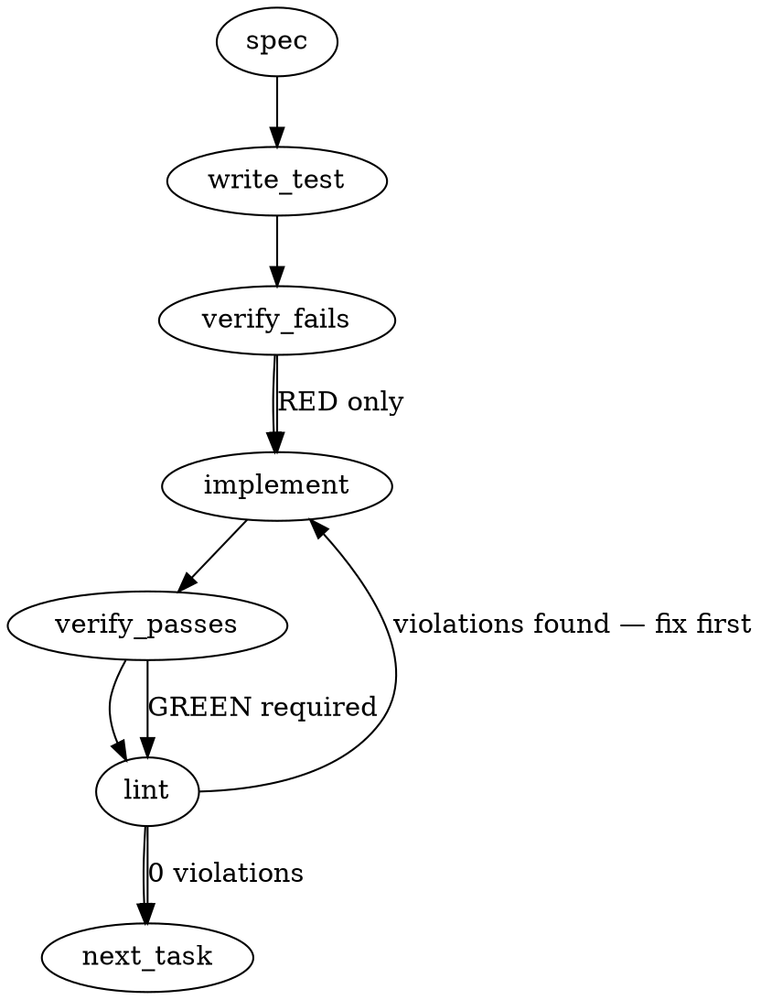

### Problem Statement

We need to implement Slice D of ADR-112, specifically "Gate 2" of the Windtunnel Scorer, which evaluates minted rules against ground truth and positive controls to determine if they meet the required precision (`cullRateThreshold`) and correctly fulfill the `differential-holds` preimage requirement.

### Architectural Context

From the provided Totem Knowledge, ADR-112 enforces a strict evaluation model for rule efficacy via the Windtunnel Scorer. We must utilize the `ScorerInput` interface from `windtunnel-scorer.ts` to evaluate `mintedRuleIds`. A critical architectural constraint explicitly stated in the types is that unlabeled firings strictly imply a `needsAdjudication` state—they must not be silently treated as true or false positives. Additionally, the system must evaluate whether the `PreimageDifferentialOutcome` is valid (the rule fires on the preimage but not on the postimage, avoiding the fix-shaped Falsifying Metric §1(i)).

### Files to Examine

1. `packages/core/src/spine/windtunnel-scorer.ts` — Contains the `ScorerInput` interface, which defines the inputs (`firings`, `groundTruth`, `cullRateThreshold`) Gate 2 will consume.
2. `packages/core/src/spine/preimage-differential.ts` — Defines `PreimageDifferentialOutcome`, critical for understanding the positive control gating logic (`'differential-holds'`).
3. `packages/core/src/spine/authored-controls.ts` — Provides context on how controls are derived prior to hitting the scorer.

### Technical Approach & Contracts

Implement `evaluateScorerGate2`, a pure function that processes `ScorerInput` and emits a `ScorerGate2Output`.

**Data Contracts:**

```typescript
// Add to packages/core/src/spine/windtunnel-scorer.ts

export type RuleGate2Status = 'passed' | 'culled' | 'needs_adjudication';

export interface Gate2RuleResult {
  ruleId: string;
  status: RuleGate2Status;
  falsePositiveRate: number;
  unlabeledFiringsCount: number;
  failedPositiveControls: boolean;
  rejectionReasons: string[];
}

export interface ScorerGate2Output {
  results: Map<string, Gate2RuleResult>;
  summary: {
    totalPassed: number;
    totalCulled: number;
    totalNeedsAdjudication: number;
  };
}
```

**Sequence Logic:**

1. Initialize a result map for all `mintedRuleIds`.
2. For each rule, cross-reference `firings` with `groundTruth`.
3. Count True Positives (TP), False Positives (FP), and unlabeled firings.
4. Verify the rule against `positiveControlTargets` to ensure `differential-holds` (it must successfully fire on its designated positive control preimages).
5. Apply gating logic:
   - If `unlabeledFiringsCount > 0`, status is `needs_adjudication` (Halt evaluation for this rule).
   - If positive controls fail, status is `culled` (Reason: "Fails preimage differential").
   - Calculate FP rate `(FP / (TP + FP))`. If `FP + TP === 0`, default to 0.
   - If `FP rate > cullRateThreshold`, status is `culled`.
   - Otherwise, status is `passed`.

### Edge Cases & Traps

- **Unlabeled Firings Trap:** As noted in the type definitions, any firing not explicitly mapped in `groundTruth` MUST flag the rule for adjudication. It cannot be assumed to be a False Positive or ignored, as this silently skews the `cullRateThreshold`.
- **Division by Zero:** A rule might fire 0 times in the current corpus. The FP rate calculation must safely handle `0 / 0`, classifying it as a `0` FP rate, falling back entirely to the positive control check.
- **Falsifying Metric §1(i) Trap:** A rule might fire on BOTH the preimage and postimage. The `preimage-differential.ts` context warns against "fix-shaped" evaluations. Gate 2 must ensure the rule does _not_ fire on the postimage (verifying the outcome is strictly `differential-holds`).

### Implementation Tasks

- [ ] **Task 1: Define ScorerGate2 Contracts**
  - Modify `packages/core/src/spine/windtunnel-scorer.ts` to export `RuleGate2Status`, `Gate2RuleResult`, and `ScorerGate2Output` interfaces.
  - No implementation logic yet, just types.
    > TEST DIRECTIVE: Before implementing, write a failing test named `exports ScorerGate2Output and related types` in `packages/core/src/spine/__tests__/windtunnel-scorer.test.ts` checking for type exports.
  - write test (or update existing) → verify fails → implement → verify passes → lint

- [ ] **Task 2: Implement Base evaluateScorerGate2 Function and Adjudication Trap**
  - Implement the `evaluateScorerGate2(input: ScorerInput): ScorerGate2Output` function stub.
  - Add logic to iterate over `mintedRuleIds` and check for unlabeled firings.
    > TOTEM INVARIANT (Unlabeled Firings): Unlabeled firings ⇒ needsAdjudication. Never classify an unmapped ground truth ID as FP or TP.
    > TEST DIRECTIVE: Before implementing, write a failing test named `flags rule as needs_adjudication if any firing lacks ground truth label` proving the invariant.
  - write test (or update existing) → verify fails → implement → verify passes → lint

- [ ] **Task 3: Implement Positive Control Differential Gate**
  - Update `evaluateScorerGate2` to verify that each rule successfully fires on its defined `positiveControlTargets`.
  - If a rule fails to meet `differential-holds` (e.g. misses the preimage or hits the postimage), mark it `culled`.
    > TEST DIRECTIVE: Before implementing, write a failing test named `culls rule if it fails positive control differential check` ensuring rules missing their designated controls are rejected.
  - write test (or update existing) → verify fails → implement → verify passes → lint

- [ ] **Task 4: Implement FP Cull Rate Threshold Gate**
  - Update `evaluateScorerGate2` to calculate the FP rate and compare it to `cullRateThreshold`.
  - Protect against Division by Zero when calculating `FP / (TP + FP)`.
    > TEST DIRECTIVE: Before implementing, write a failing test named `culls rule when false positive rate exceeds cullRateThreshold` and `passes rule with zero firings gracefully without NaN`.
  - write test (or update existing) → verify fails → implement → verify passes → lint

### Execution Flow (structural constraint)



### Verification (MANDATORY — do not skip)

Every implementation MUST end with these steps:

1. `totem lint` — deterministic rule check (zero LLM, ~2s). Fixes any violations.
2. `totem review` — AI-powered architectural review (~18s). Addresses any critical findings.
3. If using MCP, call `verify_execution` to confirm compliance before declaring the task done.

### Test Plan

- **Scenario 1:** A rule with 100% true positive firings and passing positive controls returns `passed`.
- **Scenario 2:** A rule with zero total firings but passing positive controls handles the 0/0 math safely and returns `passed`.
- **Scenario 3:** A rule with an FP rate of 0.05 against a threshold of 0.02 returns `culled` with a specific rejection reason.
- **Scenario 4:** A rule with 99 TPs and 1 firing missing from the `groundTruth` map returns `needs_adjudication`, bypassing the cull rate check entirely.
- **Scenario 5:** A rule that fires on the postimage (fails `differential-holds`) returns `culled`.

---

> **NOTE (totem-claude, 2026-06-29):** The Gemini-generated body above is a generic first-pass and is **superseded** by the authoritative design below, which is built from (a) ADR-112 §5/§6/§9 (re-read at current merged state, strategy `2a4df9e`) and (b) a live surface map of the cert-run scorer. In particular the Gemini `evaluateScorerGate2`/`ScorerInput` shapes are **not** the real surface — the real owners are `scoreWindtunnel` / `deriveLabelsFromDispositions` / `buildCertifyingCorpus` / `persistCertifyingOutcome`.

## Implementation Design

### Scope (2 sentences)

Slice D wires the inert `deriveAuthoredControls` emission into the Gate-1 cert run so an **authored-provenance** corpus can be scored at power: the §9 producer-kind switches (train-side positive controls, whole-window FP, train-side exposure) are applied, the §5.3 three-role scoring is implemented (non-vacuity ← train-side differential control; precision ← whole-window FP; per-rule generalization ← held-out activation gating **Gate-2 promotion, not Gate-1 survival**), and the ADR-110 §5 report gains `heldOutActivationsByRule` + the Gate-2-eligible set. It will **NOT** touch the miner path's behavior (mining stays held-out-shaped; every authored branch is `kind`-switched, never a global change), **NOT** introduce any blocking gate (Gate 1 still never blocks — §1 zero-enforcement), and **NOT** implement the `kind:'commit'` near-miss source (deferred per §6; cert-1 is lesson-anchored only).

### Proposed decomposition (HEADLINE — this is the load-bearing decision)

The surface map shows D spans ~6 subsystems, **three greenfield** (`heldOutActivationsByRule`, Gate-2 eligibility, whole-window labeling all absent from `src/`). That is too large for one PR and breaks the established ADR-112 inert-until-next slicing (A / B / C1 / C2a / C2b). Recommended cut, each shippable + gate-green, each inert until the next consumes it:

- **D1 — corpus injection seam (inert).** Add an `authoredControls?: AuthoredControls` channel to `CertifyingCorpus`; `buildCertifyingCorpus` calls `deriveAuthoredControls({rules, split})` when the corpus provenance kind is `authored` (read from `provenanceByRule`). Assembled but **scored by nobody** — mirrors C1's inert-primitive pattern; ends `deriveAuthoredControls`'s zero-caller status without behavioral change.
- **D2 — whole-window labeling.** `deriveLabelsFromDispositions` (+ the `spine-derive-labels` CLI) labels **every non-control firing in both slices** when policy `labelScope:'whole-window'` (authored), so a train-slice FP carries a label. Testable in isolation; still no authored scoring.
- **D3 — §5.3 scoring + `heldOutActivationsByRule`.** `scoreWindtunnel` (kind-switched, or a sibling authored pass merged into the verdict) consumes `authoredControls`: non-vacuity from the differential-gated `positive[]`, whole-window FP (labels now span the window), negative silence-cull via `nearMissSource` join-back, and computes `heldOutActivationsByRule`. Verdict gains the activations map.
- **D4 — Gate-2 eligibility + report (D goes live).** Gate-2-eligible set = survivors restricted to held-out-exercised rules; `exposureControlSide`-gated `positiveControlsExercised` (train-side); enriched §5 report via `persistCertifyingOutcome` + `legitimacy-projection`. This is where the cert runs at-power on an authored corpus.

Alternative compressions: **2-slice** (D1+D2 plumbing / D3+D4 scorer) or **all-in-one**. My recommendation: **start with D1 this session** (smallest, de-risks the seam, fully inert, sets the `CertifyingCorpus` shape the rest hang off). Open question O1 below puts the cut to the operator + cohort.

### Data model deltas

- **`CertifyingCorpus.authoredControls?: AuthoredControls`** (`spine-windtunnel.ts:341-352`). Holds the emitted positive/negative/non-emission controls. **Writer:** `buildCertifyingCorpus` (D1). **Reader:** `scoreWindtunnel`/authored pass (D3). **Invariant:** present iff corpus provenance kind is `authored` (single-provenance §7); optional so the miner path is byte-unchanged. Guaranteed by the `provenanceByRule`-kind branch at assembly.
- **`WindtunnelVerdict.heldOutActivationsByRule?: Map<ruleId, number>`** (`windtunnel-scorer.ts:25-48`). Per-rule count of held-out-slice activations. **Writer:** `scoreWindtunnel` (D3). **Reader:** Gate-2 eligibility (D4) + report. **Invariant:** keys = minted rule ids; a rule absent ⇒ 0 (explicit, not silent — see failure table).
- **`WindtunnelVerdict.gate2EligibleRuleIds?: string[]`** (D4). Survivors ∩ held-out-exercised. **Writer:** scorer/D4. **Reader:** report. **Invariant:** ⊆ surviving set; a survivor with 0 held-out activations is **excluded but NOT failed** (§5.3 — `held-out-unexercised`).
- **No new reserved keys / sentinels.** `positiveControlGate`/`positiveControlSide`/`labelScope`/`exposureControlSide` already exist in `rule-policy.ts` as frozen-enum DATA — D **reads** them (D2 reads `labelScope`, D3/D4 read `exposureControlSide`); it adds no policy fields. This is the §9 "data, not behavioral branch" discipline (Tenet 9).

### State lifecycle

All new state is **per-cert-run** (request-scoped), created during `runCertifyingEngine` (`spine-windtunnel.ts:497-585`), never persisted beyond the transient `windtunnel-cert-run.v1` report, never mutated after the verdict is sealed. `authoredControls` is created at corpus assembly (`buildCertifyingCorpus`) and read once by the scorer; `heldOutActivationsByRule`/`gate2EligibleRuleIds` are created in the scorer and read once by the report producer. **No state crosses a lifecycle boundary** (no session/server-lifetime flags) — the one-shot-flag bug class does not apply here.

### Failure modes

| Failure                                                                         | Category            | Agent-facing surface                                                           | Recovery                                                            |
| ------------------------------------------------------------------------------- | ------------------- | ------------------------------------------------------------------------------ | ------------------------------------------------------------------- |
| Authored corpus assembled but a positive `fixture.pr` is held-out (leakage)     | runtime / permanent | **hard error** (already thrown in `deriveAuthoredControls:305-313`)            | fix the split/fixture; run voided (§5 falsifier §1(c))              |
| A train-slice firing has **no** ground-truth label (deriver didn't widen scope) | runtime / permanent | **hard error** at score time (a train FP must never silently escape — §6/§5.3) | D2 must label window-wide; absence = a real bug, fail loud not skip |
| Rule with **zero held-out activations**                                         | runtime / expected  | **report status** `held-out-unexercised`, excluded from Gate-2 set             | not a failure — survives Gate 1 (§5.3); recorded, never culled      |
| Negative `nearMissSource` join-back finds no matching fixture                   | runtime / permanent | **hard error** (Tenet-20 dangling pointer)                                     | fix the record; never charitably skip the silence check             |
| Matcher fires on a negative near-miss exemplar                                  | runtime / expected  | **cull** (cullLedger, §3.3) — not a corpus FP                                  | working as designed (ADR-110 §5 verdict precedence)                 |
| `positiveControlGate`/`Side` mismatch vs authored policy                        | init / permanent    | **hard error** (already asserted `:273-285`)                                   | producer/policy misconfig; surfaces at assembly                     |
| Unlabeled non-control firing remains after whole-window derive                  | runtime / permanent | `needsAdjudication` → HONEST-NEGATIVE                                          | never charitably TP/FP (existing scorer discipline)                 |

No row is "silent degradation." Every authored-path gap fails loud — the whole point of the leakage guard is mechanical, not charitable (Tenet 4 + ADR-112 §5).

### Invariants to lock in via tests

- An authored corpus's positive control scores non-vacuity from the **exemplar differential**, NEVER from the rule's landed PR diff (Tenet-20; the lc "review-caught defect never lands" case must PASS, not spuriously FAIL).
- A **train-slice** false positive triggers FAIL (precision-1.0 floor spans the whole window — held-out-only scoring must not let it escape).
- A non-vacuous, zero-FP rule with **zero held-out activations** SURVIVES Gate 1 and is EXCLUDED from the Gate-2-eligible set (the two are distinct verdicts — the codex break).
- `exposureDenominator.positiveControlsExercised` counts **train-side** controls for an authored corpus (a rare-defect rule with no held-out activation still contributes to the exposure floor).
- The miner path is **byte-unchanged**: a mined-provenance corpus produces an identical verdict + report before and after D (every authored behavior is `kind`-gated).
- A duplicate/dangling control join-key fails loud (carry the C2b answer-key-uniqueness discipline into the consumer).

### Open questions

- **O1 — Decomposition + this-session scope.**
  - **Options:** (a) 4 sub-slices D1–D4, start D1 now; (b) 2 sub-slices (plumbing / scorer); (c) one big D PR.
  - **Recommendation:** (a) — start **D1** (inert corpus seam) this session. Matches the established inert-until-next discipline, keeps each PR reviewable, de-risks the `CertifyingCorpus` shape early. Cohort + operator to confirm.
- **O2 — Scorer extension shape: kind-switch `scoreWindtunnel` vs. a sibling authored pass.**
  - **Options:** (a) add `kind`-aware branches inside `scoreWindtunnel`; (b) a separate `scoreAuthoredWindtunnel` that produces the same `WindtunnelVerdict` shape, dispatched by provenance kind at the orchestration layer.
  - **Recommendation:** (b) — a sibling pass keeps the miner scorer untouched (protects the byte-unchanged invariant) and isolates the authored logic; dispatch on kind in `runCertifyingEngine`. Build-altitude (mine) but worth a cohort lens. Defer the firm call to D3.
- **O3 — Where `heldOutActivationsByRule` is computed (CONTRACT-ADJACENT → couple-on-D to strategy).**
  - **Question:** Does "held-out activation" count any firing on a held-out-slice PR, or only **non-control** firings (excluding the rule's own controls)? The §5.3 intent is _generalization beyond what the author saw_ — controls are train-side under authored, so held-out firings are inherently non-control, but the precise denominator wants strategy's confirmation against §5.3.
  - **Recommendation:** count held-out-slice **non-control** firings per rule; route to strategy-claude as the one genuinely contract-adjacent question (the rest are build-altitude per the ADR's altitude note).

### Verification note

The ADR's altitude clause is explicit: it fixes _invariants_ + _declared amendments_; the _mechanics_ (how `derive-labels` switches by kind, the exact firing-to-label join, id disambiguation) are **reconciled at build against live code**. O1/O2 are build-altitude (mine, cohort-reviewed); O3 is the one to couple-on-D with strategy.

## Panel outcome — RESOLVED (folded 2026-06-29, pre-build cohort panel + couple-on-D)

4-seat panel (codex contract / agy test-completeness / gemini tenet-arch / strategy couple-on-D). Convergent. Operator greenlit O1=(a), build D1 now.

- **O1 → (a) 4 sub-slices, build D1 now.** Operator + gemini approved.
- **O2 → (b) sibling `scoreAuthoredWindtunnel` pass.** gemini + me; protects miner-byte-unchanged + Tenet-9 at the boundary. Carry to D3.
- **O3 → non-control held-out firings.** strategy RULED (2019Z): per rule, count firings on held-out-slice PRs **excluding the rule's own declared controls**; pin on the _principle_ ("generalization beyond what the author saw" — a control is definitionally what the author saw), not the train-side coincidence (that's today's corollary). Negatives never count. strategy lands a one-sentence §5.3 amendment **couple-on-merge with the Slice-D contract PR**. §9 switch-table CONFIRMED current (no axis moved).

### D1 design REVISED per codex CONCERN (two required folds — both verified against source)

1. **Call-shape reshape (REQUIRED).** The shipped `deriveAuthoredControls` reads `rule.legitimacy?.provenance` (`authored-controls.ts:231`) and hard-throws if absent. At the assembly seam the compiled rules carry **no** legitimacy — `rules = scored.map(c => c.rule)`; provenance lives in the `c.provenance` sidecar → `provenanceByRule` (`spine-cert-corpus.ts:105-108`); `legitimacy` is stamped only post-scoring (survivors-only, `legitimacy-projection.ts`). So `deriveAuthoredControls({rules, split})` as originally designed would throw at runtime. **Fold:** widen `deriveAuthoredControls` to read **sidecar provenance** — accept `provenanceByRule` (or `{rule, provenance}` pairs / `CompiledCandidate[]`); NEVER synthesize `rule.legitimacy` (it also carries control booleans, intentionally absent pre-verdict). Build-mechanic choice (param shape): lean **add `provenanceByRule: Map<string, ProvenanceRecord>` to the params**, since the seam already builds that map and it keeps a single provenance source-of-truth; update the C2b tests to pass it. This is the first real exercise of the inert C2b primitive — aligning its input contract to reality is part of D1.
2. **Single-provenance enforced AT the seam (REQUIRED).** Don't treat §7 as upstream-guaranteed. Homogeneous pass over the scored set: require `provenanceByRule.get(rule.lessonHash)` for every rule (missing → hard error); derive kind via canonical `provenanceKind`; >1 kind → hard error (mixed-provenance, §7 out of scope); `mined` → omit `authoredControls`; `authored` → attach (even if arrays empty).

## D1 RE-CUT — RESOLVED (panel round 2, 2026-06-30) — the producer is built-but-unwired

A post-round-1 surface trace found the authored producer is **fully built but disconnected at three points** (none wired into the cert corpus): `runRuleAuthor`→`AuthoredRuleRecord[]` (only the `rule author` CLI calls it), `toCompileFeed`→`runCompileStage` authored branch (built, "one compiler, two producers", **zero production callers**), and `deriveAuthoredControls` (zero callers). `buildCertifyingCorpus` is mined-only. So round-1 D1 ("call deriveAuthoredControls") is **necessary-but-not-sufficient** — nothing feeds authored rules into the corpus. Round-2 cohort (codex contract / gemini arch / strategy couple-on-D) **convergent**:

- **Architecture: SIBLING `buildAuthoredCertifyingCorpus` + new `buildAuthoredCorpusProvider`** (NOT a branch in the mined `buildCertifyingCorpus`). The mined assembler's `source/extractor/classifier/stage4` deps are irrelevant to authored; a branch = one function doing two disjoint jobs (Tenet-9 anti-shape). **Kind-dispatch single-home = provider RESOLUTION at the orchestration entry (`runCommand`), reading the producer kind off the `WindtunnelLock`/policy** (gemini) — instantiate the right provider once, pass the generic `CertifyingCorpusProvider` down; NO `if (kind==='authored')` scattered downstream. Mined path **byte-unchanged**.
- **Scope: feed + controls = ONE inert D1 (option a).** Unanimous. Feed-only leaves the corpus without its present-iff-authored channel; controls-only leaves the production feed gap. Only acceptable split if ever forced: feed(D1)+controls(D1b), never controls-only.
- **strategy scope ruling:** the producer→corpus feed is **in the Slice-D arc (D1)**, §8-legal as a sibling. strategy pins a one-line §8 clarification (sibling dispatched on kind) **couple-on-merge with the D-feed PR** (the sibling IS the seam). §7 single-provenance CONFIRMED (one run = wholly authored OR mined).

### D1 build (resolved)

1. **`buildAuthoredCorpusProvider`** (sibling to `buildReplayCorpusProvider`), selected by producer kind at provider resolution (the single dispatch home). Reads the lock/config to know the run is authored-primary.
2. **`buildAuthoredCertifyingCorpus`** (sibling to `buildCertifyingCorpus`): authored records → compile → assemble + derive controls. Steps:
   - obtain authored records via `runRuleAuthor(totemDir, {judgedBy})` **or a factored equivalent preserving ALL producer invariants** (strict authored-file shape incl. recursive producer-owned-key rejection, independent structural-eligibility re-check, stable id mint/reuse from the ledger, fail-loud dup-identity, ledger append/read-back, `judgedBy`≠author) — **NEVER ad-hoc record construction / raw YAML→record** (codex);
   - **`rejected.length === 0` precondition** — fail the cert run if any authored record was rejected (never certify the eligible subset of a partially-invalid file);
   - **verify the file/ledger split-binding BEFORE compile** — prove the authoring-ledger entries' `splitRef`/`authoredAfterSplit`/`heldOutNonInspectionAttestation` match the split used by THIS cert run; these are NOT on `AuthoredRuleRecord` (they're on the file/ledger), so extend the feed result or add a helper returning the authoring-run metadata/ledger refs (codex finding 4 — `deriveAuthoredControls`'s train-side check alone is insufficient for leakage);
   - `toCompileFeed(records)` → `runCompileStage` → `CompiledCandidate[]`; **authored compile-rejection = HARD failure** (broken authored cert input, not mined noise — fail before emitting an incomplete controls set);
   - assemble `rules` + `provenanceByRule` from `c.provenance` sidecar (no `rule.legitimacy`); enforce homogeneous authored provenance (mixed → throw);
   - call the widened `deriveAuthoredControls({ rules, split, provenanceByRule })`; attach `authoredControls` (defined-with-empty-arrays if no fixtures).
3. **`CertifyingCorpus.authoredControls?`** channel — if the return type bakes in mined ledgers, prefer a **tagged variant** over mined-placeholder fields (codex).
4. **`deriveAuthoredControls` reshape** — read sidecar `provenanceByRule` param (the round-1 fold #1).
5. **Inert:** no scorer/persist/report consumes `authoredControls` (D3/D4 do). The leakage/rejected/compile/duplicate throws are assembly contract guards (not flag-gated).

### D1 tests (codex's required set + round-1 matrix)

- **Production-path:** authored YAML → `runRuleAuthor` → `toCompileFeed` → `runCompileStage` → authored corpus with `rules` + `provenanceByRule` + `authoredControls` (exercise the REAL compile path, not mocked candidates — agy round-1 §4).
- Rejected authored input (any `rejected`) fails the corpus build even if other records are eligible.
- Authored compile-rejection fails the authored corpus build (not a partial corpus).
- Split mismatch (file/ledger ↔ current cert split) fails BEFORE compile.
- Mixed mined/authored provenance at assembly fails loud.
- `deriveAuthoredControls` consumes sidecar provenance; requires no pre-verdict `rule.legitimacy`.
- Existing mined `buildCertifyingCorpus` byte/shape-unchanged (no `authoredControls` on mined output).
- 3-state channel matrix (mined→undefined / authored→populated / authored-empty→defined-empty-arrays).

### Round-1 D1 channel + tests (folded codex + agy) — carried into the resolved build above

- **Channel:** `CertifyingCorpus.authoredControls?: AuthoredControls` — **present iff `corpusKind === 'authored'`** (undefined for mined; **empty arrays, not undefined**, for an authored corpus with no fixtures — agy state 3). `AuthoredControls = { positive, negative, nonEmissions }`; positive = `{ pr, targetRuleId, filePath, matchedSpan }` (NO `contentHash`/`preimageSource` — correcting agy's example shape).
- **Inertness:** the `deriveAuthoredControls` throws (leakage / policy-mismatch / duplicate-locus) stay as assembly contract guards — NOT hidden behind a flag (codex Q2). No second uniqueness algo; D1 propagates C2b's fail-loud (codex Q3).
- **Tests (3-state matrix + regressions):** (1) mined → `authoredControls === undefined` + existing cert-corpus tests byte-unchanged; (2) authored w/ fixtures → channel populated, deep-structure asserted on the TRUE shape; (3) authored w/ empty fixtures → defined, empty arrays; (4) mixed-provenance → throws before partial derive; (5) missing provenance for a scored rule → throws; (6) authored path requires/adds no `rule.legitimacy`; (7) leakage/policy/duplicate-locus failures propagate through the seam.
