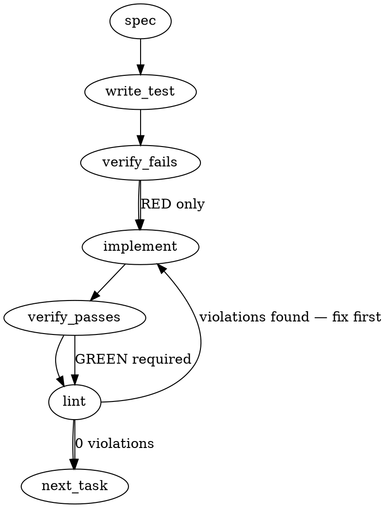

### Problem Statement

We need to introduce a `producerKind`-aware `corpusWindowPrs` selector to compute the target PR window (train union heldOut minus controls) for disposition fetching, and implement a `skip-groundTruth` fast-path for `authored` corpora in `spine-derive-labels.ts`. This ensures authored windtunnel runs bypass unnecessary ground-truth label derivation while strictly preserving the existing single-home routing dispatch for corpus assembly.

### Architectural Context

None found in provided context regarding specific lessons, but existing code establishes a strong invariant: `resolveCertifyingCorpusProvider` in `spine-cert-run-corpus.ts` is the _single home_ for dispatching behavior based on `lock.producerKind ?? 'mined'`. The new `skip-groundTruth` path must respect this and not duplicate the dispatch logic.

### Files to Examine

1. `packages/cli/src/commands/spine-cert-run-corpus.ts` — Review `resolveCertifyingCorpusProvider` and `assembleCertifyingCorpus` to understand the Section-8 single-home dispatch and how `skipGroundTruth` is currently passed in `opts`.
2. `packages/cli/src/commands/spine-derive-labels.ts` — Examine `deriveLabelsCommand` to see where the `skip-groundTruth` short-circuit must be injected.
3. `packages/cli/src/commands/spine-fetch-dispositions.ts` (assumed path) — Locate `corpusHeldOutPrs` to implement `corpusWindowPrs(split, lock)` as a sibling.

### Technical Approach & Contracts

**1. The `corpusWindowPrs` Function Contract:**
We will define a new pure function in `spine-fetch-dispositions.ts`.

```typescript
interface Split {
  trainPrs: string[];
  heldOutPrs: string[];
  positiveControlPrs?: string[];
  negativeControlPrs?: string[];
}
// Contract
export function corpusWindowPrs(split: Split, lock: WindtunnelLock): string[];
```

_Logic:_

- If `lock.producerKind === 'authored'`, branch accordingly (e.g., authored corpora might not use strict train/heldOut splits in the same way, or simply returns all non-control PRs).
- For `mined` (default): Compute `(trainPrs ∪ heldOutPrs) \ (positiveControls ∪ negativeControls)`.

**2. The `skip-groundTruth` Authored Assembly Path:**
In `deriveLabelsCommand` (`spine-derive-labels.ts`), read `lock.producerKind`. If it resolves to `'authored'`, bypass the standard `deriveLabelsFromDispositions` execution. Instead, construct a fast-path that either yields an empty/passthrough label set or delegates directly to `assembleCertifyingCorpus` with `{ skipGroundTruth: true }`.

**3. Gate Resolution (Section-8 Single-Home Resolver Dispatch):**
_Does the skip-groundTruth authored assembly re-decide the section-8 single-home resolver dispatch?_
**No.** It is an architectural trap to duplicate the `producerKind === 'authored'` check to instantiate providers directly in `spine-derive-labels.ts`.
_Recommendation:_ `spine-derive-labels.ts` must pass `{ skipGroundTruth: true }` in the options downward into the core assembly pipeline. The dispatch logic at `spine-cert-run-corpus.ts:488-490` remains the _exclusive_ owner of determining which `CertifyingCorpusProvider` is constructed.

### Edge Cases & Traps

- **Nullish `producerKind`:** `lock.producerKind` is optional. The logic must always coalesce `lock.producerKind ?? 'mined'` before branching.
- **Set Arithmetic Flaws:** When computing `union` minus `controls`, ensure you are doing strict string matching (or number matching if PRs are IDs). A `Set<string>` should be used to guarantee `O(1)` lookups for the subtraction phase to prevent subtle `O(n^2)` performance traps on massive corpora.
- **Dangling Dispositions:** If `deriveLabelsCommand` skips ground truth, ensure the command still writes out a valid, schema-compliant `CorpusDispositions` or `MinerLedgers` file (even if empty/mocked) so downstream pipeline steps do not crash on missing files.

### Implementation Tasks

- [ ] **Task 1: Implement `corpusWindowPrs` selector**
  - Modify `packages/cli/src/commands/spine-fetch-dispositions.ts`.
  - Add `corpusWindowPrs` sibling function to `corpusHeldOutPrs`.
  - Coalesce `producerKind ?? 'mined'`.
  - Implement the Set math: `Array.from(new Set([...train, ...heldOut].filter(pr => !controls.has(pr))))`.
  - > TEST DIRECTIVE: Before implementing, write a failing test named `removes positive and negative controls from train and heldOut union` that proves the set math works correctly, and a second test `handles missing control arrays safely`.
  - write test → verify fails → implement → verify passes → lint

- [ ] **Task 2: Wire `producerKind` awareness into `deriveLabelsCommand`**
  - Modify `packages/cli/src/commands/spine-derive-labels.ts`.
  - Extract `producerKind` from the parsed `WindtunnelLock`.
  - Introduce an early branch: if `authored`, set `skipGroundTruth = true` and bypass `deriveLabelsFromDispositions`.
  - Ensure the output contract matches what downstream steps expect (write out the necessary canonical json).
  - > TEST DIRECTIVE: Before implementing, write a failing test named `bypasses deriveLabelsFromDispositions for authored producerKind` that mocks the lock to `authored` and verifies the derivation engine is not invoked.
  - write test → verify fails → implement → verify passes → lint

- [ ] **Task 3: Propagate `skipGroundTruth` through corpus assembly**
  - Modify `packages/cli/src/commands/spine-cert-run-corpus.ts`.
  - Ensure `assembleCertifyingCorpus` explicitly passes `skipGroundTruth: opts.skipGroundTruth` into `inputs` for `resolveCertifyingCorpusProvider`.
  - Verify that `resolveCertifyingCorpusProvider` explicitly respects the flag for authored dispatch _without_ overriding the `producerKind === 'authored'` gateway.
  - write test (or update existing) → verify fails → implement → verify passes → lint

### Execution Flow (structural constraint)



### Verification (MANDATORY — do not skip)

1. `totem lint` — deterministic rule check (zero LLM, ~2s). Fixes any violations.
2. `totem review` — AI-powered architectural review (~18s). Addresses any critical findings.
3. If using MCP, call `verify_execution` to confirm compliance before declaring the task done.

### Test Plan

- **Unit (Set Math):** Construct mock `split` objects with overlapping PRs in train/heldOut, and subset overlaps in controls. Assert `corpusWindowPrs` deduplicates and strictly subtracts all controls.
- **Unit (Authored Branch):** Test `corpusWindowPrs` with `lock.producerKind = 'authored'` to ensure it returns the expected structural set for authored locks.
- **Integration (Label Derivation):** Invoke `deriveLabelsCommand` with an `authored` lock. Assert that `deriveLabelsFromDispositions` is never called (via spies) and the command exits gracefully with a valid contract payload.
- **Integration (Assembly Routing):** Call `assembleCertifyingCorpus` with `skipGroundTruth: true`. Assert that `resolveCertifyingCorpusProvider` correctly routes to the authored provider, proving the Section-8 single-home dispatch was not circumvented.

---

> ⚠ **Corrections to the auto-generated draft above (verified against source — do NOT act on the draft where it conflicts).** The `## Implementation Design` section below is the authoritative spec.
>
> 1. **PRs are `number[]`**, not `string[]` (`spine-fetch-dispositions.ts:44`). Set math is over numbers.
> 2. **Authored does NOT bypass label derivation.** D2.6 exists _precisely so authored derives labels WINDOW-WIDE._ `skipGroundTruth` is the circularity guard (the deriver _produces_ `ground-truth-labels.json`, so it must not require the `groundTruthSha` that doesn't exist yet) — it is NOT a "skip derivation / empty label set" switch. The draft's Task 2 ("bypass `deriveLabelsFromDispositions`", "empty/passthrough label set") would reintroduce the permanent-HONEST-NEGATIVE bug this slice fixes.
> 3. **`derive-labels` does not call `resolveCertifyingCorpusProvider`.** It calls `assembleCertifyingCorpus` directly (`:151`), which itself never calls the resolver. Routing the derive path _through_ the resolver would be the §8 re-decision to AVOID. The additive-sibling design is a new `assembleAuthoredCertifyingCorpus` sibling, resolver untouched.
> 4. `corpusWindowPrs(split)` is a **pure split-only selector** (sibling of `corpusHeldOutPrs`); the _command_ reads `producerKind`, not the selector — mirrors the existing structure and keeps kind-reads at the command layer.

## Implementation Design

### Scope

Make the two by-hand **producer** commands `producerKind`-aware so an `authored` cert corpus derives its answer key **window-wide** (train ∪ held-out, minus controls): `fetch-dispositions` freezes window-wide dispositions, and `derive-labels` enumerates window-wide firings via a new authored skip-groundTruth assembler. This will NOT modify `resolveCertifyingCorpusProvider` (the §8 RUN-path single-home dispatch), will NOT change any mined behavior (byte-identical), and will NOT touch the certifying-run engine, freeze, or persist paths.

### Data model deltas

- **`corpusWindowPrs(split): number[]`** (new export, `spine-fetch-dispositions.ts`). Pure sibling of `corpusHeldOutPrs`. Holds the window-wide corpus PR set `(trainPrs ∪ heldOutPrs) − (positiveControlPrs ∪ negativeControlPrs)`, deduped, ascending. Writer: none (pure). Reader: `fetchDispositionsCommand` (authored branch). Invariant: deterministic order, controls always excluded (same `Set` subtraction as `corpusHeldOutPrs`).
- **`assembleAuthoredCertifyingCorpus(opts, lock): Promise<{corpus}>`** (new export, `spine-cert-run-corpus.ts`). Sibling of `assembleCertifyingCorpus` for the DERIVE path. Loads the authored substrate via `loadAuthoredCertRunFixtures(gate1Dir, {expectedPrDiffsSha, skipGroundTruth})` then calls the existing `buildAuthoredCertifyingCorpus`. Reader: `deriveLabelsCommand` (authored branch). Invariant: on `skipGroundTruth`, requires `prDiffsSha` (still hash-bind the scoring source) but NOT `groundTruthSha` (deriver produces it) — mirrors `assembleCertifyingCorpus`'s skip semantics.
- **`skipGroundTruth?: boolean`** additive optional param on `loadAuthoredCertRunFixtures`'s opts (default `false` ⇒ resolver call byte-unchanged). Parity with `loadCertRunFixtures`, which already has it.
- **No new lock fields, no new schema, no reserved keys.** `producerKind` is read (never written) at exactly two new command sites (`fetchDispositionsCommand`, `deriveLabelsCommand`), each coalescing `lock.producerKind ?? 'mined'`.

### State lifecycle

All state is **per-invocation** (CLI command scope). `corpusWindowPrs` is pure/stateless. The authored substrate (`split/prDiffs/groundTruth`) is loaded, consumed to build firings, and discarded within one `derive-labels` run. `groundTruthSha` is stamped into the lock exactly as today (read-modify-write, idempotent) — no lifecycle change. No cross-request or persistent state; no one-shot flags.

### Failure modes

| Failure                                                       | Category | Agent-facing surface                                                                | Recovery                                  |
| ------------------------------------------------------------- | -------- | ----------------------------------------------------------------------------------- | ----------------------------------------- |
| authored window empty (all window PRs are controls)           | runtime  | hard error `CONFIG_INVALID` (scope-aware msg: "window has no non-control PRs")      | fix split / re-materialize                |
| authored lock missing `prDiffsSha` on derive                  | runtime  | hard error `CONFIG_INVALID` (existing precondition, reused)                         | re-materialize cert corpus                |
| authored substrate absent / tampered (`prDiffs` sha mismatch) | runtime  | hard error `CONFIG_INVALID` (existing `loadAuthoredCertRunFixtures` integrity gate) | restore frozen fixtures                   |
| empty authoring-ledger / rejected authored rules              | runtime  | hard error `GATE_INVALID` (existing `buildAuthoredCertifyingCorpus` gates)          | author rules first                        |
| sparse answer key (few dispositions bind)                     | runtime  | **honest-negative, reported** (diagnostic density line) — NOT an error              | expected; never densify-to-PASS (Tenet 4) |

No silent-degradation rows: every authored failure fails loud, reusing the existing hard-gate discipline. The only "empty-ish" outcome (sparse labels) is the intended honest-negative surfaced via diagnostics.

### Invariants to lock in via tests

- `corpusWindowPrs` = `(train ∪ heldOut) − controls`, deduped + ascending; a PR in both train and controls is excluded; a train-only non-control PR is INCLUDED (the held-out-only key would have dropped it — the D2.6 raison d'être).
- `fetch-dispositions` picks `corpusWindowPrs` iff `producerKind==='authored'`, else `corpusHeldOutPrs` (mined byte-unchanged: mined fixture split yields the identical PR set as before).
- `derive-labels` on an authored lock enumerates firings over the window-wide authored substrate and **derives real labels** (train-side positive-control firings become labeled, not `needsAdjudication`) — the anti-regression for the permanent-HONEST-NEGATIVE bug.
- `assembleAuthoredCertifyingCorpus({skipGroundTruth:true})` requires `prDiffsSha`, tolerates absent `groundTruthSha`, and never reads `ground-truth-labels.json` (circularity guard).
- `resolveCertifyingCorpusProvider` is unchanged — the RUN path still hard-requires `groundTruthSha` (authored run precondition intact).

### Open questions

- **Question:** Where does the authored skip-groundTruth substrate load live — a `skipGroundTruth` param added to `loadAuthoredCertRunFixtures`, or a thin deriver-local loader?
  - **Options:** (a) add optional `skipGroundTruth` to `loadAuthoredCertRunFixtures` (parity with `loadCertRunFixtures`, one loader, resolver call unchanged by default); (b) a separate deriver-only authored loader (avoids touching the resolver's loader at all, but duplicates the integrity/parse logic).
  - **Recommendation:** **(a)** — additive optional param, zero resolver-behavior change, no duplicated integrity discipline. This keeps the change purely additive and is the parity the mined loader already models.
- **Question:** `totemDir` wiring — `deriveLabelsCommand` has `gate1Dir` but the authored assembler needs `.totem` (for the authoring-ledger). Derive it as `path.dirname(path.dirname(gate1Dir))` (gate-1 is `.totem/spine/gate-1`) or add an explicit `--totem-dir`/opt?
  - **Options:** (a) derive from `gate1Dir` by convention; (b) add an injected opt (test-friendlier, explicit).
  - **Recommendation:** **(b)** add an optional `totemDir` to `DeriveLabelsOptions` defaulting to the convention-derived path — explicit + injectable for tests, matches the file's existing `cwd`/`outputDir` injection style.
