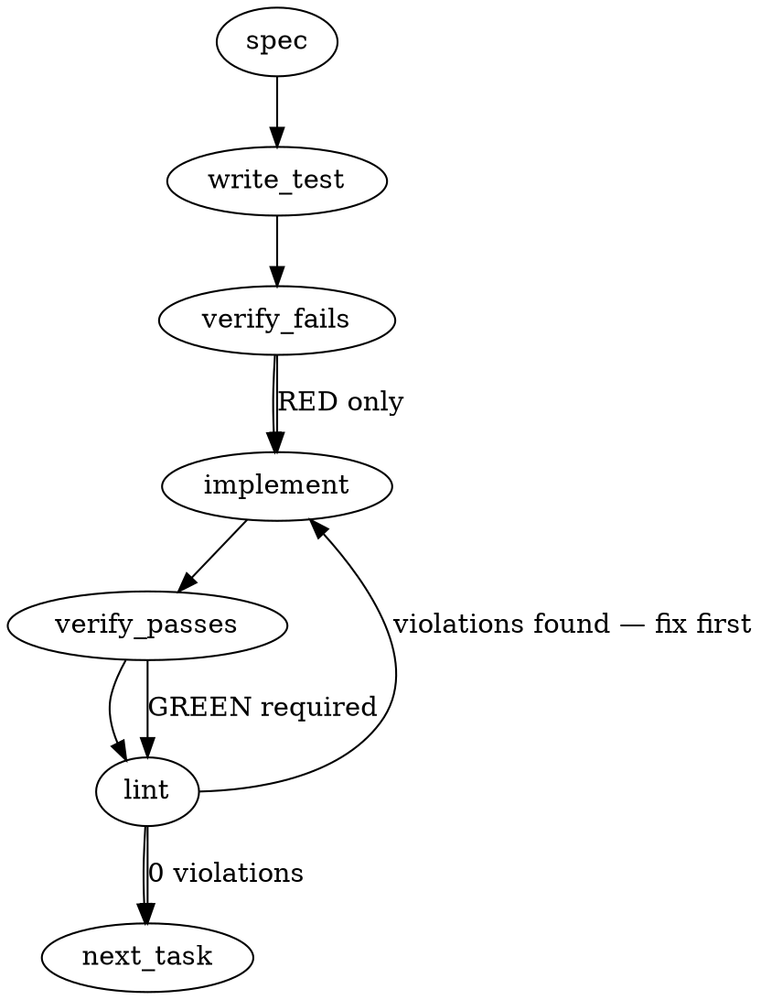

### Problem Statement

Implement the `agents-md-canonical` deterministic lint rule for `totem lint` to fulfill Proposal 272 § 6.7. This replaces the LLM-prose enforcement of ADR-038, automatically verifying that any repository containing agent configuration files (e.g., `CLAUDE.md`, `.cursorrules`) explicitly delegates to a single, centralized `AGENTS.md` file.

### Architectural Context

- **ADR-038 "AGENTS.md Standard Adoption"**: Establishes `AGENTS.md` as the single source of truth for agent instructions.
- **Pack Ecosystem Graduation (Active Work)**: Mandates collapsing convention-rule duplication and replacing LLM-prose enforcement (Tenet 15 violations) with deterministic-substrate hardening.
- **Derived Standing State**: State is derived from substrate, not maintained in prose. The linter must deterministically fail if the substrate (agent files) drifts from the standard.

### Files to Examine

1. `CLAUDE.md` — Contains the canonical text pattern that must be enforced: `"The canonical agent instructions for this repository live in [\`AGENTS.md\`](AGENTS.md)."`
2. `packages/core/src/rules/index.ts` (or equivalent rule registry) — To understand how new text/file-based rules are registered and executed.
3. `packages/pack-agent-security/test/repo-sweep.test.ts` — Provides context on how rules are evaluated across a repository using AST Grep or regex matchers.

### Technical Approach & Contracts

We will implement a custom file-based rule in the core linter (or `pack-agent-security`, depending on standard rule placement).

**Contract Requirements:**

- **Target Files Pattern**: `CLAUDE.md`, `.cursorrules`, `.github/copilot-instructions.md`, `windsurfrules`.
- **Validation Logic**:
  1. Use `resolveGitRoot` to determine the repository root.
  2. If any Target File exists in the root (or standard subdirectories), it MUST contain the regex pattern `/AGENTS\.md/i` (or ideally the exact delegation string).
  3. If a Target File exists, the `AGENTS.md` file MUST also exist at the Git root.
- **Data Contract Change**: Add `agents-md-canonical` to the rule registry types/schemas.
  ```typescript
  // Example expected internal rule output format
  export interface RuleViolation {
    ruleId: 'agents-md-canonical';
    filePath: string;
    message: string;
    severity: 'error';
  }
  ```

**Trade-offs Considered:**

- _AST Grep vs. Regex/Text Match_: AST Grep is powerful for code, but Markdown is heavily prose-based. A direct file read and Regex match is faster, more reliable for Markdown prose, and avoids complex AST parsers for simple substring checks. _Recommendation: Use regex/text matching via standard Node `fs` operations combined with the `resolveGitRoot` helper._

### Edge Cases & Traps

- **Missing Git Root**: Repositories not yet initialized with Git will cause `resolveGitRoot` to return `null`. The rule must handle this gracefully (e.g., fallback to `process.cwd()`).
- **Missing Target Files**: If no agent files exist, the rule should immediately pass (no enforcement needed if no agents are configured).
- **Case Sensitivity**: Operating systems handle file names differently (`claude.md` vs `CLAUDE.md`). The file scanner must be case-insensitive when identifying target files, but strict on the exact string match inside the file.
- **Empty Files**: An empty `.cursorrules` file should trigger a violation, not crash the parser.

### Implementation Tasks

- [ ] **Task 1: Define Rule Tests & Interface**
  - Files to modify: `packages/core/test/rules/agents-md-canonical.test.ts` (create), `packages/core/src/rules/agents-md-canonical.ts` (create)
    > TEST DIRECTIVE: Before implementing, write a failing test named `flags agent files missing AGENTS.md delegation` that proves the regression is caught. Write additional tests for `passes when delegation exists` and `fails when AGENTS.md is missing from root`.
  - Step 1: Create the test file with mock file system setups mimicking the presence/absence of `CLAUDE.md` and `AGENTS.md`.
  - Step 2: Create the empty rule function `evaluateAgentsMdCanonical(cwd: string): RuleViolation[]`.
  - Step 3: Run the test to ensure it fails.
  - Step 4: Implement the rule logic. Use `resolveGitRoot(cwd)` to find the root. Check for target files (`CLAUDE.md`, `.cursorrules`). If found, verify `AGENTS.md` exists and the target file contains the string `AGENTS.md`.
  - Step 5: Verify passes → lint.

- [ ] **Task 2: Refine Canonical String Matching**
  - Files to modify: `packages/core/src/rules/agents-md-canonical.ts`, `packages/core/test/rules/agents-md-canonical.test.ts`
    > TOTEM INVARIANT (ADR-038 "AGENTS.md Standard Adoption"): The agent file must not just contain "AGENTS.md", it must explicitly delegate instructions to it to prevent duplication.
    > TEST DIRECTIVE: Before implementing, write a failing test named `rejects file containing AGENTS.md without explicit delegation phrasing` that proves the regression is caught.
  - Step 1: Update tests to expect a stricter match (e.g., `canonical agent instructions` or similar verifiable delegation text, rather than just the word `AGENTS.md`).
  - Step 2: Verify test fails.
  - Step 3: Update the regex/string matching logic in `evaluateAgentsMdCanonical`.
  - Step 4: Verify passes → lint.

- [ ] **Task 3: Integrate Rule into Linter Registry**
  - Files to modify: `packages/core/src/rules/index.ts` (or standard rule manifest)
  - Step 1: Write a test in the integration suite verifying that running the linter with `agents-md-canonical` enabled correctly scans a mock directory.
  - Step 2: Verify test fails.
  - Step 3: Import and register `evaluateAgentsMdCanonical` in the main rule registry. Assign it the standard error severity.
  - Step 4: Verify passes → lint.

### Execution Flow (structural constraint)



### Verification (MANDATORY — do not skip)

Every implementation MUST end with these steps:

1. `totem lint` — deterministic rule check (zero LLM, ~2s). Fixes any violations.
2. `totem review` — AI-powered architectural review (~18s). Addresses any critical findings.
3. If using MCP, call `verify_execution` to confirm compliance before declaring the task done.

### Test Plan

- **Baseline Pass**: Directory with `AGENTS.md` and `CLAUDE.md` containing the exact canonical delegation string. Returns 0 violations.
- **Baseline Skip**: Directory with NO agent files (`CLAUDE.md`, `.cursorrules`, etc.). Returns 0 violations.
- **Missing Delegation**: Directory with `CLAUDE.md` containing generic text, but missing the canonical delegation string. Returns 1 violation pointing to `CLAUDE.md`.
- **Missing AGENTS.md**: Directory with `.cursorrules` containing the canonical delegation string, but `AGENTS.md` does not exist at the Git root. Returns 1 violation complaining about the missing `AGENTS.md` target.
- **Graceful Degradation**: Running the rule in a non-Git directory falls back safely and correctly evaluates files relative to the current working directory without throwing unhandled exceptions.

---

## Implementation Design (Phase 3)

> **Note on the Gemini-generated body above.** The original spec assumed a custom `packages/core/src/rules/` registry that does not exist. Totem rules compile from `.totem/lessons/*.md` to regex/AST-grep patterns evaluated against **diff additions only** (see `packages/cli/src/commands/run-compiled-rules.ts`). Repo-shape predicates do not fit that engine. This Implementation Design supersedes the contract sketched in "Technical Approach & Contracts" above and is the source of truth for the PR.

### Scope (2 sentences)

Add a single `checkAgentsMdCanonical` diagnostic to `packages/cli/src/commands/doctor.ts` plus minimal wiring so `totem doctor` surfaces a `fail` when a repo's `CLAUDE.md` violates the ADR-038 redirect shape per Proposal 272 § 6.7. Will **not** touch `totem lint` engine, `compiled-rules.json`, the lesson pipeline, `GEMINI.md`, or any cohort `CLAUDE.md` files (those already shipped in claude-0044).

### Data model deltas

No new types, no new state containers. Uses the existing `DiagnosticResult` shape (`{ name, status, message, remediation? }`) already exported by `doctor.ts`. No persisted state.

Two new module-level constants (private, named):

- `CLAUDE_MD_REDIRECT_MAX_BYTES = 600` — the size gate from Proposal 272 § 6.7. Reason for naming: avoids the magic-number anti-pattern; lets the gate be re-cited by the violation message verbatim. Headroom: the largest current cohort redirect is 558 bytes (`totem-playground`); 600 leaves ~42 bytes for typical title-line variance.
- `AGENTS_MD_REDIRECT_PATTERN = /canonical agent instructions[^.]*\[`AGENTS\.md`\]\(AGENTS\.md\)/i` — minimal shape signature. The literal phrase "canonical agent instructions" plus the `[`AGENTS.md`](AGENTS.md)` link is what every cohort redirect contains. Tight enough that a fat `CLAUDE.md` accidentally containing the word "AGENTS.md" doesn't pass; loose enough that minor wording variants survive.

### State lifecycle

No state. Pure function over filesystem reads (no caching, no memoization). Per-invocation: read `CLAUDE.md` if present, read `AGENTS.md` if present (existence check only, not contents), return a `DiagnosticResult`.

### Failure modes

| Failure                                                                         | Category  | Agent-facing surface                                                                                                                                                    | Recovery                                                                 |
| ------------------------------------------------------------------------------- | --------- | ----------------------------------------------------------------------------------------------------------------------------------------------------------------------- | ------------------------------------------------------------------------ |
| Repo has neither `package.json` nor `.git`                                      | gating    | `status: 'skip'`, message "not a project root"                                                                                                                          | none — intentional opt-out for non-project dirs                          |
| No `CLAUDE.md` present                                                          | gating    | `status: 'pass'`, message "no CLAUDE.md (no enforcement)"                                                                                                               | none — nothing to lint                                                   |
| `CLAUDE.md` ≤ 600 bytes                                                         | runtime   | `status: 'pass'`, message "CLAUDE.md is a redirect (N bytes)"                                                                                                           | none                                                                     |
| `CLAUDE.md` > 600 bytes AND matches `AGENTS_MD_REDIRECT_PATTERN`                | runtime   | `status: 'pass'`, message "CLAUDE.md is a verbose redirect (N bytes)"                                                                                                   | none — odd but valid; the pattern is load-bearing, the size is heuristic |
| `CLAUDE.md` > 600 bytes AND does NOT match the redirect pattern                 | runtime   | `status: 'fail'`, message "CLAUDE.md is N bytes and not a redirect (ADR-038)", remediation "Lift content to AGENTS.md and replace CLAUDE.md with the redirect template" | operator-side fix; same pattern as `checkConfig`'s fail-with-remediation |
| `CLAUDE.md` > 600 bytes AND matches redirect pattern AND `AGENTS.md` is missing | runtime   | `status: 'fail'`, message "CLAUDE.md redirects to AGENTS.md but AGENTS.md does not exist", remediation "Create AGENTS.md per ADR-038"                                   | operator-side fix                                                        |
| `CLAUDE.md` unreadable (permission / IO error)                                  | transient | `status: 'warn'`, message "CLAUDE.md unreadable"                                                                                                                        | matches existing `checkCompiledRules` pattern (catch, warn)              |

Every "silent degradation" row here would be a Tenet 4 violation; none present. The `skip` rows are gating predicates, not silent degradations.

### Invariants to lock in via tests

- A cohort redirect (484-558 bytes, contains the canonical phrase) passes (verified against all 7 current cohort redirects as fixtures).
- A 1500-byte CLAUDE.md filled with project rules but no redirect phrase **fails** with the "not a redirect" message.
- A 1500-byte CLAUDE.md that matches the redirect pattern (verbose redirect) **passes** — the pattern is the load-bearing signal, not the size.
- A 700-byte CLAUDE.md that matches the redirect pattern AND `AGENTS.md` is absent **fails** with the "AGENTS.md missing" message.
- A directory with no `CLAUDE.md` **passes** (skip-equivalent — nothing to enforce).
- A directory with no `package.json` AND no `.git` **skips** entirely (intentional opt-out for scratch dirs).
- The size threshold and pattern are exported (or stably referenced) so the test asserts them by reference, not duplicated literal — preventing the FR-C01-class drift CR loves to flag.

### Open questions

- **Question 1:** Surface — `totem doctor` only, or also `totem lint`?
  - **Options:**
    - (a) `totem doctor` only — clean architecture fit (repo-health diagnostic surface); requires operator/CI to invoke doctor; doesn't auto-fire on PR.
    - (b) Both — add the check to `doctor.ts` and also call it from `lint.ts` after `runCompiledRules`. Adds a second invocation site but no logic duplication.
    - (c) `totem lint` only — proposal-text-literal; awkward fit (needs side-channel that bypasses the diff-based engine).
  - **Recommendation:** (a) `totem doctor` only. The proposal's intent is "automated enforcement of the redirect shape"; doctor IS that surface. Add a follow-on issue for "wire `totem doctor --strict` into pre-push or CI" if we want it to fire on PRs. Faithful translation of the proposal text, not literal — and the conversion should be called out explicitly in the PR body so strategy-Claude can sanity-check.

- **Question 2:** Redirect-pattern strictness.
  - **Options:**
    - (a) Strict — require the exact ADR-038 link, the exact phrase, AND a `Read AGENTS.md` sentinel. Catches anyone trying to back-door content with a single decoy sentence.
    - (b) Minimal — what I proposed: "canonical agent instructions" + the AGENTS.md link.
    - (c) Looser — just the `[\`AGENTS.md\`](AGENTS.md)` link presence.
  - **Recommendation:** (b) minimal. Strict (a) over-fits to today's exact template — the next time we tweak the redirect for Cursor/Windsurf parity, every consumer breaks. Looser (c) lets a fat CLAUDE.md that mentions AGENTS.md in passing skate. Minimal is the right pinpoint.

- **Question 3:** Threshold value — keep proposal-text 600, or pick another?
  - **Options:**
    - (a) 600 — proposal text; 42-byte headroom on the largest current redirect.
    - (b) 800 — more headroom; catches "redirect plus a paragraph of vendor-specific addendum" cases as still-OK.
    - (c) Make it configurable (`agentsMdCanonicalMaxBytes` in totem.config.ts).
  - **Recommendation:** (a) 600 — proposal text. Configurability (c) is a YAGNI hook; the gate is heuristic and the pattern is the load-bearing signal anyway.

- **Question 4:** `GEMINI.md` parity.
  - **Options:**
    - (a) Out of scope — Proposal 272 § 6.7 only names CLAUDE.md.
    - (b) Mirror enforcement on GEMINI.md too — symmetric per ADR-038.
  - **Recommendation:** (a) out of scope for this PR. File a follow-on. Reason: Proposal 272 text is explicit on CLAUDE.md; expanding scope now invites bot-round churn on a hand-bundled "since we're here" change.

- **Question 5:** Where should the new function live — `doctor.ts` (with sibling `check*` functions) or a new file (`checks/agents-md-canonical.ts`)?
  - **Options:**
    - (a) Append to `doctor.ts` like every existing check.
    - (b) New file in a new directory.
  - **Recommendation:** (a) append to `doctor.ts`. The file is already a registry of check functions; adding another preserves "find all checks by reading one file." A separate-file refactor is a different PR if doctor.ts gets unwieldy later.
