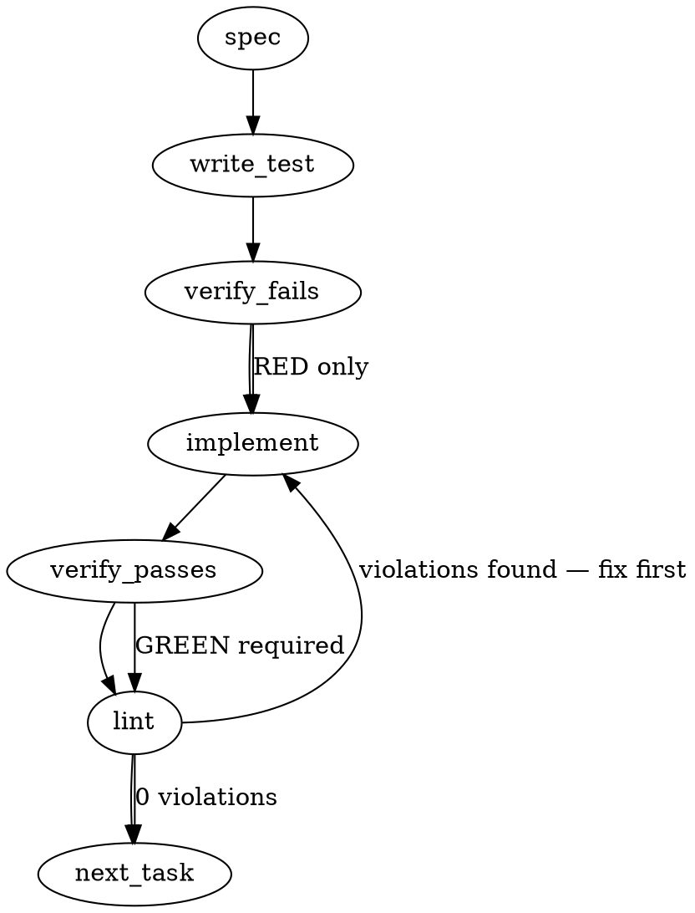

### Problem Statement

We need to design and implement the `agent-workflow-pack` to manage AI agent workflow phases, establish strict agent detection within Git hooks, and enforce zero-trust rule activation via the 5-stage rule funnel during session preflights and delegation hooks.

### Architectural Context

- **Zero-Trust Default (docs/wiki/pack-ecosystem.md):** Any rule or pack configuration generated by an AI must be verified against the codebase before enforcement using the 5-stage Pipeline Engine (`Extract -> Classify -> Compile -> Verify-Against-Codebase -> Activate`). This is a critical security boundary.
- **Agent Detection Block (packages/cli/src/commands/install-hooks.ts):** Agent detection relies on identifying environment variables (`CLAUDE_CODE_AGENT`, `CLAUDE_VERSION`, `CURSOR_TRACE_ID`).
- **Start of Session Automation (docs/reference/workflow-automation.md):** The `/preflight` command initializes fresh sessions by executing preflight tasks and automatically re-injecting rules via `PostCompact`.
- **Agent Delegation Patterns (docs/reference/workflow-automation.md):** Delegate resource-heavy background operations (like shielding, linting, and testing) to background sub-agents while maintaining the main agent's focus on strategy.

### Files to Examine

1. `packages/core/src/pack-discovery.ts` — Understand current pack registration, resolution, and validation patterns.
2. `packages/cli/src/commands/install-hooks.ts` — Read the existing `buildAgentDetectionBlock` implementation to integrate agent-aware Git hooks.
3. `docs/wiki/pack-ecosystem.md` — Deep dive into the zero-trust pipeline architecture and how packs are isolated and verified.
4. `docs/reference/workflow-automation.md` — Understand hook sequences, preflight commands, and agent delegation expectations.

### Technical Approach & Contracts

We will implement an `AgentWorkflowPack` that manages agent-specific lifecycle hooks and interacts with the Pipeline Engine to verify and activate context-specific rules safely.

#### 1. Data Contracts

**Agent Workflow Configuration Schema (Zod):**
We define a formal schema for validating configuration payloads of the agent-workflow pack.

```typescript
import { z } from 'zod';

export const AgentWorkflowPackConfigSchema = z.object({
  name: z.literal('agent-workflow'),
  version: z.string(),
  preflight: z.object({
    enabled: z.boolean().default(true),
    commands: z.array(z.string()).default([]),
  }),
  delegation: z.object({
    enableShield: z.boolean().default(true),
    backgroundTasks: z.array(z.string()).default(['lint', 'test']),
  }),
  hooks: z
    .object({
      preCommit: z.string().optional(),
      prePush: z.string().optional(),
      postCompact: z.string().optional(),
    })
    .default({}),
});

export type AgentWorkflowPackConfig = z.infer<typeof AgentWorkflowPackConfigSchema>;
```

#### 2. Workflow Logic

```
[Agent Session Starts]
        │
        ▼
   /preflight
        │
        ├──> Read pack config safely using `readJsonSafe`
        ├──> Execute preflight checks & rule re-injection (PostCompact)
        │
        ▼
[Development Activity]
        │
        ├──> Run delegated background lint/test shields using `safeExec`
        │
        ▼
[Git Operations (Commit/Push)]
        │
        ├──> Trigger Agent-Aware Hook
        ├──> Run `buildAgentDetectionBlock` check
        ├──> If Agent: Run `Verify-Against-Codebase` pipeline before allowing commit
```

#### 3. Core Architectural Decisions & Trade-offs

- **Approach A: Dynamic Hook Scripts.** Inject conditional logic into standard git hooks that execute Node scripts when an agent is detected.
- **Approach B: Separate Hook Scripts for Agents.** Maintain distinct `agent-pre-commit` hooks.
- _Recommendation:_ **Approach A.** By keeping a single source of truth for the hook files and using conditional execution (environment checks via `buildAgentDetectionBlock`), we avoid desynchronization between human and agent git workflows.

### Edge Cases & Traps

1. **Environment Variable Erasure / Spoofing:** An agent can spawn a subprocess with cleared environment variables, bypassing `buildAgentDetectionBlock`.
   _Mitigation:_ Check for fallback indicators such as specific git author configurations (`*agent*` or `*bot*` in name/email) or parent process names via shell commands.
2. **Concurrent File Mod Access (Race Conditions):** When background subagents run test or lint suites concurrently with main agent edits, shared temporary files or build caches might be corrupted.
   _Mitigation:_ Use atomic test outputs and enforce locks or isolated directory executions for delegation.
3. **Unverified Pack Ingestion:** Loading configuration files directly from insecure sources without zero-trust validation.
   _Mitigation:_ Read pack configurations strictly with Zod validation (`readJsonSafe`) and parse them through the 5-stage verify pipeline.

### Implementation Tasks

- [ ] **Task 1: Define the Agent Workflow Config Schema**
  - Create `packages/core/src/schemas/agent-workflow.ts` (and its test file `packages/core/__tests__/agent-workflow.test.ts`).
  - Define and export `AgentWorkflowPackConfigSchema`.
  - Write unit tests validating partial, complete, and invalid workflow configuration shapes.
    > TEST DIRECTIVE: Before implementing, write a failing test named `rejectsInvalidDelegationTasks` that proves schema rejection when background tasks list unsupported values.
  - _Step:_ write test → verify fails → implement → verify passes → lint

- [ ] **Task 2: Implement Pack Discovery Validation for Workflow Pack**
  - Modify `packages/core/src/pack-discovery.ts` to include support for the `agent-workflow` pack.
  - Integrate validation checks using `AgentWorkflowPackConfigSchema` when loading packs matching the `'agent-workflow'` type.
    > TOTEM INVARIANT (Zero-Trust Default): Rules generated or parsed by packs must go through schema validation before being loaded.
  - Ensure `readJsonSafe` from `@mmnto/totem` is used to load and validate configurations from local files.
  - _Step:_ write test → verify fails → implement → verify passes → lint

- [ ] **Task 3: Implement Agent-Aware Preflight Executions**
  - Create `packages/core/src/preflight-runner.ts`.
  - Implement `runPreflight` using `safeExec` to securely execute preflight and postcompact automation scripts defined in the config.
    > TOTEM INVARIANT (Zero-Trust Default): Do not run unverified code or raw commands directly from external configurations without strict bounds and shell escaping.
  - Ensure the execution path is resolved correctly via `resolveGitRoot`.
  - _Step:_ write test → verify fails → implement → verify passes → lint

- [ ] **Task 4: Enhance Agent Detection in Hooks Installer**
  - Modify `packages/cli/src/commands/install-hooks.ts`.
  - Update `buildAgentDetectionBlock()` to robustly check parent process details and Git author config configurations if common env variables are missing or cleared.
  - Write integration tests confirming the updated detection block outputs correct exit codes under simulated agent/non-agent environments.
    > TEST DIRECTIVE: Before implementing, write a failing test named `detectsAgentThroughGitConfig` that verifies detection works if env variables are missing but git author is flagged as an agent.
  - _Step:_ write test → verify fails → implement → verify passes → lint

- [ ] **Task 5: Implement Rule Verification Hook**
  - Create `packages/core/src/rule-verifier.ts`.
  - Implement the verification handler checking rules against codebase parameters before activation.
  - Integrate this with the pre-commit workflow logic to prevent unverified agent rules from being committed.
  - _Step:_ write test → verify fails → implement → verify passes → lint

### Execution Flow (structural constraint)



### Verification

Every implementation MUST end with these steps:

1. `totem lint` — deterministic rule check (zero LLM, ~2s). Fixes any violations.
2. `totem review` — AI-powered architectural review (~18s). Addresses any critical findings.
3. If using MCP, call `verify_execution` to confirm compliance before declaring the task done.

### Test Plan

- **Unit Tests:**
  - Validate `AgentWorkflowPackConfigSchema` enforces complete types, fallback defaults, and throws errors on invalid command schemas.
  - Test robust agent detection script output with mocked environments (simulating Claude Code, Cursor, generic subagents).
- **Integration Tests:**
  - Mock pack discovery pipeline (`pack-discovery.ts`) load patterns using invalid JSON configurations to confirm safe failure handling.
  - Verify `runPreflight` handles execution timeouts and isolates environment variables between main and sub-agents.

## Implementation Design

> **Supersedes the generated content above entirely.** The synthesis retrieved workflow-automation/hook docs and invented a config-schema + preflight-runner + agent-detection feature set that is not this ask (a live specimen of the confidently-wrong-spec class, mmnto-ai/totem#2465 / mmnto-ai/totem#1620 — no evidence-set disclosure). Ask 1's actual ruled content is the pilot build-asks dispatch (2026-07-23T0124Z): the **agent-workflow micro-pack v1 (8 rules)** + the **mainstream-TS fixture repo**, which together gate strategy's protocol freeze and the pilot clock.

### Scope

New package `packages/pack-agent-workflow` (`@mmnto/pack-agent-workflow`, agent-workflow-governance identity, stack-portable by construction) carrying the eight ruled v1 rules with per-rule good/bad fixture pairs, following the `pack-agent-security` shape (`compiled-rules.json` + `test/fixtures/{bad,good}-*` + rules/structure/parity tests); plus the mainstream-TS fixture repo as controls substrate, pack wind tunnel, and codex's Q4 day-0 replay substrate. Explicitly NOT: the v1.1 conditional modules (lc's three), the T4 atomic-write rule (own weaker-rationale note), pack-agent-security publication/signing, per-vendor adapter controls, and the skill-install adapter mechanism (waits for two instances per the mmnto-ai/totem#1891 ruling).

### The eight rules (ruled shortlist, provenance in the round record)

1. GitHub auto-close adjacency guard (T1 — extraction from the shipped shields)
2. Fail-open-gate ban family (T2 ∪ codex's declared-gate `|| true` / `continue-on-error` masking — one family, two detectors: TS catch-swallow + workflow-YAML masking)
3. Agent-context secret exposure (T3 — the extraction candidate from pack-agent-security)
4. Agent-instruction single-authority (codex — AGENTS.md canonical, tool files pointer-only)
5. Committed agent-permission floor (codex — **advisory tier, ruled**, until per-vendor adapters have paired controls)
6. Governed-file edit marker (kimi R1)
7. Dependency-introduction disclosure, warn-class (kimi R2)
8. Optional-dep fail-loud (kimi R3 — the mmnto-ai/totem-strategy#630 class generalized; conditional applicability accepted)

### Data model / artifacts

- Pack `compiled-rules.json`: hand-authored entries (astGrepPattern or regex, tier, fileGlobs, heading ≤60). File-type diversity beyond the all-TS precedent: rules 1/4/6 target markdown, rule 2's second detector targets workflow YAML, rule 8 targets package.json/lockfiles.
- Per-rule fixture pairs in `test/fixtures/` (unit-level controls) + fixture-repo sites (integration-level; ADR-110's hybrid doctrine — purpose-built adversarial near-misses harden the negative control).
- No new runtime state anywhere; the pack is static data + tests.

### Freeze interaction (stated deliberately)

The rule-compilation freeze covers the **legacy lesson→rule compile path** (`totem lesson compile`). Pack rules here are **hand-authored, pack-local artifacts** — no legacy compiler invocation, no repo `.totem/compiled-rules.json` mutation, no compile-manifest touch — and the pack itself was operator-ruled 2026-07-23 in the pilot round. Freeze-adjacent but outside the frozen path; the wind-tunnel-style per-rule controls replace the frozen pipeline's Stage-4 role.

### Failure modes

| Failure                                     | Category  | Surface                                                                                                               | Recovery                |
| ------------------------------------------- | --------- | --------------------------------------------------------------------------------------------------------------------- | ----------------------- |
| Rule false-positive on legit code           | authoring | negative-control test failure at build; ADR-110 precision discipline                                                  | fix pattern before ship |
| Pattern references hallucinated names/paths | authoring | fixture-repo sweep test (rule must fire on its bad site, nowhere else)                                                | fix pattern             |
| Dead fileGlobs (never match)                | authoring | glob-coverage test: every rule's globs match ≥1 fixture-repo file (the mmnto-ai/totem#2453 class, prevented at birth) | fix globs               |

### Invariants to lock via tests

- Every rule fires on its bad fixture and its fixture-repo bad site; silent on its good fixture and the fixture repo's clean baseline.
- Rule 5 carries advisory tier (asserted, not assumed).
- Every heading ≤60 enforced chars; every fileGlob matches ≥1 fixture-repo file.
- Pack structure passes the `pack-agent-security` structure/parity test shape.

### Open questions (operator rulings needed before build)

- **Q1 — fixture repo location + name:** new GitHub repo (recommend — realistic standalone consumer, honest day-0 replay substrate; propose `mmnto-ai/totem-fixture-ts`, needs your provisioning) vs in-repo `examples/` dir (cheaper, but self-referential as a "consumer"). **Recommendation: new repo.**
- **Q2 — extraction semantics from pack-agent-security:** propose MOVE (not copy) of the agent-context secret-exposure class only — single authority, no consumer break since that pack is unpublished — with strategy-claude confirming (they own the signing/gap-inventory thread). The four existing security families (dynamic-eval, network-exfil ×2, obfuscation, process-spawn) stay put.
- **Q3 — publication:** keep `@mmnto/pack-agent-workflow` in-repo/unpublished until strategy's protocol artifact freezes (pack-agent-security precedent), publish as part of the pilot arming. **Recommendation: in-repo until freeze.**
- **Q4 — tiers for the other seven rules:** recommend error-tier for the trap-shaped (1, 2, 3, 8), warn-tier for the convention-shaped (4, 6, 7) — subject to revision from the fixture-repo wind-tunnel results.

---

## Panel dispositions + rulings (2026-07-24, post-panel)

Pre-build cohort panel ran 2026-07-24 (totem-codex / totem-kimi / totem-agy / totem-gemini / strategy-claude, one lens each). Operator delegated the rulings below to totem-claude ("greenlight whatever else the other agents recommended if you agree with them"). Every mechanical premise cited was re-verified at source before adoption.

### Hard engine constraint (verified, not negotiable)

ast-grep's built-in extension registry is `.ts` / `.tsx` / `.jsx` / `.js` / `.mjs` / `.cjs` only (`packages/core/src/ast-classifier.ts:211-213`). Other languages require `registerLang(ext, lang, wasmLoader)` during boot before the registry seals (`ast-classifier.ts:240-249`, ADR-097 § 5 Q5) — a runtime pack, which this pack's scope excludes. **Every markdown / YAML / JSON rule ships `engine: "regex"`.**

Trap: `resolveAstGrepLangs` (`ast-grep-query.ts:95-113`) falls back to `[Lang.Tsx]` when no positive glob carries a registered extension, so an ast-grep rule globbed at `**/*.md` silently parses markdown as TSX instead of failing loud.

Second constraint, equally load-bearing: the regex runtime is `applyRulesToAdditions` (`rule-engine.ts:561`) — it takes `additions: DiffAddition[]` and evaluates **each diff-added line independently**. Removals are structurally invisible; whole-document and cross-file invariants are unrepresentable.

### Entry count: 8 governed concepts → **9 compiled entries**

Rule 2 splits, because the two detectors cannot share an `engine` field (codex's ruling, forced by the constraint above). Separate `lessonHash`, headings, messages, fixtures, and independently mutable severity. Related only by category/tags and a README cross-reference — a developer who hits one must not receive remediation for the other.

### Final tier table

| #   | Rule (final heading)                         | Engine / target       | Q4 adopted | **Final**            | Basis                                                                                                                                    |
| --- | -------------------------------------------- | --------------------- | ---------- | -------------------- | ---------------------------------------------------------------------------------------------------------------------------------------- |
| 1   | GitHub auto-close adjacency guard            | regex / markdown      | error      | **warn**             | gemini: line-oriented regex has no fenced-code/backtick awareness; docs explaining the rule fire on themselves                           |
| 2a  | TypeScript catch-swallow                     | ast-grep / TS-JS      | error      | **error**            | codex + gemini: clear AST signature, low noise                                                                                           |
| 2b  | Workflow gate masking (same-line)            | regex / workflow YAML | error      | **error**            | codex: restricted to same-line forms whose gate intent is observable                                                                     |
| 2c  | Bare `continue-on-error: true`               | —                     | —          | **deferred from v1** | codex: not classifiable as a declared gate from one line; legitimate best-effort cleanup shares the token                                |
| 3   | Agent-context secret exposure                | ast-grep / TS-JS      | error      | **error**            | unchanged; MOVE from pack-agent-security confirmed                                                                                       |
| 4   | Reject competing agent-instruction authority | regex / markdown      | warn       | **warn** (recut)     | codex: per-line regex cannot prove pointer presence                                                                                      |
| 5   | Avoid committed agent permission bypasses    | regex / settings JSON | advisory   | **advisory** (recut) | unchanged tier; heading recut to the representable claim                                                                                 |
| 6   | Governed-file edit marker                    | regex / markdown      | warn       | **warn**             | unchanged                                                                                                                                |
| 7   | Dependency-introduction disclosure           | regex / package.json  | warn       | **warn**             | unchanged                                                                                                                                |
| 8   | Optional-dep declaration disclosure          | regex / package.json  | error      | **warn**             | kimi: post-narrowing it fires on every optional-dep introduction, and legitimately-optional is the normal case; error-tier trains bypass |

Three rules move off the adopted Q4 recommendation (1, 8 by tier; 4 by scope). Rule 2's split changes the count.

### Recuts — the spec overclaimed, corrected here

- **Rule 4.** The phrase "tool files pointer-only" claims more than the runtime can establish. Recut to: flag an added line in `**/CLAUDE.md` / `**/GEMINI.md` that claims `canonical agent instructions` or `source of truth` **without** pointing to `AGENTS.md`. Explicitly **do not** scan `.github/copilot-instructions.md` or `.junie/guidelines.md` — those are generated rule-export surfaces, not ADR-038 thin redirects, and flagging their normative content would flag legitimate exports. The full presence/existence invariant stays on the doctor lane, where `checkAgentsMdCanonical` (`packages/cli/src/commands/doctor.ts:858`) already reads whole files.
- **Rule 5.** "Permission floor" is roadmap intent, not a claim a static per-line rule can make. Recut to "avoid committed agent permission bypasses": exact config surfaces (`**/.claude/settings.json`, `**/.gemini/settings.json`), unmistakable universal-bypass tokens only (explicit bypass-permissions / YOLO mode / the exact universal grant `Bash(*)`). Command-scoped wildcards like `Bash(gh search *)` are bounded grants and must **not** fire. The message asks for review; it must not claim the repository is unprotected.
- **Rule 8.** Narrowed to the declaration shape — flag diff-added `optionalDependencies` entries, requiring a fail-loud consumer check plus disclosure. The actual strategy#630 defect (a pin present-then-gone) is a removal _and_ cross-file, unreachable from this runtime on two independent axes; filed separately as mmnto-ai/totem#2504.
- **Rule 6.** Per-line evaluation means the marker must be detectable on the added line itself, or the rule inverts to flagging added lines lacking a same-line marker token. A "file contains a marker somewhere" presence-invariant is not representable.

### Glob discipline (banned shapes)

Repeat offenders under the runtime's bounded matcher dialect — patterns violating it fall back to a **literal** string matcher that expects actual `*` characters in the path, so they can never hit (this is a mechanism behind the mmnto-ai/totem#2453 dead-glob population):

terminal `dir/**/*` · mid-name wildcards (`Dockerfile*`, `.env*`) · single-star directory segments (`packages/*/src/**`) · `.git/hooks/*` and `.husky/*` · brace alternation (`**/*.{yml,yaml}`) · question-mark and character-class forms.

Use separate `.yml` and `.yaml` globs. Prove liveness through the runtime's own exported `fileMatchesGlobs`, never micromatch/picomatch or a hand-rolled approximation.

**Glob coverage must prove both sides** (codex): every positive glob matches ≥1 named fixture path, **and** every negative glob actually excludes a named otherwise-matching path. A dead negative glob silently broadens enforcement, so positive-only coverage is insufficient.

### Control stack — Layer 1 alone is a vacuous pass

agy's ruling: do **not** ship on unit fixtures alone. It leaves the pack blind to glob-mismatch defects and guarantees false positives on first consumer contact.

**Unblock (adopted):** build Layer 2/3 as an in-tree wind tunnel at `packages/pack-agent-workflow/test/fixtures/wind-tunnel/`, holding in-situ good/bad specimens plus adversarial near-misses. Tests run the rules against that tree, satisfying "fires on its bad site, silent elsewhere" and glob-coverage entirely in-repo. When `mmnto-ai/totem-fixture-ts` is provisioned, the directory is pushed to seed it, preserving parity without holding the pilot clock.

Mandated near-miss specimens (agy): control-flow-altering catch blocks (`catch { return; }`) and logging catch blocks; `continue-on-error` appearing under a non-step YAML key; prose separating the keyword from the issue ID; fenced code blocks and inline-backticked `Closes #N`; validated fallback implementations for optional deps; `process.env.*` reads and explicitly-mocked test keys for the secret rule.

### Q1 / Q2 / Q3

- **Q1** — build on the in-tree wind tunnel per above. `mmnto-ai/totem-fixture-ts` provisioning remains with the operator; it is load-bearing for the freeze _evidence_, not for the build.
- **Q2 — ⚠ PREMISE FALSE, RULING WITHDRAWN PENDING RE-RULE (2026-07-24, found at build time).** There is **no agent-context secret-exposure rule in `pack-agent-security`**. Its five rules are process-spawn, dynamic-eval, network-exfil (api), network-exfil (shell), obfuscation — exactly the set the spec calls "the four families that stay put". A sweep of every `packages/pack-*/compiled-rules.json` returns zero secret/credential/token-shaped rules. **There is nothing to MOVE.**

  The class lives instead in the repo's **legacy compiled corpus** `.totem/compiled-rules.json` (`1a7080ebf6162de3` "NEVER inline secrets, tokens, or API keys into agent config"; `ec594c0f3c8ad660` "Avoid inlining tokens or API keys in configuration files"; `f30c7342898d4b9b` "Environment variables from the host machine can leak" — two with exact-duplicate twins, a likely mmnto-ai/totem-strategy#609 specimen).

  Consequences: both of strategy-claude's stated Q2 concerns are moot (nothing leaves pack-agent-security, so its gap inventory is untouched; there is no shared scaffolding, so the mmnto-ai/totem#2460 copy-vs-re-point caveat does not apply). But a **new freeze question** appears that this spec does not cover — the freeze-interaction section argues the pack is outside the frozen path on the basis of zero corpus interaction, and sourcing a pack rule _from_ the frozen corpus is a relationship nobody has ruled on. Not decided here.

  **RE-RULED 2026-07-24 (strategy-claude, confirm withdrawn in full): AUTHOR NEW.** Rule 3 is authored fresh against the agent-context surface, treating the legacy corpus entries as **prior art to read, not a source to extract from**. Two reasons it stands on its own rather than inheriting the MOVE's: extraction would import the unresolved duplicate-hash state of a corpus whose own dedup is open (and pack rules are the surface consumers are asked to trust); and authoring keeps the freeze question from arising at all, which is the strongest argument for it — it needs no new ruling. **Built and green** as entry 4 of 9.

  **Gap-inventory constraint — RE-SCOPED, not deleted** (strategy-claude's explicit request). The constraint was recorded against a subtraction from `pack-agent-security`; that event never happened. It now attaches to the other pack and the opposite direction: **`@mmnto/pack-agent-workflow` gains an agent-context secret-exposure rule as an ADDITION.** If the agent-security gap inventory ever becomes a per-pack manifest rather than surface-wide coverage tracking, that manifest must reflect this pack asserting the secret-exposure class — otherwise the pack's self-assertion and the inventory disagree. Owner: strategy-claude (signing / gap-inventory thread).

  The mmnto-ai/totem#2460 caveat is **void, not merely moot**: there is no shared matcher scaffolding to copy-versus-re-point, because there was no source rule.

  Process note: this survived operator adoption, an explicit verification request from totem-claude to strategy-claude, and strategy-claude's confirm. Three passes; the artifact was never opened. strategy-claude's sharpening: each pass raised confidence without anyone re-earning it, and it surfaced only when someone tried to move a file — the one step that cannot be performed on a nonexistent artifact.

- **Q3** — the circularity resolves by naming the gating artifact precisely: **freeze proceeds on the pack built and tested in-repo; publication happens at pilot arming.** Publishing is a distribution event that proves nothing additional about the protocol and is the step that cannot be cleanly reversed. Matches the pack-agent-security precedent.

### Recorded disagreements

Two gemini recommendations declined, both in favour of later and better-grounded arguments:

1. **Rule 8 error-tier** (gemini) vs **warn** (kimi). gemini's case rested on near-zero false positives because package.json is structured and targeted — sound _before_ the narrowing, but the narrowed rule fires on every optional-dep introduction, where the legitimate case dominates. kimi's reply explicitly read gemini's and argued past it. Sided with kimi.
2. **Bare `continue-on-error: true` at error-tier** (gemini: "highly structured, shouldn't appear in prose") vs **defer** (codex). gemini's argument addresses prose collision, which is not the failure mode; the problem is that legitimate best-effort cleanup and telemetry steps use the identical token, and one line carries no gate context to separate them. Sided with codex.
