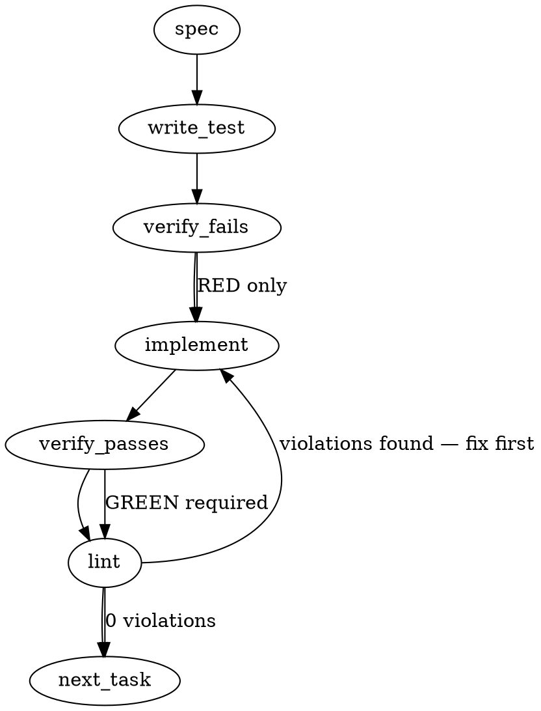

### Problem Statement

The system requires a robust, type-safe, and validation-strict parser for `Prop310` Version 1 specification files (typically JSON format). This parser must ingest, validate, and transform raw payloads into guaranteed type-safe domain objects, preventing malformed or invalid schemas from leaking deeper into core systems.

### Architectural Context

- **Parity with Lock Parsers:** Similar to the doctrine parser in `packages/core/src/parity-detect.ts`, JSON parsing must degrade gracefully to structured validation failures rather than unhandled system-level throws.
- **Shared Helpers Integration:** The parser must utilize the core `@mmnto/totem` package's `readJsonSafe` helper for file-based ingestion to ensure automatic Zod schema enforcement and standardized error handling.
- **WASM / Parser Precedents:** If parsing requires AST integration, web-tree-sitter constraints detailed in `packages/core/src/ast-classifier.ts` (using non-native, web-safe engines) must be respected.

### Files to Examine

- `packages/core/src/parity-detect.ts` — Examine `parseStrategyDoctrineLock` for handling raw JSON inputs and structured diagnostic returns.
- `packages/core/src/prop310-parser.ts` — **(New File)** Proposed location for the Prop310 parser implementation, schemas, and types.
- `packages/core/test/prop310-parser.test.ts` — **(New File)** Proposed location for comprehensive unit and contract validation tests.

### Technical Approach & Contracts

#### 1. Schema & Contract Design (Zod)

We will define a strict Zod validation schema representing the `Prop310` Version 1 format. The schema will enforce mandatory fields, string format patterns, and exact version matching to avoid v2 overlap.

```typescript
import { z } from 'zod';

export const Prop310V1Schema = z
  .object({
    version: z.literal('1'),
    id: z.string().regex(/^PROP-310-[A-Z0-9_-]+$/i, 'Invalid Prop310 ID format'),
    title: z.string().min(1, 'Title cannot be empty'),
    rules: z.array(
      z.object({
        id: z.string(),
        severity: z.enum(['error', 'warning', 'info']),
        matcher: z.string().min(1, 'Matcher pattern required'),
        message: z.string(),
      }),
    ),
    metadata: z.record(z.unknown()).optional(),
  })
  .strict();

export type Prop310V1 = z.infer<typeof Prop310V1Schema>;

export type ParserResult<T> =
  | { success: true; data: T }
  | { success: false; error: Error; diagnostics: string[] };
```

#### 2. Parsing Function Signature

The core parser will support both direct string ingestion and safe file loading:

```typescript
// Core parsing and validating logic
export function parseProp310V1(rawJson: string): ParserResult<Prop310V1>;

// Safe file parser wrapping `readJsonSafe`
export function loadProp310V1File(filePath: string): Prop310V1;
```

### Edge Cases & Traps

- **Version Skew:** A user might attempt to pass a Prop310 Version 2 document to this parser. To prevent subtle mismatches, the parser must fail early and explicitly if the `"version"` field is present but is not exactly `"1"`.
- **JSON Bomb / Size Limits:** Ensure the input string length is checked before triggering `JSON.parse` to avoid running out of memory on malicious or bloated files.
- **Regex Denial of Service (ReDoS):** Ensure ID validation regexes are simple and non-backtracking. The pattern `/^PROP-310-[A-Z0-9_-]+$/i` is linear and safe.
- **Lossy Type Casts:** Zod’s `.strict()` mode is essential to prevent developer-defined payloads from passing unrecognized parameters down-funnel, which could result in silent compatibility regressions during future v2 upgrades.

### Implementation Tasks

- [ ] **Task 1: Define Schemas & Interfaces**
      Create the core schema definitions and export the structural types in `packages/core/src/prop310-parser.ts`.

  > TEST DIRECTIVE: Before implementing, write a failing test named `rejects non-v1 schema versions` that asserts a document with version "2" throws or returns an explicit version-mismatch validation error.
  > _Write test → verify fails → implement → verify passes → lint_

- [ ] **Task 2: Implement String Parser with Safe Diagnostic Returns**
      Implement `parseProp310V1` in `packages/core/src/prop310-parser.ts`. Wrap parsing errors so syntactic JSON malformations degrade gracefully to `{ success: false, error: SyntaxError }` without blowing up caller stacks.

  > TOTEM INVARIANT (Parity Lock Parsing): Malformed lock/proposal documents must degrade to diagnostic failure signals rather than system-terminating throws.
  > TEST DIRECTIVE: Before implementing, write a failing test named `gracefully catches malformed JSON` ensuring invalid string inputs return a structured diagnostic failure instead of throwing.
  > _Write test → verify fails → implement → verify passes → lint_

- [ ] **Task 3: Implement File Loader using Shared Helpers**
      Implement `loadProp310V1File` in `packages/core/src/prop310-parser.ts`. It must use the `@mmnto/totem` shared helper `readJsonSafe` mapped directly to `Prop310V1Schema`.
  > TOTEM INVARIANT (Shared Helpers): The plan MUST use readJsonSafe instead of manually reading from fs and calling JSON.parse.
  > TEST DIRECTIVE: Before implementing, write a failing test named `correctly parses valid schema files` using a temporary mock file matching the exact Zod contract.
  > _Write test → verify fails → implement → verify passes → lint_

### Execution Flow



### Verification

Every implementation MUST end with these steps:

1. `totem lint` — Run deterministic lint and rule checking on newly modified files.
2. `totem review` — Execute supplementary AI pipeline validation over the generated diff.

### Test Plan

- **Contract Verification:**
  - Verify documents with correct properties are successfully validated with complete type adherence.
  - Verify schemas with missing fields (e.g., `title` omitted) or invalid structure (e.g., non-literal `version`) are caught by the Zod parser.
- **Robustness Tests:**
  - Test the parser against large payloads to ensure performance stability.
  - Test error handling with raw syntax-errors (e.g., unclosed quotes) to guarantee diagnostic error outputs are readable and informative.
- **File System Integration:**
  - Assert `loadProp310V1File` safely catches file accessibility problems by propagating Totem's internal file read exceptions clearly.

## Implementation Design

**Contract of record:** [Prop 310](https://github.com/mmnto-ai/totem-strategy/blob/main/proposals/active/310-record-grammar.md) (incl. Amendment 1) + ADR-103 Amendment 2026-08-19 + ADR-112. The generated sections above diverge from the primaries and are NOT the contract — divergence table:

| Generated spec says                                | Primaries say                                                                                     |
| -------------------------------------------------- | ------------------------------------------------------------------------------------------------- |
| JSON "Prop310 specification file", `readJsonSafe`  | YAML carrier, one rule = one file at `.totem/rules/<slug>.rule.yaml` (§ Design 1, R10)            |
| Author-set `id: PROP-310-*`, `version: '1'` string | No author-set id/version — R17 producer-owned identity; integer `schemaVersion: 1` (§ Design 2–3) |
| `severity: error\|warning\|info`                   | Closed `error \| warning`, NO default (§ Design 4)                                                |
| Graceful `{success:false}` degradation             | Explicit-or-error, fail loud; no-silent-skip supersedes warn-and-ignore (§ Design 2, R5)          |

### Scope

Build the V1 record-grammar path: parser for `.totem/rules/*.rule.yaml` (closed-key, explicit-or-error), total lowering into the existing spine compile seam with the four named compiled homes (`excludeGlobs`, `requires`, `examples`, `language`) plus verbatim `verification_shadow` carry, the Amendment-1 record→envelope derivation (LF-normalizing writer, CR-blind pair hashes, fail-loud join), intake/front-end adaptation with content-addressed attestation relocation, manifest attestation of the new file class, and the § Design 14 conformance fixture suite (one negative fixture per banned-silent behavior + per dialect rule). It will NOT: evaluate `verification_shadow` (Amendment R4 gate), implement `rego`/`ast`/`block`-scope/multi-requires (version-bump/reserved), narrow any reader enum, touch the frozen legacy lesson-compile path (`extractManualPattern`, `sanitizeFileGlobs` tolerant behavior), migrate legacy rules or mutate lessons, or run/score R14 translations (translator ≠ scorer; the trial is strategy-chartered on mmnto-ai/totem-strategy#288).

### Data model deltas

- **`RuleRecordSchema`** (new; `packages/core/src/spine/rule-record.ts`; Zod `.strict()` at every depth): `schemaVersion: z.literal(1)` · `severity: 'error'|'warning'` · `message` non-empty · `recoveryHint?` · `target { type: 'ast-grep'|'regex', language (required iff ast-grep, forbidden for regex), pattern XOR rule (NapiConfig subset), scope { fileGlobs min-1, excludeGlobs? } }` · `examples` min-1 of `{bad, good}` · `requires? { pattern, scope: 'line'|'file' ('block' parses into the reserved-unimplemented gate) }` · `curation?` (per Prop 270 §8, camelCase) · `verification_shadow? { type, source }` (closed keys, retained verbatim). Written by authors; read by parser→intake→compiler. Invariant: no field has a default; the inexpressible set (producer-owned keys, `provenance`, `id`, `version`, `declaredEngine`, ADR-112 intake-seam authoring metadata) is rejected as unknown-key by closure.
- **`ParsedRuleRecord`** (parser output, pure value): record + `derivedEngine` (from `target.type`, § Design 3) + per-pair CR-blind content hashes (LF-image basis, Amendment 1 item 3). No module-level state; parser is deterministic and total.
- **`CompiledRule` additions** (`compiler-schema.ts`, all optional — mined rules lack them): `excludeGlobs?`, `requires?`, `examples?`, `language?`, `verificationShadow?` (verbatim). Written by `compileCandidate` on the record path; read by `rule-engine` (excludeGlobs two-array match, requires two-pass), certification (examples), diagnostics. Invariant: additions never alter mined-rule byte-identity (schema additions optional ⇒ existing compiled corpus re-parses unchanged).
- **Envelope derivation**: fixture-envelope `preimageSource` derived from record `examples[i]` keyed `(ruleId, ordinal)` + pair hash as drift sensor. Written by intake derivation; read by certification (which continues to read anchored fixtures — 06's read-side rule). Invariant: dangling/duplicate/hash-mismatched reference fails loud at intake; never silent re-pair.

### State lifecycle

Record files: persistent, author-owned canonical source (Tenet 20 class (a)); created by hand or `totem rule scaffold`; never written by compile. Parse results: per-invocation values, no cache. `compiled-rules.json`: existing regenerable-cache lifecycle, unchanged ownership. Derived envelope entries: persistent, written only at intake, content-addressed to the exact record set (attestation relocation constraint, § Design 1). No new cross-lifecycle flags; the language registry stays the existing Map-backed compile-time authority.

### Failure modes

| Failure                                                                                                   | Category          | Agent-facing surface                                                                                                                                                                     | Recovery                |
| --------------------------------------------------------------------------------------------------------- | ----------------- | ---------------------------------------------------------------------------------------------------------------------------------------------------------------------------------------- | ----------------------- |
| Unknown key at any depth / author-set identity key                                                        | runtime (parse)   | hard error, file+path named                                                                                                                                                              | fix the record          |
| Unknown `schemaVersion` / `target.type` / reserved construct (`scope: block`)                             | runtime           | hard error (V1 consumer declares no degraded mode)                                                                                                                                       | version-bump or fix     |
| Missing mandatory field; out-of-vocab severity; `language` missing-for-ast-grep or present-for-regex      | runtime (parse)   | hard error                                                                                                                                                                               | fix the record          |
| Dialect violation (braces, `!`-negation, nested/adjacent `**`, regex-in-glob, absolute path/drive letter) | runtime (parse)   | hard error, rule cited                                                                                                                                                                   | rewrite glob explicitly |
| Unresolvable `language:` at compile                                                                       | runtime (compile) | hard error                                                                                                                                                                               | register language / fix |
| Payload fails engine gate (safe-regex2, NapiConfig validation) or cannot lower                            | runtime (compile) | hard error at intake preflight (never accept-at-parse-drop-at-compile)                                                                                                                   | fix payload             |
| Payload/type divergence (yaml fence under regex class)                                                    | runtime (compile) | hard error (engine-binding assert, carried over)                                                                                                                                         | fix `target.type`       |
| Examples⇄fixture join dangling/duplicate/hash-mismatch                                                    | runtime (intake)  | hard error                                                                                                                                                                               | re-derive envelope      |
| CRLF in exemplar values                                                                                   | runtime (write)   | silent LF-normalization at write — **justified**: it IS the admit rule (Amendment 1 item 2), spec-mandated representation, not drift; read-side hash is CR-blind so no false drift fires | n/a                     |
| Record file unreadable / YAML syntax error                                                                | runtime           | hard error, file named                                                                                                                                                                   | fix file                |

### Invariants to lock in via tests (conformance suite core, § Design 14)

- No silent default: every mandatory omission errors; severity/scope have no fallback values.
- No silent skip: unknown version/type/reserved construct can never drop a rule without error.
- No silent expansion: `{a,b}` is a parse error on the record path while `sanitizeFileGlobs` legacy behavior is byte-identical before/after (freeze guard test).
- No silent promotion: `*.ts` matches root-level only; effective scope equals declared scope.
- `declaredEngine` is always derived from `target.type`; the engine-binding assert still fails loud on payload/type divergence (not tautological).
- Lowering is total: every construct that parses reaches the compiled record or fails compile loud.
- Mined-path byte-identity: existing `compiled-rules.json` re-validates unchanged under the extended schema.
- Round-trip: record→envelope derivation reproduces the certification preimage byte-exactly for LF-clean content; writer never emits real `\r` into parsed values; pair hash identical across CRLF/LF authored variants.
- `requires` two-pass: fires iff target matches ∧ pattern absent in declared scope; `line` + `file` implemented; exactly one block.
- Freeze isolation: no legacy lesson-compile file's behavior changes (the record path is new code beside it).

### Open questions

- **Question:** Do `.totem/rules/*.rule.yaml` files join the retrieval index (chunker class), or only the manifest attestation surface at V1?
  - **Options:** (a) manifest-only now, file a named issue for indexing; (b) wire the chunker in this build.
  - **Recommendation:** (a) — the proposal requires the decision be named, not the wiring; indexing is separable and widens the diff.
- **Question:** PR shape — one build or a sliced stack?
  - **Options:** single PR (~all surfaces, heavy review); stack of 3 (1: schema+parser+dialect+conformance fixtures, land-alone-able; 2: compiled homes + lowering + runtime eval; 3: intake front-end + envelope derivation + manifest attestation).
  - **Recommendation:** stack of 3 — slice 1 is pure-new code with zero coupling risk; slices 2–3 each carry their own contract tests.
- **Question:** Confirm freeze boundary — I will read `.totem/freeze.json`'s do-not list before coding; the record path is new code beside the frozen legacy path, but the `CompiledRuleSchema` additions touch a file the legacy path also reads (additive/optional only).
  - **Options:** proceed as scoped; or route a freeze-adjacency note to the freeze entry first.
  - **Recommendation:** proceed — additive-optional schema fields don't regenerate or alter frozen outputs (locked by the byte-identity invariant above).
