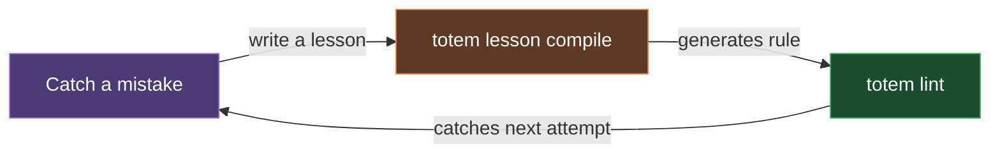

# Totem

[](https://www.npmjs.com/package/@mmnto/totem)
[](https://github.com/mmnto-ai/totem/actions/workflows/ci.yml)
[](https://github.com/mmnto-ai/totem/tree/main/packages/mcp)
[](LICENSE)
[](https://nodejs.org)
[](https://pnpm.io)

**Editor integrations:** [Claude Code](.claude/) · [Gemini CLI](.gemini/) · [GitHub Copilot](.github/copilot-instructions.md) · [JetBrains Junie](.junie/) · others in progress. See [`AGENTS.md`](AGENTS.md) for how integration works.

_AI coding agents are brilliant goldfish. Totem keeps your project's lessons, rules, and context in the repository itself, underneath whichever agent you run, so what the team learned survives the session that learned it._

> `totem lint` is deterministic and offline. Zero LLM calls, no network, and the cost scales with the size of your diff, not the size of your history. Timing numbers live in [CI-recomputed receipts](docs/wiki/maturity.md), not in this README.

When using LLMs on projects, I found that agents kept making the same architectural mistakes. They forgot context and reinvented helpers that already existed. The velocity was great, but the architectural integrity degraded quickly. Every PR became an exhausting back-and-forth with review bots over the same nits. They can make the wrong way look brilliant (until you realize what happened). They'll rarely ask: _"doesn't a shared helper already exist for this?"_

The cause is structural, not a prompt problem. Models are stateless. Every session starts from zero, and anything the last session learned is gone unless it lives somewhere durable. If project rules and lessons don't reside in the repository alongside the code, no amount of re-explaining fixes it for the next session.

Totem is what I extracted to solve that friction. It's a file-based toolkit: plain markdown lessons, a queryable knowledge index derived from them, and compiled lint rules a zero-LLM linter enforces. The lint engine is deterministic; the index is local, derived, and rebuilt from your files at any time; the compiler and review commands are LLM-powered and opt-in. The structural pieces ship today. The discipline and telemetry layers are in active development; the [maturity page](docs/wiki/maturity.md) carries the honest split, machine-derived from committed data.

---

- [Tripwires, Not Tracks](#tripwires-not-tracks)
- [How Mistakes Become Rules](#how-mistakes-become-rules)
- [The Queryable Knowledge Index](#the-queryable-knowledge-index)
- [What's in the Box](#whats-in-the-box)
- [What Works and What Doesn't](#what-works-and-what-doesnt)
- [Quickstart](#quickstart)
- [Documentation & Workflows](#documentation--workflows)

---

## Tripwires, Not Tracks

To an agent, documentation is merely a suggestion. I tried the heavy orchestration approach that dictates every step of the agent's workflow, and found it rigid and disruptive to the human-in-the-loop dynamic. Totem is built on a different philosophy: you provide an open field surrounded by electric fences. The LLM is free to code however it wants, but when it attempts to alter the permanent state of the world (e.g., `git push`), it hits a deterministic tripwire.

Totem turns a plain-English markdown lesson into a physical constraint that a local, zero-LLM linter enforces:

**Input:** (`.totem/lessons/no-child-process.md`)

```markdown
## Lesson - Never use native child_process

Tags: architecture
Direct use of `node:child_process` is forbidden outside `core/src/sys/`. Use the `safeExec` shared helper instead.
```

**Output:** (`git push` blocked on the agent's machine)

```bash
$ git push
[Lint] Running compiled rules (zero LLM)...
### Warnings
- **packages/cli/src/git.ts:22** - Never use native child_process
  Pattern: `import { execSync } from 'node:child_process'`
  Lesson: "Direct use of `node:child_process` is forbidden outside `core/src/sys/`. Use the `safeExec` shared helper instead."
[Lint] Verdict: FAIL - Fix violations before pushing.
```

The "wrong" way becomes the "loud" way. No LLM in the loop at runtime, no network, and the linter only reads your diff, which is why enforcement stays cheap no matter how large the project gets.

## How Mistakes Become Rules

The core loop is simple. A mistake gets caught in a PR review, a bot nit, or a production bug. I write a plain-English lesson that explains what went wrong. `totem lesson compile` turns the lesson into an AST or regex rule, and `totem lint` enforces it on every push from that point forward. The same compiled pattern can't ship past the linter again once the pre-push hook or CI runs and the rule matches.



When a rule matches comments or string literals instead of actual code, `totem doctor` flags it as noisy, and `totem lesson compile --upgrade` re-runs the compiler with a precision-targeted prompt. I'd rather have 300 precise rules than 1,000 noisy ones.

Want to watch the whole loop run on a committed fixture? [`examples/proof-kit/`](examples/proof-kit/) is a tiny repo where a real mistake, its lesson, and the compiled rule that blocks the recurrence are all committed. CI re-proves the block on every push and writes a [receipt](examples/proof-kit/receipt.json) with its parameters.

## The Queryable Knowledge Index

Your lessons and ADRs live in your repo as plain markdown files: those files are the canonical source. `totem sync` derives a local semantic index from them (Tree-sitter + LanceDB) so they become queryable. The derived store stays on your machine and rebuilds from the files at any time, so there's no cloud dependency and no vendor lock-in.

MCP-compatible agents query it through the bundled MCP server. Registering that server with your agent is a one-time, per-agent configuration step; `totem init` scaffolds it for the agents it detects, and for anything else, see [MCP Server Setup](docs/wiki/mcp-setup.md). Once registered, before your agent writes a line of code, it can ask "what patterns are banned in this codebase?" and get ranked candidates from your project's actual history. The agent still has to read them and synthesize: a queryable index returns candidates, not pre-synthesized answers. Whether an agent actually issues that query before deriving from scratch is an agent-discipline question; see [What Works and What Doesn't](#what-works-and-what-doesnt).

## What's in the Box

Totem is a set of CLI tools, not a framework. Building blocks you wire into whatever CI and workflow you already have. Several commands support `--json` for scripting; check `totem <command> --help`.

| Command                | What it does                                                                                                                     |
| ---------------------- | -------------------------------------------------------------------------------------------------------------------------------- |
| `totem lint`           | Run all compiled rules against your diff. Zero LLM, offline.                                                                     |
| `totem lesson compile` | Turn plain-English lessons into AST or regex rules.                                                                              |
| `totem lesson extract` | Pull lessons from PR reviews and bot comments.                                                                                   |
| `totem doctor`         | Verify the wiring end-to-end; flag noisy rules via Trap Ledger telemetry, suggest upgrades.                                      |
| `totem spec`           | Generate an implementation spec from a GitHub issue before you touch any code (LLM-powered, requires a configured LLM provider). |
| `totem review`         | LLM-powered review on an uncommitted diff, grounded in your project's lessons (requires a configured LLM provider).              |
| `totem sync`           | Rebuild the semantic index from your lessons and docs.                                                                           |
| `totem hook install`   | Install Git hooks (`pre-push` lint gate).                                                                                        |

For CI, `totem lint --format sarif` pipes into GitHub Code Scanning or any SARIF-compliant tool, so tripwires show up as inline PR annotations. The stream is scoped to error-severity findings; warnings stay local until a rule earns promotion. Recipes in [CI/CD Integration](docs/wiki/ci-integration.md); the same flag works on the standalone `totem-lite` binary for CI without Node.js.

## What Works and What Doesn't

Totem has three layers, and I want to be honest about where each one stands:

1. **The enforcement layer works.** Compiled rules and Git hooks catch violations mechanically and offline. Nothing on that floor touches the network, so it runs natively in air-gapped environments. No source code leaves your machine. Because it lints the diff, not the history, it stays fast at any project size; the [maturity page](docs/wiki/maturity.md) renders the live lint receipt with its parameters, recomputed in CI.
2. **The planning layer works too, to my surprise.** Before the agent writes any code, `totem spec` pulls the GitHub issue body and queries the knowledge base for relevant lessons and ADRs. It writes a structured implementation spec to `.totem/specs/<issue>.md`. None of this is a hard tripwire: the agent could write a vague spec and ignore the retrieved context. But in practice, in my own use of it, the structured prompt has repeatedly caught "I'm about to reinvent a helper that already exists" before the agent commits to an approach.
3. **The knowledge index is real infrastructure.** The index exists, it's portable across repos, and any MCP agent can query it once registered. But whether an agent _consistently acts_ on the context it retrieves is an open question I'm actively working through. Availability is deterministic. The agent's discipline is not.

I built the enforcement layer because the upstream layers aren't enough on their own. An agent can have a clean spec, relevant lessons in context, and still drift when it gets deep into a task. The tripwires catch what the planning layer and the knowledge index miss. That's the whole point of keeping them as three distinct layers: each catches a different class of failure, at a different stage of the workflow.

The [maturity page](docs/wiki/maturity.md) is this section in machine-derived form: shipped, partial, and goal rows built from committed data and drift-gated in CI, so the claims can't quietly outrun the code.

## Quickstart

Initialize Totem in any project (Node, Python, Go, Rust):

```bash
pnpm dlx @mmnto/cli init
```

This scaffolds `totem.config.ts`, wires up the `pre-push` git hook, and installs the baseline rule pack.

Run the linter (offline):

```bash
pnpm dlx @mmnto/cli lint
```

Then verify the wiring:

```bash
pnpm dlx @mmnto/cli doctor --strict
```

`doctor --strict` reports config, hooks, rules, and index wiring, and exits non-zero on fail-class diagnostics. Read and resolve its warnings before treating setup as complete; if an agent is running this setup for you, that is its checklist too.

No Node.js? The **Totem Lite** standalone binary runs `init`, `lint`, and `hook install` fully offline: grab it from [Releases](https://github.com/mmnto-ai/totem/releases); platform commands in the [Installation Guide](docs/wiki/installation.md).

## Documentation & Workflows

- [**It Never Happens Again:**](docs/wiki/it-never-happens-again.md) How a PR mistake becomes a permanent project law: one lesson file, one command.
- [**Governing AI Agents:**](docs/wiki/governing-ai-agents.md) How to use hooks and MCP tools to enforce project rules on Claude and Gemini from Turn 1.
- [**It Stops Crying Wolf:**](docs/wiki/it-stops-crying-wolf.md) How override telemetry flags noisy rules for downgrade: proposed as a PR, merged by a human.
- [**Maturity:**](docs/wiki/maturity.md) What's shipped, partial, and still a goal: machine-derived rows with receipts, drift-gated in CI.
- [**Proof Kit:**](examples/proof-kit/) A committed, re-runnable exhibit: one real mistake, the rule compiled from its lesson, and CI re-proving on every pull request that the mistake stays blocked, with zero LLM calls.

### Deep Dives

- [CLI Reference](docs/wiki/cli-reference.md)
- [Architecture & Workflows](docs/reference/architecture.md)
- [MCP Server Setup](docs/wiki/mcp-setup.md)
- [CI/CD Integration](docs/wiki/ci-integration.md)

## Open Source Commitment

The core toolkit (enforcement engine, `totem lesson compile`, MCP server, and the rule-tuning loop) is Apache 2.0. If federation, hosted services, or centralized telemetry are introduced later, they are intended to be separate products, while the local toolkit remains Apache 2.0.

See [`COVENANT.md`](COVENANT.md) for details.

## License

Apache 2.0 License.
