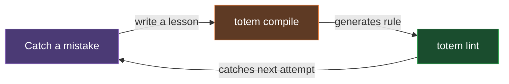

# Totem

_AI coding agents are brilliant goldfish. Totem is their persistent, cross-repo memory._

When using LLMs on projects, I found that agents kept making the same architectural mistakes, forgetting context, and reinventing the wheel. The velocity was great, but the architectural integrity degraded quickly. Every PR became an exhausting back-and-forth with review bots over the exact same nits. 

They can make the wrong way look brilliant — until you realize what happened. They'll rarely ask: _"doesn't a shared helper already exist for this?"_

Totem is the framework I extracted to solve that friction. It's a collection of tools that acts as a persistent memory and enforcement layer for AI agents. It uses deterministic hooks to remember the lessons the AI forgets.

## Documentation is merely a suggestion

I tried the heavy orchestration approach—dictating every step of the agent's workflow—and found it rigid and disruptive to the human-in-the-loop dynamic. Totem is built on a different philosophy: **Tripwires, Not Tracks.**

You provide an open field surrounded by electric fences. The LLM is free to code however it wants, but when it attempts to alter the permanent state of the world (e.g., `git push`), it hits a deterministic tripwire. 

Totem turns a plain-English markdown lesson into a physical constraint that a local, zero-LLM linter enforces:

**Input:** (`.totem/lessons/no-child-process.md`)

```markdown
## Lesson — Never use native child_process

Tags: architecture
Direct use of `node:child_process` is forbidden outside `core/src/sys/`. Use the `safeExec` shared helper instead.
```

**Output:** (`git push` blocked on the agent's machine)

```bash
$ git push
[Lint] Running 393 rules (zero LLM)...
### Warnings
- **packages/cli/src/git.ts:22** — Never use native child_process
  Pattern: `import { execSync } from 'node:child_process'`
  Lesson: "Direct use of `node:child_process` is forbidden outside `core/src/sys/`. Use the `safeExec` shared helper instead."
[Lint] Verdict: FAIL — Fix violations before pushing.
```

The "wrong" way becomes the "loud" way. No LLM in the loop at runtime — just sub-second, offline enforcement.

## How Mistakes Become Rules

The core loop is simple: a mistake gets caught (PR review, bot nit, production bug), I write a plain-English lesson describing what went wrong, `totem compile` turns it into an AST or regex rule, and `totem lint` enforces it on every push from that point forward. The same mistake can never happen again.



When a rule starts getting noisy — matching comments or string literals instead of actual code — `totem doctor` flags it and `totem compile --upgrade` re-runs the compiler with a precision-targeted prompt. I'd rather have 300 precise rules than 1,000 noisy ones.

## What's in the Box

Totem is a set of CLI tools, not a framework. `totem lint`, `totem compile`, `totem extract`, `totem doctor` — building blocks you wire into whatever CI and workflow you already have. Every command supports `--json` for scripting.

The same Tree-sitter + LanceDB index that powers the compiler also powers a built-in MCP server. Plug it into Claude, Cursor, Windsurf, or any MCP-compatible agent and your AI gets read/write access to your project's lessons and architectural decisions before it writes a line of code. The agent can ask "what patterns are banned in this codebase?" and get a real answer instead of guessing.

## What Works and What Doesn't

I've learned the hard way that an AI agent's memory is unreliable. You can load rules, lessons, and explicit instructions into the agent's context — and it will still ignore them when it gets deep into a task.

Totem has two layers, and I want to be honest about where each one stands:

1. **The deterministic layer** works. The compiled rules, the Git hooks, the pre-push lint gate — they catch violations mechanically, every time, offline, in under a second.
2. **The probabilistic layer** is still earning its keep. The MCP server and semantic search help agents find the right context, but whether the agent reliably *acts* on that context is an open question I'm actively working through.

The deterministic layer is the product. The probabilistic layer is the experiment.

## Changelog

See [Releases](https://github.com/mmnto-ai/totem/releases) for recent updates.

## Quickstart

Initialize Totem in any project (Node, Python, Go, Rust):

```bash
pnpm dlx @mmnto/cli init
```

This scaffolds `totem.config.ts`, installs foundational baseline rules, and configures the `pre-push` git hook.

Run the linter (no AI, no network, no config):

```bash
pnpm dlx @mmnto/cli lint
```

### Standalone Binary (No Node.js Required)

If you are working in a non-JavaScript ecosystem (Rust, Go, Python) and don't want to install Node.js, you can download the **Totem Lite** standalone binary from the [GitHub Releases](https://github.com/mmnto-ai/totem/releases) page.

```bash
# Linux (x64)
curl -L https://github.com/mmnto-ai/totem/releases/latest/download/totem-lite-linux-x64 -o totem
chmod +x totem && sudo mv totem /usr/local/bin/

# macOS (Apple Silicon)
curl -L https://github.com/mmnto-ai/totem/releases/latest/download/totem-lite-darwin-arm64 -o totem
chmod +x totem && sudo mv totem /usr/local/bin/
```

The Lite binary includes the full AST engine and can run `totem init`, `totem lint`, and `totem hooks` completely offline. For Windows and other platforms, see the [Installation Guide](https://github.com/mmnto-ai/totem/blob/main/docs/wiki/installation.md).

## Try It Live

[](https://codespaces.new/mmnto-ai/totem-playground)

The [Totem Playground](https://github.com/mmnto-ai/totem-playground) is a pre-broken Next.js app with 5 intentional architectural violations. Open it in Codespaces, run `totem lint`, and watch Totem catch every one — zero config, zero API keys. Then try `totem rule list --json` to see the engine as a scriptable API.

## Documentation & Workflows

See the Wiki for how to use Totem to govern your workflows:

- [**It Never Happens Again:**](https://github.com/mmnto-ai/totem/blob/main/docs/wiki/it-never-happens-again.md) How to turn a PR mistake into a permanent project law in 60 seconds.
- [**Governing AI Agents:**](https://github.com/mmnto-ai/totem/blob/main/docs/wiki/governing-ai-agents.md) How to use hooks and MCP tools to enforce project rules on Claude and Gemini from Turn 1.
- [**It Stops Crying Wolf:**](https://github.com/mmnto-ai/totem/blob/main/docs/wiki/it-stops-crying-wolf.md) How the Self-Healing Loop automatically downgrades noisy rules based on developer frustration.

### Deep Dives

- [CLI Reference](https://github.com/mmnto-ai/totem/blob/main/docs/wiki/cli-reference.md)
- [Architecture & Workflows](https://github.com/mmnto-ai/totem/blob/main/docs/reference/architecture-diagram.md)
- [MCP Server Setup](https://github.com/mmnto-ai/totem/blob/main/docs/wiki/mcp-setup.md)
- [CI/CD Integration](https://github.com/mmnto-ai/totem/blob/main/docs/wiki/ci-integration.md)

## Open Core Covenant

**Single-repo local use is free. Multi-repo centralized governance is paid.** The enforcement engine, lesson pipeline, MCP server, and self-healing loop are Apache 2.0 and will remain free and open. See [`COVENANT.md`](https://github.com/mmnto-ai/totem/blob/main/COVENANT.md) for full details.

## License

Apache 2.0 License.
