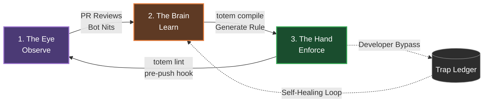

# Totem

_AI coding agents are brilliant goldfish. Totem gives them a memory._

**Your AI agents keep making the same mistakes.** They're brilliant at the 100 lines in front of them, but terrible at asking: _"Does a shared helper already exist for this?"_

Every PR becomes a back-and-forth with review bots about the same architectural nits — missing lazy imports, improper error tagging, reinventing the wheel. That's the **"Bot-Tax."**

Write what you learned in plain English. Totem compiles it into a rule. That mistake physically cannot happen again.

## A Platform of Primitives, Not Opinionated Workflows

Totem is a **standard library for codebase governance**. It provides fast, deterministic building blocks (`totem lint`, `totem compile`, `totem extract`) that you wire into your own CI/CD reality.

We do not force you into a rigid, 7-step AI methodology. We provide the **Sensors** (the knowledge index, the deterministic compiler). You are the Flight Controller. You decide where to put the **Actuators** (Git hooks, IDE plugins).

## The Codebase Immune System (The Pipeline Engine)

Totem operates as a continuous, self-healing loop that converts institutional knowledge into physical constraints through **The Pipeline Engine**. You can author rules manually (zero-LLM), import from ESLint, compile from Markdown examples, or let Totem auto-capture warnings from PR bots.



1. **The Eye (Observe):** `totem review` (our optional reference implementation) and your CI bots watch the code. What went wrong?
2. **The Brain (Learn):** `totem extract` captures the markdown lesson from the PR. `totem compile` automatically writes the AST/Regex plugin for you. What did we learn?
3. **The Hand (Enforce):** `totem lint` (the fast, deterministic core) physically blocks the push. Make it impossible to repeat.

**Note on Tooling:** Every CLI command in Totem supports the `--json` global flag, allowing you to easily pipe Totem's output into your own custom UI or automation scripts.

## How a Mistake Becomes Impossible

Documentation is not enforcement. Telling an AI to "follow the style guide" in a README is a suggestion.

Totem translates a plain-English markdown lesson into a deterministic physical constraint:

**Input:** (`.totem/lessons/no-child-process.md`)

```markdown
## Lesson — Never use native child_process

Tags: architecture
Direct use of `node:child_process` is forbidden outside `core/src/sys/`. Use the `safeExec` shared helper instead.
```

**Output:** (`git push` blocked on the agent's machine)

```bash
$ git push
[Lint] Running 365 rules (zero LLM)...
### Warnings
- **packages/cli/src/git.ts:22** — Never use native child_process
  Pattern: `import { execSync } from 'node:child_process'`
  Lesson: "Direct use of `node:child_process` is forbidden outside `core/src/sys/`. Use the `safeExec` shared helper instead."
[Lint] Verdict: FAIL — Fix violations before pushing.
```

The "wrong" way becomes the "loud" way.

## Quickstart

Initialize Totem in any project (Node, Python, Go, Rust):

```bash
pnpm dlx @mmnto/cli init
```

This scaffolds `totem.config.ts`, installs foundational baseline rules, and configures the `pre-push` git hook.

Run the enforcement engine (Zero-LLM, offline, fast):

```bash
pnpm dlx @mmnto/cli lint
```

### Standalone Binary (No Node.js Required)

If you are working in a non-JavaScript ecosystem (Rust, Go, Python) and don't want to install Node.js, you can download the **Totem Lite** standalone binary from the [GitHub Releases](https://github.com/mmnto-ai/totem/releases) page.

```bash
# Linux / macOS (example)
curl -L https://github.com/mmnto-ai/totem/releases/latest/download/totem-linux-x64 -o totem
chmod +x totem
sudo mv totem /usr/local/bin/
```

The Lite binary includes the full AST engine and can run `totem init`, `totem lint`, and `totem hooks` completely offline. See the [Installation Guide](https://github.com/mmnto-ai/totem/blob/main/docs/wiki/installation.md) for details.

## Try It Live

[](https://codespaces.new/mmnto-ai/totem-playground)

The [Totem Playground](https://github.com/mmnto-ai/totem-playground) is a pre-broken Next.js app with 5 intentional architectural violations. Open it in Codespaces, run `totem lint`, and watch Totem catch every one — zero config, zero API keys. Then try `totem rule list --json` to see the engine as a scriptable API.

## Documentation & Workflows

Stop reading manuals and start solving friction. See the Wiki for how to use Totem to govern your workflows:

- [**It Never Happens Again:**](https://github.com/mmnto-ai/totem/blob/main/docs/wiki/it-never-happens-again.md) How to turn a PR mistake into a permanent project law in 60 seconds.
- [**Governing AI Agents:**](https://github.com/mmnto-ai/totem/blob/main/docs/wiki/governing-ai-agents.md) How to use hooks and MCP tools to enforce project rules on Claude and Gemini from Turn 1.
- [**It Stops Crying Wolf:**](https://github.com/mmnto-ai/totem/blob/main/docs/wiki/it-stops-crying-wolf.md) How the Self-Healing Loop automatically downgrades noisy rules based on developer frustration.

### Deep Dives

- [CLI Reference](https://github.com/mmnto-ai/totem/blob/main/docs/wiki/cli-reference.md)
- [Architecture & Workflows](https://github.com/mmnto-ai/totem/blob/main/docs/reference/architecture-diagram.md)
- [MCP Server Setup](https://github.com/mmnto-ai/totem/blob/main/docs/wiki/mcp-setup.md)
- [CI/CD Integration](https://github.com/mmnto-ai/totem/blob/main/docs/wiki/ci-integration.md)

## Open Core Covenant

**Single-repo local use is free. Multi-repo centralized governance is paid.** The enforcement engine, lesson pipeline, MCP server, and self-healing loop are Apache 2.0 and will remain free and open. See [`COVENANT.md`](https://github.com/mmnto-ai/totem/blob/main/COVENANT.md) for full details.

## License

Apache 2.0 License.
