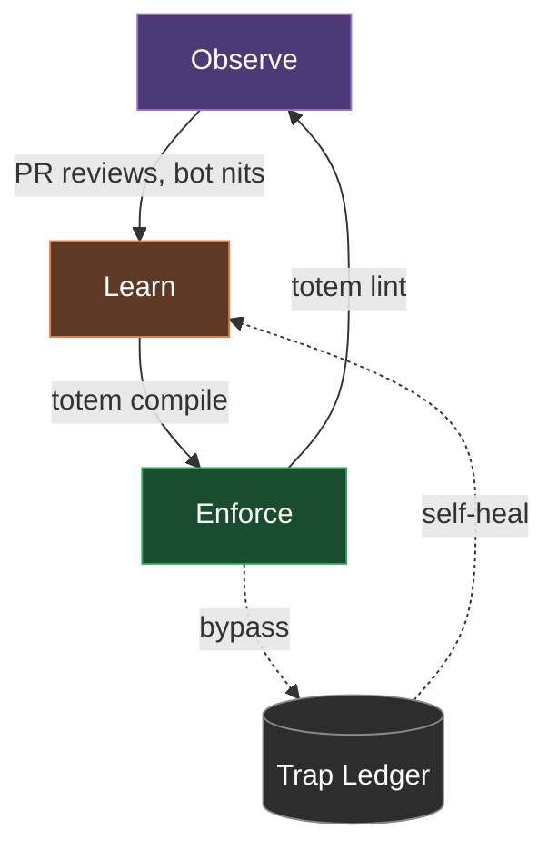

# Totem

_AI coding agents are brilliant goldfish. Totem is their persistent, cross-repo memory._

**Your AI agents keep making the same mistakes.** They can make the wrong way look brilliant — until you realize what happened. They'll never ask: _"doesn't a shared helper already exist for this?"_

Every PR becomes a back-and-forth with review bots about the same architectural nits — missing lazy imports, improper error tagging, reinventing the wheel. Same nit, every PR.

Totem is a zero-config CLI and native MCP server that gives your AI agents a persistent, vendor-agnostic semantic memory. It is not an orchestration framework like LangChain — it is a drop-in compiler that adds a deterministic validation layer to the tools you already use (Claude, Gemini, Cursor, Copilot).

## How a Mistake Becomes Impossible

Documentation is a suggestion. Totem turns a plain-English markdown lesson into a physical constraint the linter enforces on every push:

**Input:** (`.totem/lessons/no-child-process.md`)

```markdown
## Lesson — Never use native child_process

Tags: architecture
Direct use of `node:child_process` is forbidden outside `core/src/sys/`. Use the `safeExec` shared helper instead.
```

**Output:** (`git push` blocked on the agent's machine)

```bash
$ git push
[Lint] Running 393 rules (zero LLM)...
### Warnings
- **packages/cli/src/git.ts:22** — Never use native child_process
  Pattern: `import { execSync } from 'node:child_process'`
  Lesson: "Direct use of `node:child_process` is forbidden outside `core/src/sys/`. Use the `safeExec` shared helper instead."
[Lint] Verdict: FAIL — Fix violations before pushing.
```

The "wrong" way becomes the "loud" way. No LLM in the loop at runtime — just sub-second, offline enforcement.

## A Platform of Primitives, Not Opinionated Workflows

Totem doesn't force a workflow on you. It's building blocks — `totem lint`, `totem compile`, `totem extract`, `totem doctor` — that you wire into whatever CI you already have.

We provide the **Sensors**: the knowledge index, the compiler that turns lessons into rules, the deterministic linter shown above, and the context telemetry that flags noisy rules over time. You are the **Flight Controller**. You decide where to put the **Actuators** (Git hooks, IDE plugins, PR bot triggers, CI gates). Totem doesn't assume your workflow; it integrates with it.

The same Tree-sitter + LanceDB index that powers the compiler also powers the **Semantic Memory Layer (MCP)**: plug Totem into Claude Desktop, Windsurf, or your IDE via the built-in MCP server and your agents get read/write access to your project's architectural decisions (ADRs) and design tenets _before_ they write a single line of code.

## The Self-Healing Loop

Mistakes get observed, compiled into rules, and enforced automatically.



1. **Observe:** `totem review` or your existing CI bots catch a mistake.
2. **Learn:** `totem extract` captures the lesson. `totem compile` turns it into an ast-grep or regex rule.
3. **Enforce:** `totem lint` blocks the push. Sub-second, zero-LLM, offline.

Every CLI command supports `--json` for piping into your own automation.

## Quality > Quantity

In 1.13.0 we recompiled all 1156 lessons through Claude Sonnet 4.6 (`anthropic:claude-sonnet-4-6`), shipping 393 precise rules (203 ast-grep, 190 regex) and purging 143 noisy hallucinated rules. Quality > quantity is enforced by the compile gate, not by manual curation. Strategy #73 benchmark proved Sonnet wins on every metric (90% correctness vs 73%, 2.4s vs 19.6s).

The `totem doctor` command now flags regex rules whose telemetry shows >20% of matches landing in non-code contexts (strings, comments, regex literals) and recommends ast-grep upgrades.

You can run `totem compile --upgrade <hash>` to target one rule by hash, evict only that rule from the cache, recompile through Sonnet with a telemetry-driven directive, and replace the rule. This command rejects `--cloud` (cloud worker still on Gemini, tracked as #1221) and `--force` (the scoped eviction makes `--force` redundant and dangerous).

## Quickstart

Initialize Totem in any project (Node, Python, Go, Rust):

```bash
pnpm dlx @mmnto/cli init
```

This scaffolds `totem.config.ts`, installs foundational baseline rules, and configures the `pre-push` git hook.

Run the linter (no AI, no network, no config):

```bash
pnpm dlx @mmnto/cli lint
```

### Standalone Binary (No Node.js Required)

If you are working in a non-JavaScript ecosystem (Rust, Go, Python) and don't want to install Node.js, you can download the **Totem Lite** standalone binary from the [GitHub Releases](https://github.com/mmnto-ai/totem/releases) page.

```bash
# Linux (x64)
curl -L https://github.com/mmnto-ai/totem/releases/latest/download/totem-linux-x64 -o totem
chmod +x totem && sudo mv totem /usr/local/bin/

# macOS (Apple Silicon)
curl -L https://github.com/mmnto-ai/totem/releases/latest/download/totem-darwin-arm64 -o totem
chmod +x totem && sudo mv totem /usr/local/bin/
```

The Lite binary includes the full AST engine and can run `totem init`, `totem lint`, and `totem hooks` completely offline. For Windows and other platforms, see the [Installation Guide](https://github.com/mmnto-ai/totem/blob/main/docs/wiki/installation.md).

## Try It Live

[](https://codespaces.new/mmnto-ai/totem-playground)

The [Totem Playground](https://github.com/mmnto-ai/totem-playground) is a pre-broken Next.js app with 5 intentional architectural violations. Open it in Codespaces, run `totem lint`, and watch Totem catch every one — zero config, zero API keys. Then try `totem rule list --json` to see the engine as a scriptable API.

## Documentation & Workflows

See the Wiki for how to use Totem to govern your workflows:

- [**It Never Happens Again:**](https://github.com/mmnto-ai/totem/blob/main/docs/wiki/it-never-happens-again.md) How to turn a PR mistake into a permanent project law in 60 seconds.
- [**Governing AI Agents:**](https://github.com/mmnto-ai/totem/blob/main/docs/wiki/governing-ai-agents.md) How to use hooks and MCP tools to enforce project rules on Claude and Gemini from Turn 1.
- [**It Stops Crying Wolf:**](https://github.com/mmnto-ai/totem/blob/main/docs/wiki/it-stops-crying-wolf.md) How the Self-Healing Loop automatically downgrades noisy rules based on developer frustration.

### Deep Dives

- [CLI Reference](https://github.com/mmnto-ai/totem/blob/main/docs/wiki/cli-reference.md)
- [Architecture & Workflows](https://github.com/mmnto-ai/totem/blob/main/docs/reference/architecture-diagram.md)
- [MCP Server Setup](https://github.com/mmnto-ai/totem/blob/main/docs/wiki/mcp-setup.md)
- [CI/CD Integration](https://github.com/mmnto-ai/totem/blob/main/docs/wiki/ci-integration.md)

## Open Core Covenant

**Single-repo local use is free. Multi-repo centralized governance is paid.** The enforcement engine, lesson pipeline, MCP server, and self-healing loop are Apache 2.0 and will remain free and open. See [`COVENANT.md`](https://github.com/mmnto-ai/totem/blob/main/COVENANT.md) for full details.

## License

Apache 2.0 License.
