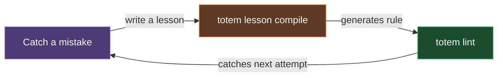

# Totem

[](https://www.npmjs.com/package/@mmnto/totem)
[](https://github.com/mmnto-ai/totem/actions/workflows/ci.yml)
[](https://github.com/mmnto-ai/totem/tree/main/packages/mcp)
[](LICENSE)
[](https://nodejs.org)
[](https://pnpm.io)

**Editor integrations:** [Claude Code](.claude/) · [Gemini CLI](.gemini/) · [GitHub Copilot](.github/copilot-instructions.md) · [JetBrains Junie](.junie/) · others in progress. See [`AGENTS.md`](AGENTS.md) for how integration works.

_AI coding agents are brilliant goldfish. Totem is the file-based substrate they read from and write to. It keeps architectural context durable across sessions._

> `totem lint` runs entirely offline and completes in under 2 seconds. No LLMs in the loop.

When using LLMs on projects, I found that agents kept making the same architectural mistakes. They forgot context and reinvented helpers that already existed. The velocity was great, but the architectural integrity degraded quickly. Every PR became an exhausting back-and-forth with review bots over the same nits.

They can make the wrong way look brilliant (until you realize what happened). They'll rarely ask: _"doesn't a shared helper already exist for this?"_

Totem is what I extracted to solve that friction. It's a file-based toolkit. The lint engine, substrate, and knowledge index are deterministic; the compiler and review commands are LLM-powered. Agents read from and write to a substrate of plain markdown lessons, a queryable knowledge index, compiled lint rules, and CLI primitives — so context stays queryable, rules stay enforceable, and state stays derivable. The structural pieces (the substrate, the index, the compiled-rule lint engine) ship today. The discipline and telemetry layers (whether agents consistently query the index, whether compliance gets measured end-to-end) are in active development; see [What Works and What Doesn't](#what-works-and-what-doesnt) for the honest split.

---

- [Documentation is merely a suggestion](#documentation-is-merely-a-suggestion)
- [How Mistakes Become Rules](#how-mistakes-become-rules)
- [The Queryable Knowledge Index](#the-queryable-knowledge-index)
- [What's in the Box](#whats-in-the-box)
- [What Works and What Doesn't](#what-works-and-what-doesnt)
- [Quickstart](#quickstart)
- [Documentation & Workflows](#documentation--workflows)

---

## Documentation is merely a suggestion

I tried the heavy orchestration approach that dictates every step of the agent's workflow, and found it rigid and disruptive to the human-in-the-loop dynamic. Totem is built on a different philosophy: **Tripwires, Not Tracks.**

You provide an open field surrounded by electric fences. The LLM is free to code however it wants, but when it attempts to alter the permanent state of the world (e.g., `git push`), it hits a deterministic tripwire.

Totem turns a plain-English markdown lesson into a physical constraint that a local, zero-LLM linter enforces:

**Input:** (`.totem/lessons/no-child-process.md`)

```markdown
## Lesson - Never use native child_process

Tags: architecture
Direct use of `node:child_process` is forbidden outside `core/src/sys/`. Use the `safeExec` shared helper instead.
```

**Output:** (`git push` blocked on the agent's machine)

```bash
$ git push
[Lint] Running compiled rules (zero LLM)...
### Warnings
- **packages/cli/src/git.ts:22** - Never use native child_process
  Pattern: `import { execSync } from 'node:child_process'`
  Lesson: "Direct use of `node:child_process` is forbidden outside `core/src/sys/`. Use the `safeExec` shared helper instead."
[Lint] Verdict: FAIL - Fix violations before pushing.
```

The "wrong" way becomes the "loud" way. No LLM in the loop at runtime. Just sub-second, offline enforcement.

## How Mistakes Become Rules

The core loop is simple. A mistake gets caught in a PR review, a bot nit, or a production bug. I write a plain-English lesson that explains what went wrong. `totem lesson compile` turns the lesson into an AST or regex rule, and `totem lint` enforces it on every push from that point forward. The same compiled pattern can't ship past the linter again once the pre-push hook or CI runs and the rule matches.



When a rule matches comments or string literals instead of actual code, `totem doctor` flags it as noisy, and `totem lesson compile --upgrade` re-runs the compiler with a precision-targeted prompt. I'd rather have 300 precise rules than 1,000 noisy ones.

## The Queryable Knowledge Index

AI agents are stateless by default. Every new session starts from zero, with no record of prior incidents or the shared helpers you've already written. You end up re-explaining the same context over and over.

Totem's approach: your lessons and ADRs live in your repo as plain markdown files — those files are the canonical source. `totem sync` derives a local semantic index from them (Tree-sitter + LanceDB) so they become queryable. The derived store stays on your machine and rebuilds from the files at any time, so there's no cloud dependency and no vendor lock-in.

MCP-compatible agents query it through the bundled MCP server. Registering that server with your agent is a one-time, per-agent configuration step — `totem init` scaffolds it for the agents it detects; for anything else, see [MCP Server Setup](docs/wiki/mcp-setup.md). Once registered, before your agent writes a line of code, it can ask "what patterns are banned in this codebase?" or "what's the architecture of the auth system?" and get a real set of ranked candidates from your project's actual history (the agent still has to read them and synthesize — a queryable index returns candidates, not pre-synthesized answers). Whether an agent actually issues that query before deriving from scratch is currently an agent-discipline question — see [What Works and What Doesn't](#what-works-and-what-doesnt).

With [Cross-Repo Mesh](docs/wiki/cross-repo-mesh.md), federation across sibling repos is supported via the opt-in `linkedIndexes` config — one repo's lessons become queryable from all linked repos when cohorts opt in, so context doesn't stop at the repo boundary.

## What's in the Box

Totem is a set of CLI tools, not a framework. Building blocks you wire into whatever CI and workflow you already have. Several commands support `--json` or `--format json` for scripting; check `totem <command> --help` for the format options on a specific command.

| Command                | What it does                                                                                                   |
| ---------------------- | -------------------------------------------------------------------------------------------------------------- |
| `totem lint`           | Run all compiled rules against your code. Zero LLM, offline, sub-second.                                       |
| `totem lesson compile` | Turn plain-English lessons into AST or regex rules.                                                            |
| `totem lesson extract` | Pull lessons from PR reviews and bot comments.                                                                 |
| `totem doctor`         | Flag locally noisy rules via Trap Ledger telemetry, suggest upgrades.                                          |
| `totem spec`           | Generate an implementation spec from a GitHub issue before you touch any code (LLM-powered, requires API key). |
| `totem review`         | LLM-powered architectural review on an uncommitted diff (requires API key).                                    |
| `totem sync`           | Rebuild the semantic index from your lessons and docs.                                                         |
| `totem hook install`   | Install Git hooks (`pre-push` lint gate).                                                                      |

The built-in MCP server exposes the same index to MCP-compatible agents, once it's registered in your agent's MCP config — an IDE-level step; see [MCP Server Setup](docs/wiki/mcp-setup.md).

## CI/CD and GitHub Integration

Because `totem lint` is deterministic and runs in under two seconds, it drops cleanly into a CI pipeline. The three output formats are `text` (default), `json` (for scripting), and `sarif` (for security dashboards):

```bash
totem lint --format sarif --out totem.sarif
```

Pipe the SARIF file into GitHub Code Scanning (via the standard `github/codeql-action/upload-sarif` action) or any SARIF-compliant tool, and Totem's tripwires show up as inline PR annotations right where the developer wrote the code that violated a rule. The stream is deliberately scoped to error-severity findings so PR reviews don't drown in probationary warnings. Warnings stay as local telemetry until a rule has enough signal to graduate.

The same `--format sarif` flag works on the standalone `totem-lite` binary for CI environments without Node.js. See [CI/CD Integration](https://github.com/mmnto-ai/totem/blob/main/docs/wiki/ci-integration.md) for pipeline recipes.

## What Works and What Doesn't

Totem has three layers, and I want to be honest about where each one stands:

1. **The enforcement layer works.** Compiled rules and Git hooks catch violations mechanically and offline, in under 2 seconds. This is the load-bearing floor that everything else stands on. Nothing on that floor touches the network, so it runs natively in air-gapped environments. No source code leaves your machine.
2. **The planning layer works too, to my surprise.** Before the agent writes any code, `totem spec` pulls the GitHub issue body and queries the knowledge base for relevant lessons and ADRs. It writes a structured implementation spec to `.totem/specs/<issue>.md`. The spec includes architectural context, files to examine, edge cases the issue description missed, and task-by-task TDD directives with retrieved lessons injected inline as invariants. None of this is a hard tripwire. The agent could write a vague spec and ignore the retrieved context. But in practice — in my own use of it — the structured prompt has repeatedly caught "I'm about to reinvent a helper that already exists" before the agent commits to an approach. A meaningful chunk of the velocity and architectural consistency I've been getting comes from this upstream gate, more than I expected when I first added it.
3. **The knowledge index is real infrastructure.** The index exists. It's portable across repos, and any MCP agent can query it. But whether an agent _consistently acts_ on the context it retrieves is an open question I'm actively working through. Availability is deterministic. The agent's discipline is not.

I built the enforcement layer because the upstream layers aren't enough on their own. An agent can have a clean spec, relevant lessons in context, and still drift when it gets deep into a task. The tripwires catch what the planning layer and the knowledge index miss. That's the whole point of keeping them as three distinct layers rather than one: each catches a different class of failure, at a different stage of the workflow.

## Changelog

See [Releases](https://github.com/mmnto-ai/totem/releases) for recent updates.

## Quickstart

Initialize Totem in any project (Node, Python, Go, Rust):

```bash
pnpm dlx @mmnto/cli init
```

This scaffolds `totem.config.ts` and wires up the `pre-push` git hook. It also installs the baseline rule pack.

Run the linter (zero setup, offline):

```bash
pnpm dlx @mmnto/cli lint
```

### Standalone Binary (No Node.js Required)

If you are working in a non-JavaScript ecosystem (Rust, Go, Python) and don't want to install Node.js, you can download the **Totem Lite** standalone binary from the [GitHub Releases](https://github.com/mmnto-ai/totem/releases) page.

```bash
# Linux (x64)
curl -L https://github.com/mmnto-ai/totem/releases/latest/download/totem-lite-linux-x64 -o totem
chmod +x totem && sudo mv totem /usr/local/bin/

# macOS (Apple Silicon)
curl -L https://github.com/mmnto-ai/totem/releases/latest/download/totem-lite-darwin-arm64 -o totem
chmod +x totem && sudo mv totem /usr/local/bin/
```

The Lite binary includes the full AST engine and can run `totem init`, `totem lint`, and `totem hook install` completely offline. For Windows and other platforms, see the [Installation Guide](https://github.com/mmnto-ai/totem/blob/main/docs/wiki/installation.md).

## Documentation & Workflows

See the Wiki for how to use Totem to govern your workflows:

- [**It Never Happens Again:**](https://github.com/mmnto-ai/totem/blob/main/docs/wiki/it-never-happens-again.md) How to turn a PR mistake into a permanent project law in 60 seconds.
- [**Governing AI Agents:**](https://github.com/mmnto-ai/totem/blob/main/docs/wiki/governing-ai-agents.md) How to use hooks and MCP tools to enforce project rules on Claude and Gemini from Turn 1.
- [**It Stops Crying Wolf:**](https://github.com/mmnto-ai/totem/blob/main/docs/wiki/it-stops-crying-wolf.md) How override telemetry flags noisy rules for downgrade — proposed as a PR, merged by a human.
- [**Maturity:**](https://github.com/mmnto-ai/totem/blob/main/docs/wiki/maturity.md) What's shipped, partial, and still a goal — each row backed by verifiable data in the repo and checked in CI.
- [**Proof Kit:**](https://github.com/mmnto-ai/totem/blob/main/examples/proof-kit) A committed, re-runnable exhibit: one real mistake, the rule compiled from its lesson, and CI re-proving on every pull request that the mistake stays blocked — with zero LLM calls.

### Deep Dives

- [CLI Reference](https://github.com/mmnto-ai/totem/blob/main/docs/wiki/cli-reference.md)
- [Architecture & Workflows](https://github.com/mmnto-ai/totem/blob/main/docs/reference/architecture.md)
- [MCP Server Setup](https://github.com/mmnto-ai/totem/blob/main/docs/wiki/mcp-setup.md)
- [CI/CD Integration](https://github.com/mmnto-ai/totem/blob/main/docs/wiki/ci-integration.md)

## Open Source Commitment

The core toolkit (enforcement engine, `totem lesson compile`, MCP server, and the rule-tuning loop) is Apache 2.0. If federation, hosted services, or centralized telemetry are introduced later, they are intended to be separate products, while the local toolkit remains Apache 2.0.

See [`COVENANT.md`](https://github.com/mmnto-ai/totem/blob/main/COVENANT.md) for details.

## License

Apache 2.0 License.
