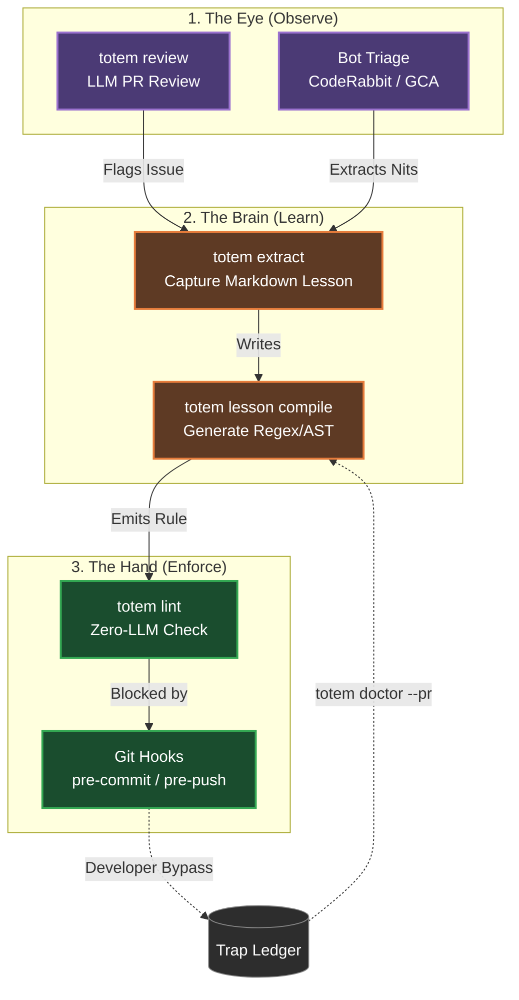
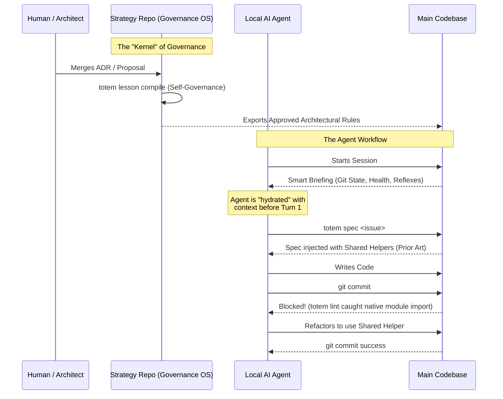
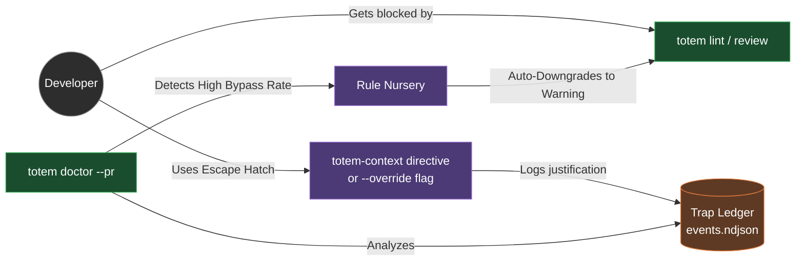

# Totem Architecture & Workflows

Totem is designed as an "Invisible Exoskeleton" for development teams and AI agents. It operates not as a static tool, but as a continuous, self-healing loop that converts institutional knowledge into deterministic physical constraints.

This document contains several views of the architecture, ranging from high-level workflows to deep-dive structural layers.

---

## 1. The Flywheel (Observe → Learn → Enforce)

This is the core functional loop of Totem. It visualizes how friction identified during code review is systematically converted into a fast, local guardrail.

---

## 2. The Agent Governance Pipeline

This diagram shows how Totem "weaponizes" project management to govern autonomous AI agents (like Claude Code or Gemini CLI), preventing them from reinventing wheels or suffering from "Session Start Amnesia."

---

## 3. The Self-Healing Engine

Totem assumes LLMs will hallucinate and developers will get frustrated. This diagram illustrates how the Trap Ledger turns a developer bypassing a guardrail into actionable telemetry that automatically tunes the system.

---

## 4. Deep Dive: Structural Layers

This diagram visualizes the separation of concerns within the codebase itself. It divides the system into the fuzzy semantic layer, the rigid deterministic layer, and the persistent memory mesh.

