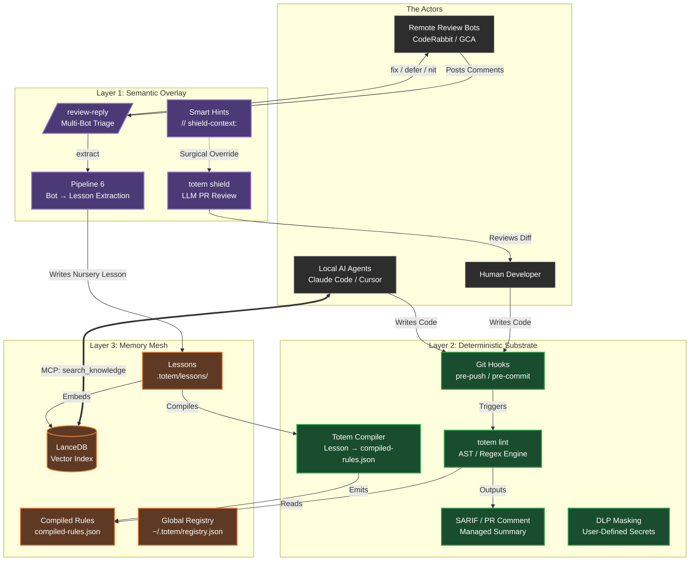

# Totem Architecture

This diagram visualizes the core architecture of the Totem platform, separating the flow of code, memory, and governance into three distinct layers: The Semantic Overlay, The Deterministic Substrate, and The Memory Mesh.

